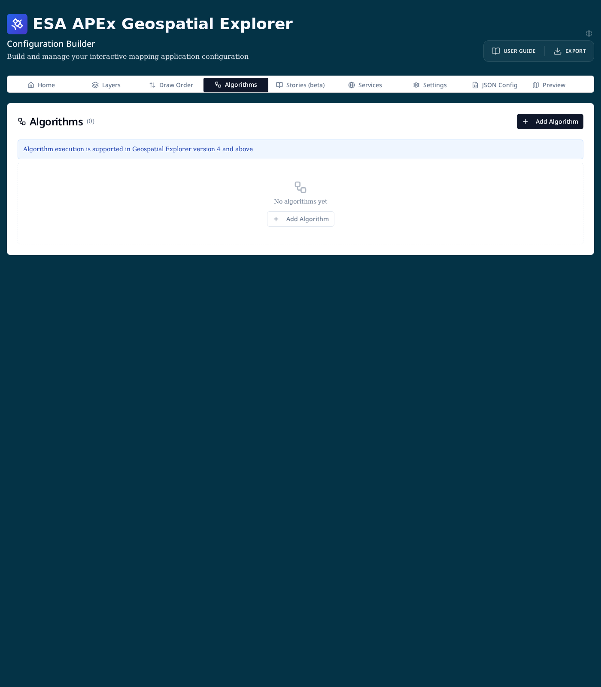
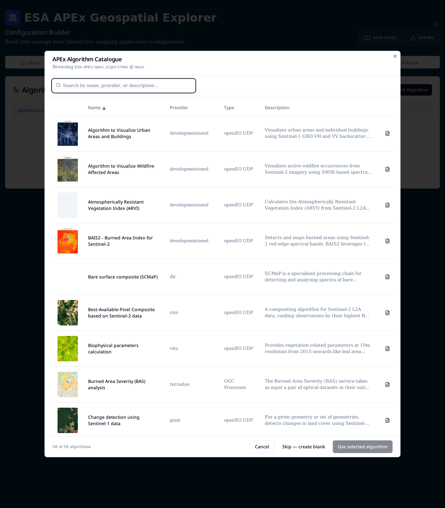
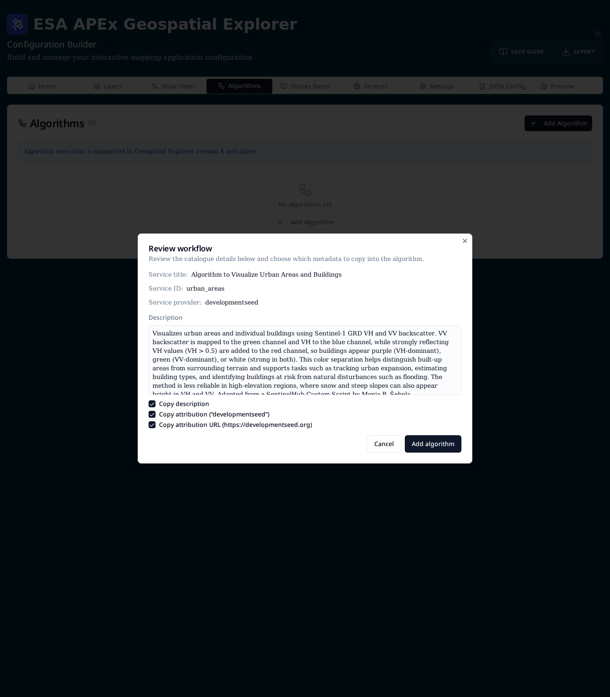
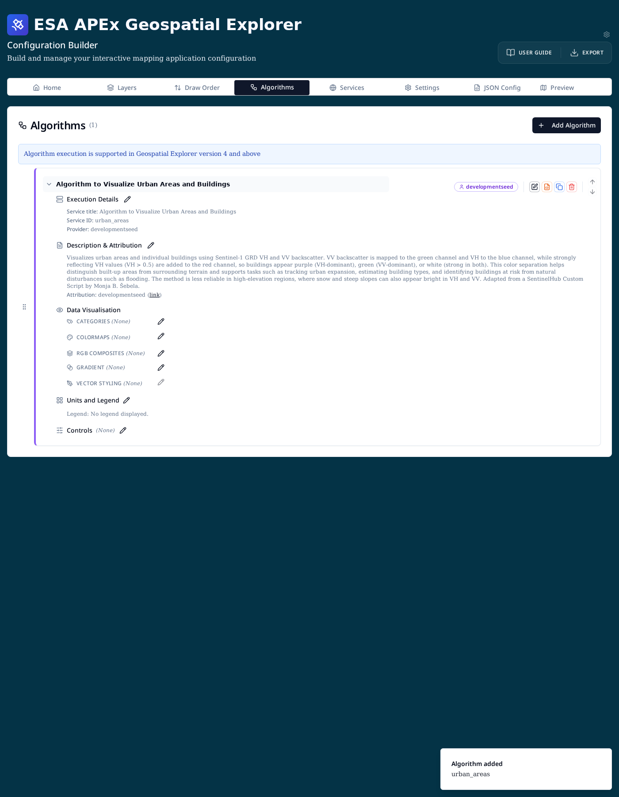

# Algorithms

The **Algorithms** tab lets you attach on-demand processing services to a
Geospatial Explorer configuration. End users can then run these algorithms
against the map — for example to compute a burned-area index, generate a
best-available-pixel composite, or detect changes between two Sentinel
acquisitions — and the resulting outputs appear as regular map layers.

!!! info "Viewer requirement"
    Algorithm execution is supported in **Geospatial Explorer version 4 and
    above**. Earlier viewer bundles will ignore the `workflows` block.

!!! note "Optional tab"
    The Algorithms tab is hidden by default. Enable it from the
    **cog icon → Config Builder settings → Show algorithms tab**.

## Concepts

- **Algorithm** — a reference to a remote processing service (an openEO
  User-Defined Process, or an OGC API Processes job). Internally the config
  key is `workflows`, but the UI uses "Algorithm" throughout.
- **APEx Algorithm Catalogue** — a curated list of algorithms published from
  the [`ESA-APEx/apex_algorithms`](https://github.com/ESA-APEx/apex_algorithms)
  repository. The builder fetches it on demand so you can add algorithms
  without hand-writing service IDs, endpoints, or descriptions.
- **Service provider** — the backend that hosts the algorithm (for example
  `vito`, `developmentseed`, `terradue`, `dlr`, `gisat`).
- **Type** — either `openEO UDP` (User-Defined Process) or `OGC Processes`.

## The Algorithms tab

Open the tab from the main navigation. Each row is one algorithm attached to
the current configuration.



Use **Add Algorithm** (top-right or in the empty-state card) to start.

## Adding an algorithm from the catalogue

The **APEx Algorithm Catalogue** dialog lists every algorithm published in the
APEx repository. You can search by name, provider, or description, and sort by
any column.



- Click a row to select it, then **Use selected algorithm** — or
  double-click a row to add it directly.
- The **document icon** on the right of each row opens the raw `record.json`
  for that algorithm, useful when you need to inspect the underlying openEO
  or OGC definition.
- **Skip — create blank** bypasses the catalogue if you want to configure a
  private or in-house algorithm by hand.

### Reviewing catalogue metadata

After selecting a catalogue entry, a **Review workflow** dialog shows what
will be copied into your config.



Toggle the three checkboxes to control which optional metadata is imported:

- **Copy description** — long-form description shown in the layer card.
- **Copy attribution** — provider name shown as the attribution label.
- **Copy attribution URL** — link target for the attribution label.

Service ID, provider, endpoint, namespace, and application are always copied
because they identify the remote service. Click **Add algorithm** to commit.

## The algorithm card

Once added, each algorithm renders as a card. Click the chevron to expand it
and reveal its configuration sections.



- **Execution Details** — service title, service ID, and provider. Edit with
  the pencil icon to change endpoint, namespace, or application.
- **Description & Attribution** — free-form description and attribution text /
  URL shown to end users in the layer card.
- **Data Visualisation** — how the algorithm's output is styled on the map.
  These options mirror the styling controls on regular layers:
  [Categories](../layers/categories.md), [Colormaps](../layers/colormaps.md),
  [RGB composites](../layers/rgb-composite.md), Gradient, and
  [Vector styling](../layers/vector-styling.md). Only one is applied at a
  time — see [Data visualisation](../layers/data-visualisation.md) for the
  mutual-exclusivity rules.
- **Units and Legend** — units suffix and legend behaviour for the output
  layer.
- **Controls** — user-adjustable controls (for example opacity or thresholds)
  exposed in the viewer.

### Row actions

The button cluster at the right of each row provides:

- **Edit** — reopens the algorithm form with all fields editable.
- **Edit JSON** — direct JSON editor for the workflow entry, useful for
  advanced fields not exposed in the form.
- **Duplicate** — clones the algorithm (its `serviceId` is suffixed with
  `_copy`).
- **Delete** — removes the algorithm from the configuration.
- **Up / Down arrows** — reorder algorithms; drag the handle on the left for
  free-form ordering.

## Configuring a custom (non-catalogue) algorithm

Choose **Skip — create blank** from the catalogue dialog to open the form
directly. The required fields are:

- **Service title** *(optional)* — human-readable label shown in the UI.
- **Service ID** *(required)* — unique identifier the viewer sends to the
  backend.
- **Service provider** — pick an existing provider from your Services tab or
  enter a custom string.
- **Additional service details — EO Application Packages** — for OGC API
  Processes / EOAP-style services, provide:
    - **Endpoint** — the processing service base URL.
    - **Namespace** — application namespace.
    - **Application** — application ID.

For openEO UDP algorithms only the service ID and provider are typically
required; the provider's registered openEO endpoint is used automatically.

## Technical reference

Algorithms are persisted under the top-level `workflows` array. A minimal
entry looks like this:

```json
{
  "workflows": [
    {
      "serviceId": "urban_areas",
      "serviceProvider": "developmentseed",
      "serviceTitle": "Algorithm to Visualize Urban Areas and Buildings",
      "meta": {
        "description": "Visualizes urban areas and individual buildings …",
        "attribution": {
          "text": "developmentseed",
          "url": "https://developmentseed.org"
        }
      },
      "layout": { "layerCard": {} }
    }
  ]
}
```

For OGC Processes entries, add a `serviceDetails` block:

```json
"serviceDetails": {
  "endpoint": "https://ogc-api.example.org",
  "namespace": "burned-area",
  "application": "bas-analysis"
}
```

See the [JSON schema reference](../reference/json-schema.md) for the full
list of supported fields on each workflow entry.
