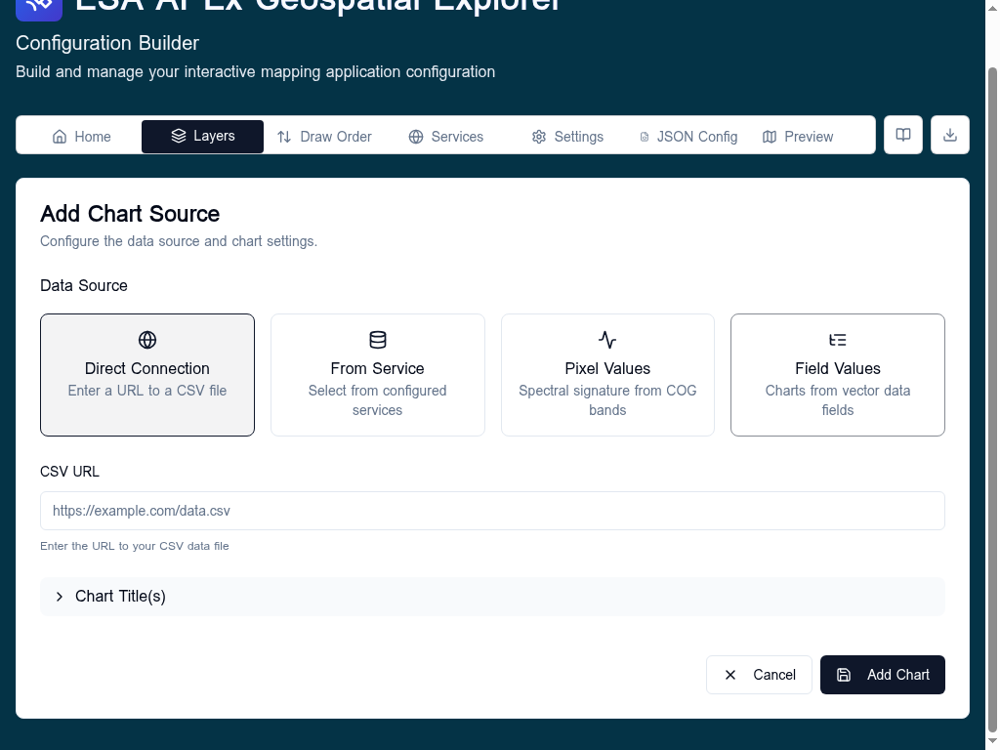

# Charts overview

Charts are added per-layer from the **Charts** tab in the Data Sources section of the layer card. They render with Plotly and appear next to the layer in the APEx Geospatial Explorer when a user opens the info panel or selects a feature.

## Source types

A chart pulls data from one of four sources:

| Type | Use for | Notes |
|---|---|---|
| **Direct Connection** | A CSV at a known URL | Simplest case; the URL is fetched at runtime. |
| **From Service** | A configured backend service that returns CSV/JSON | Pick a service registered in the Services tab. |
| **Pixel Values** | Spectral signature from a multi-band COG | Requires at least one COG data source on the layer. See [Pixel values](pixel-values.md). |
| **Field Values** | Counts/sums from GeoJSON or FlatGeoBuf properties | Used for inline pie charts. See [Field values](field-values.md). |

## Supported chart types

The visual editor currently supports **Line**, **Area**, and **Bar** for `chartType: xy`, plus **Pie** charts for the `Field Values` source. Histogram support exists in the schema but is not yet exposed in the editor UI.

## Related

- [Visual editor](visual-editor.md) — building traces and styling them.
- [CSV data](csv-data.md) — date detection and numeric parsing rules.
