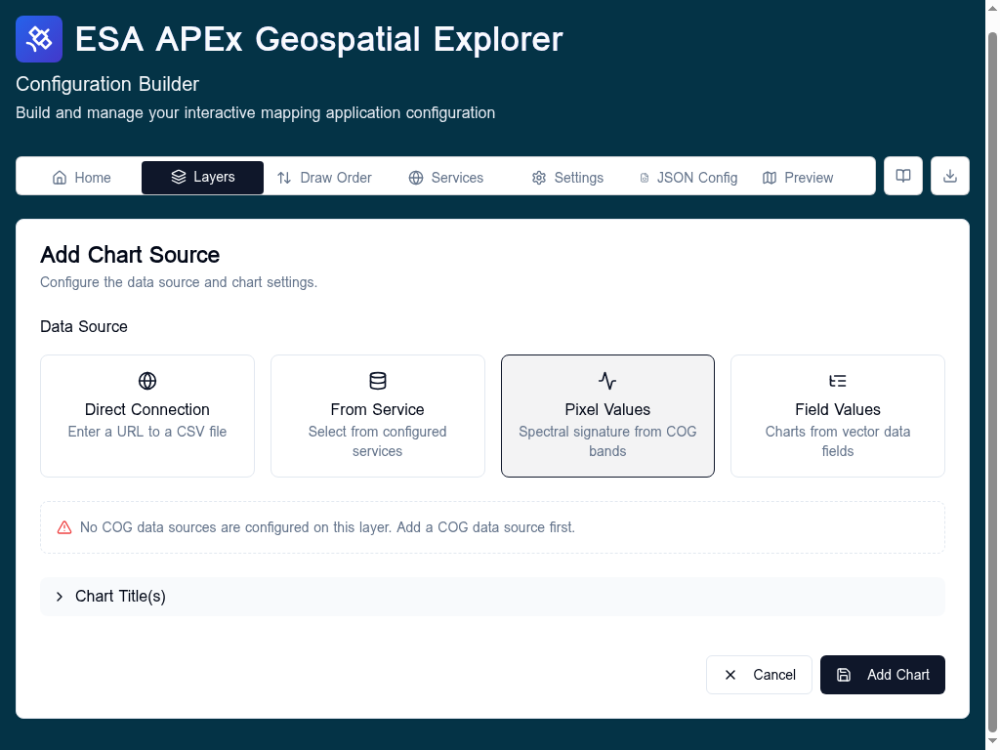

# Pixel values

The **Pixel Values** chart source renders a spectral signature — one trace per pixel sample, with band index on the X axis and pixel value on the Y axis — from a multi-band Cloud Optimized GeoTIFF on the layer.

## When to use

- Hyperspectral or multi-band imagery (Sentinel-2, Landsat, EnMAP, PRISMA).
- Letting users click a pixel and see its full spectral profile.

## Configure

1. Add at least one COG data source to the layer's **Datasets** tab. The Pixel Values source type is disabled until a COG is present.
2. In the layer's **Charts** tab, click **Add Chart** and choose **Pixel Values**.
3. The X axis is auto-populated with band labels read from the COG metadata (or `Band 1, Band 2, …` if no labels are available).
4. Each Y trace represents one sampled pixel; the runtime adds a trace per click on the map.

## Notes

- Performance guards limit metadata reads on very large hyperspectral COGs — see the COG performance guards memory.
- BSQ-interleaved COGs are detected and downloaded band-by-band; BIP COGs stream all bands together.

## Related

- [COG data sources](../data-sources/cog.md)
- [Charts overview](overview.md)
