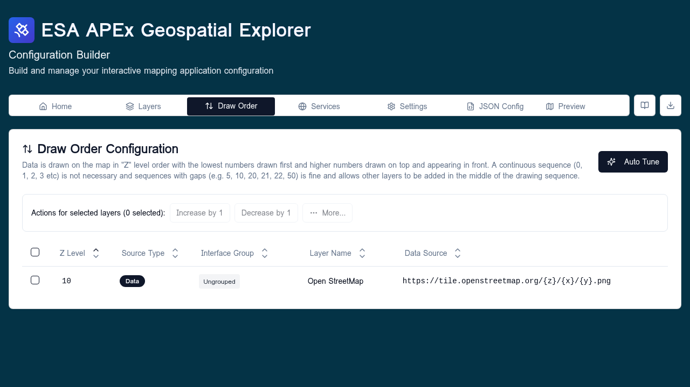

# Draw order

The **Draw order** tab controls the front-to-back stacking of layers on the map. Each layer's position here determines its `zIndex` in the rendered map: rows higher in the list draw on top of rows below them.

## When to use

Visit this tab when:

- A vector layer is being hidden by a raster overlay and needs to come forward.
- Two raster overlays draw in the wrong order regardless of toggle order.
- You need to deterministically pin certain layers (labels, boundaries) above the rest.

For day-to-day visibility, use the toggles in the Layers tab — draw order only affects stacking, not whether a layer is on or off.

## Configure

The tab lists every active layer (base layers excluded — they always sit at the bottom). Drag a row up or down to change its position. The order is persisted into each `DataSourceItem.zIndex` when the config is saved.

Tips:

- The **topmost** row in the list is drawn last, so it appears on top.
- Vector layers usually belong above raster layers so points and lines stay visible.
- Labels and annotation layers are typically pinned to the very top.
- Reordering here does not change the order layers appear inside the Layers tab — that is controlled by interface groups and within-group order.

## Validation

- Every layer must have a unique `zIndex` after reorder; the editor renumbers automatically on save.
- Hidden layers still occupy a position; toggling them on later uses the saved order.

## Related

- [Interface groups](interface-groups.md) — controls Layers-tab grouping, not draw order.
- [Layers overview](../layers/index.md)
