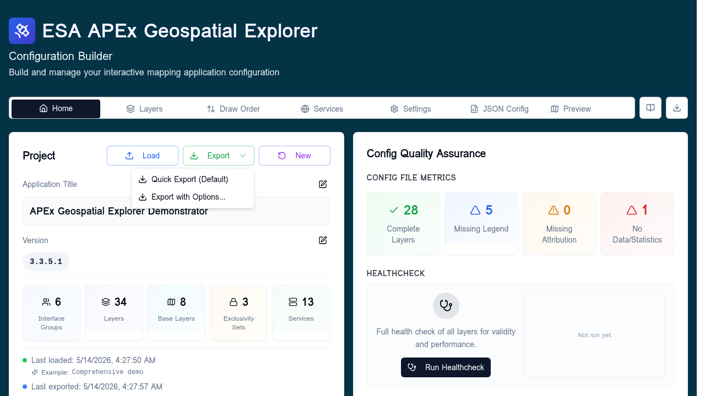
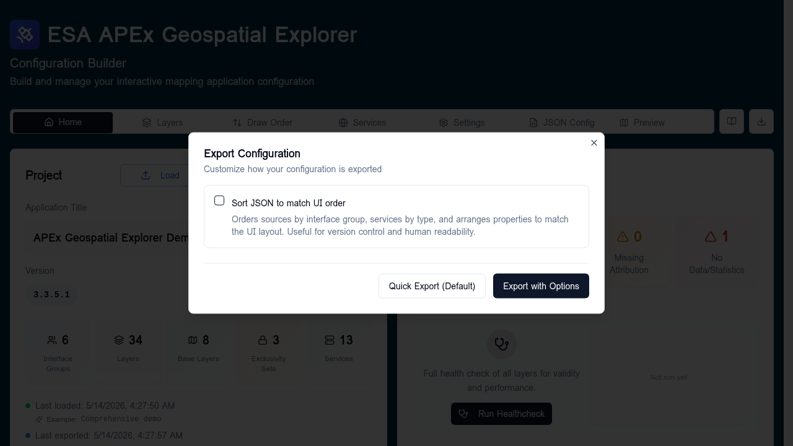

# Export options

The **Export** action on the [Home tab](../home/index.md) is a split menu with two
entries: a one-click default export, and a dialog for opting in to
formatting options.



## Quick Export (Default)

Exports the configuration as JSON immediately, with no transformations.
The downloaded filename is
`<exportPrefix>_YYYYMMDD_HHMM.json` (the prefix is configured under
[Settings → Config Export Settings](../settings/index.md#config-export-settings)).

This is the recommended default — the file matches the in-memory
configuration property-for-property, which is best for diffs and
round-tripping.

## Export with Options...

Opens a dialog with a single toggle.



### Sort JSON to match UI order

When enabled (`sortToMatchUiOrder: true`), the exporter reorders the
config to make it easier to read in version control and side-by-side with
the UI. Specifically:

- **Sources** are reordered to match the [interface group](interface-groups.md)
  ordering — grouped sources first (in group order), then ungrouped
  sources, then base layers.
- **Services** are reordered by type priority — STAC first, then
  WMS / WMTS, then S3, then any others, with alphabetical ordering within
  each group.
- **Properties within each source** are written in a fixed order:
  `name`, `isActive`, `isBaseLayer`, `preview`, `meta`, `layout`,
  `timeframe`, `defaultTimestamp`, `exclusivitySets`,
  `hasFeatureStatistics`, `data`, `statistics`, `constraints`, `workflows`.

When disabled (the default), no reordering is applied.

The dialog has two buttons:

- **Quick Export (Default)** — exports immediately with options off,
  matching the menu's quick path.
- **Export with Options** — exports with the chosen options applied.

!!! note "Read-only operation"
    Sorting only affects the downloaded JSON. The in-memory config and
    the [JSON config](json-config.md) tab are not modified.

## Filename format

All exports — quick or with options — produce a filename of the form:

```
<exportPrefix>_YYYYMMDD_HHMM.json
```

For example, `config_20260514_1130.json`. The month is the two-digit
zero-padded number. Set the prefix on the
[Settings tab](../settings/index.md#config-export-settings).
