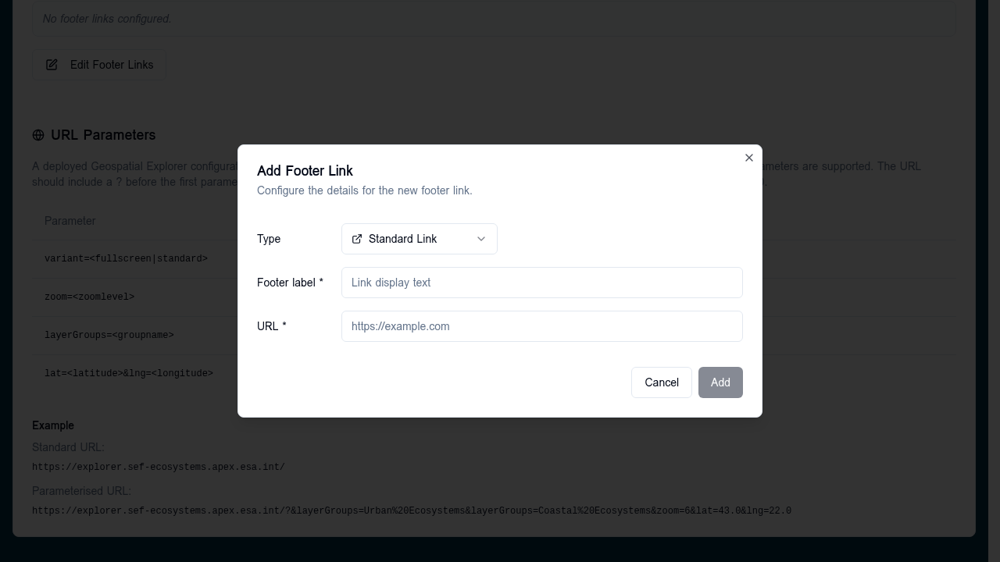
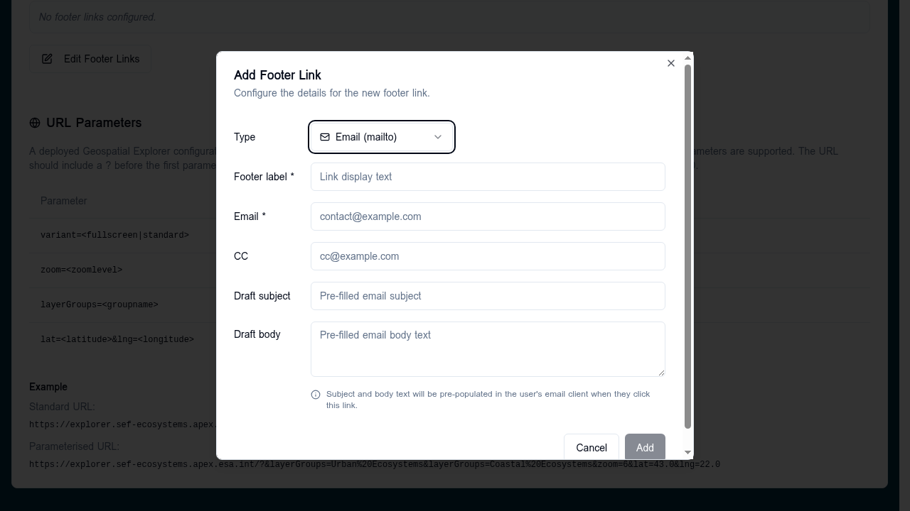

# Footer links

The **Footer Links** editor manages the links shown in the deployed APEx
Geospatial Explorer's footer bar. Open it from the [Settings tab](../settings/index.md)
by clicking **Edit Footer Links** under the Footer Links preview.

The dialog is a two-page modal: a sortable list of existing links, and an
add/edit form for a single link.

## List page

The list shows each configured link with its label, a type-aware icon, and
controls to reorder (▲▼), edit (pencil), or delete (trash). Links appear
in the deployed footer in the order shown here.

Click **+ Add Footer Link** to open the edit form for a new link, or click
the pencil icon on an existing row to edit it.

Click **Done** to save changes back to the config, or **Cancel** to discard
them.

## Add / edit form

Each link has two flavours selected via the **Type** dropdown:

### Standard Link

A regular `https://` URL, opened in a new tab in the deployed Explorer.



| Field         | Required | Notes                                                  |
|---------------|----------|--------------------------------------------------------|
| Footer label  | Yes      | Display text shown in the footer.                      |
| URL           | Yes      | Absolute `https://` URL.                               |

### Email (mailto)

An email link that opens the user's email client with optional pre-filled
fields. The form fields are bidirectionally parsed from / serialised to a
`mailto:` URL.



| Field          | Required | Maps to                          |
|----------------|----------|----------------------------------|
| Footer label   | Yes      | Link display text.               |
| Email          | Yes      | `mailto:<email>` recipient.      |
| CC             | No       | `?cc=` query parameter.          |
| Draft subject  | No       | `?subject=` query parameter.     |
| Draft body     | No       | `?body=` query parameter (multi-line). |

The composed URL looks like
`mailto:hello@example.com?cc=team@example.com&subject=Feedback&body=Hi%20there`.

The **Add** / **Save** button is disabled until the required fields for
the selected type are filled.

## Schema

Footer links are stored under `layout.footer` as an ordered array of
`FooterLink` objects (each `{ title, url }`). Mailto links are stored as
fully-formed `mailto:` URLs:

```jsonc
{
  "layout": {
    "footer": [
      { "title": "Documentation", "url": "https://docs.example.com" },
      { "title": "Contact us", "url": "mailto:hello@example.com?subject=Feedback" }
    ]
  }
}
```

## Live preview on the Settings tab

Above the **Edit Footer Links** button, the Settings tab shows each
configured link as a badge with a mail (`✉`) or external-link (`↗`) icon
depending on the URL scheme. Empty configurations show
*"No footer links configured."*.
