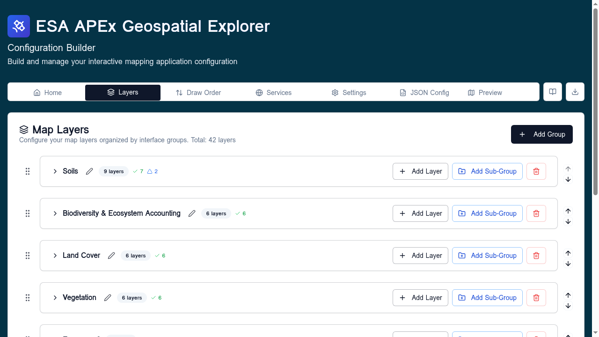
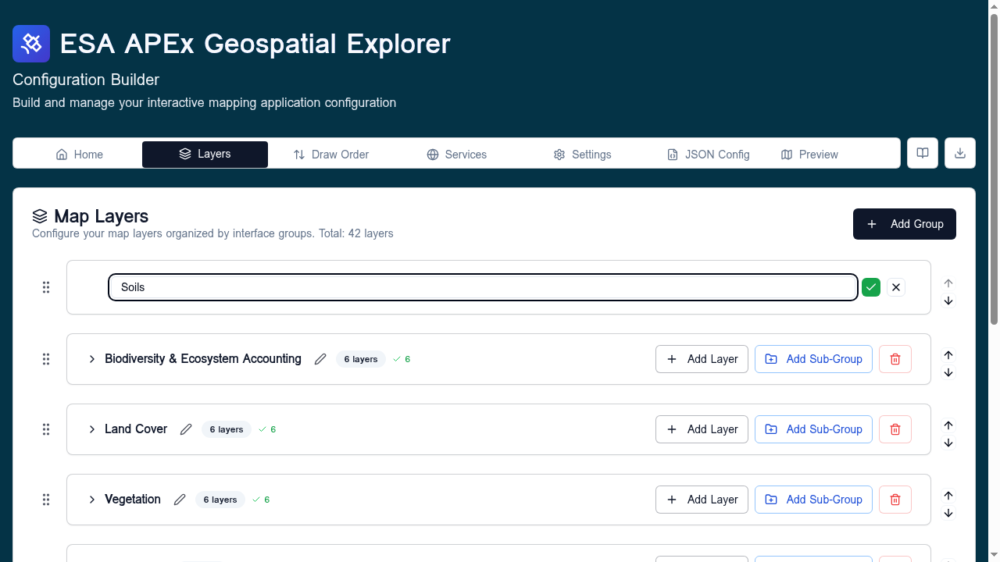

# Interface groups

**Interface groups** are the user-facing groupings shown at the top level
of the deployed APEx Geospatial Explorer's layer panel — for example
*Land Cover*, *Soils*, *Climate*. Every layer card in the config must
belong to one.

!!! tip "Follow along"
    Screenshots on this page were taken with the **Comprehensive demo**
    config loaded.

## Where they live

The **Interface Groups** card appears on the [Settings](../settings/index.md) tab.

The card lists every group as a row, in the order the deployed Explorer
will render them.

## Adding a group

1. Type a name in the **Enter group name** field at the top of the card.
2. Press **Enter** or click the **+** button.

The new group is appended to the bottom of the list. Names are free-form
but should be short — they appear as section headers in the layer panel.

## Reordering

Each row has up/down arrow buttons. The order in this list is the order
groups appear in the deployed Explorer.

- **Single click** ↑ / ↓ — move one position.
- **Double click** ↑ / ↓ — jump to the top / bottom.
- The drag handle (⋮⋮) on the left supports drag-and-drop reordering for
  longer lists.

## Renaming

Click the pencil icon on a row to enter rename mode. Edit the value and
click the green check to confirm or the outline button to cancel. Press
**Enter** to confirm from the keyboard.

When you rename a group, every layer card that referenced the old name is
updated to the new name automatically.

## Deleting

Click the red trash-can icon. You will be blocked from deleting a group
that still contains layers — move or delete the layers first.

## Group occupancy

Each row shows a count: `(N sources)`. This is the number of data sources
currently assigned to layers in that group, useful as a sanity check
before deleting or reordering.

## Sub-interface groups

Sub-groups are **not** declared here. They are typed directly into the
**Sub-interface group** field on each layer card. Any sub-group name used
on at least one card automatically appears as a folder under its parent
interface group in the deployed Explorer.

For the conceptual model see [Layers overview → How the tab is laid out](../layers/index.md#how-the-tab-is-laid-out).

## Tips

- Keep the number of top-level groups small (3–6 is ideal). Use sub-groups
  on individual layer cards for finer-grained organisation.
- Group names are case-sensitive.
- The order in this list also drives the order in the
  [Draw Order](draw-order.md) tab's grouping.
