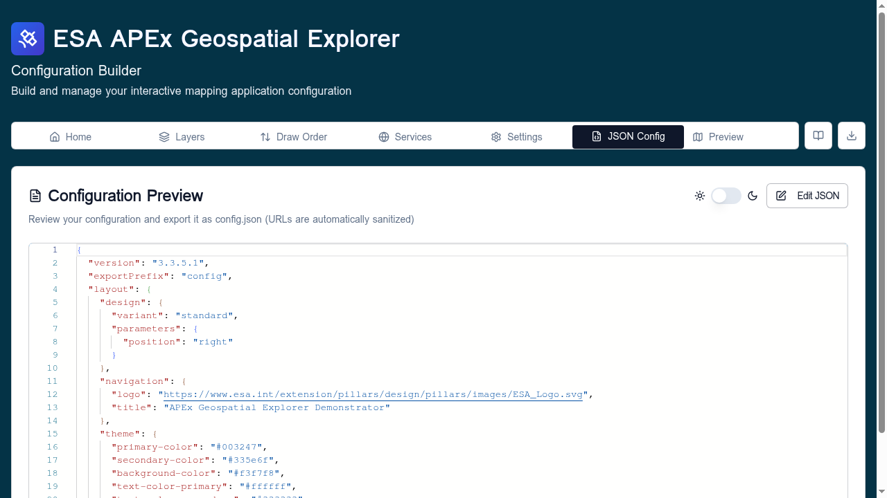
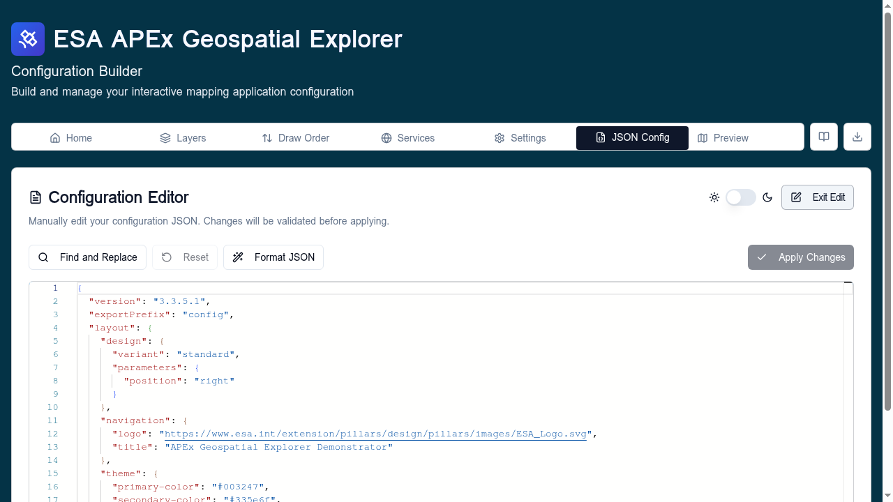

# JSON config

The **JSON Config** tab shows the raw configuration document as it would
be exported. Use it to inspect the current state, copy values into
documentation, or paste in a configuration to load. For a field-by-field
breakdown of every key, see the
[JSON schema reference](../reference/json-schema.md).

The tab has two modes: **Preview** (default, read-only) and **Edit**.

## Preview mode

Shows the configuration as syntax-highlighted JSON. URLs are
automatically [sanitised](../reference/url-parameters.md) — query strings
and signed-URL parameters are stripped from the rendered preview.

The toggle next to the title switches between light and dark syntax
themes, and **Edit JSON** enters edit mode.

The same JSON is also available at the `/config.json` route as plain
text, which is useful for fetching from scripts or piping into `jq`.

## Edit mode

Click **Edit JSON** to switch to a free-form editor.

The toolbar provides:

- **Find and Replace** — opens a panel to search the buffer and
  optionally replace matches.
- **Reset** — discards edits and reloads the current in-memory config.
- **Format JSON** — pretty-prints the buffer (2-space indent).
- **Apply Changes** — validates the buffer against the configuration
  [schema](#schema-validation) and, if valid, replaces the in-memory
  config.
- **Exit Edit** — returns to preview mode without applying changes.

### Paste-to-load workflow

Edit mode is the recommended way to load a configuration that was
emailed, pasted from a chat, or copied from another deployed Explorer:

1. Click **Edit JSON**.
2. Select all (Ctrl/Cmd + A) and paste the new JSON.
3. Click **Format JSON** to normalise whitespace.
4. Click **Apply Changes**.

If validation fails, the tab keeps your edits and shows the errors so you
can fix them in place.

## Schema validation

**Apply Changes** runs the buffer through the same Zod schemas the rest
of the app uses (`MetaSchema`, `LayoutSchema`, source/service schemas,
etc.). Validation is strict: unknown top-level fields are rejected, and
optional fields that fail their inner schema are reported with the path
that caused the failure.

For the canonical export workflow with optional sorting, see
[Export options](export-options.md). For the read-only fetch endpoint,
visit [`/config.json`](#preview-mode) on the deployed instance.
