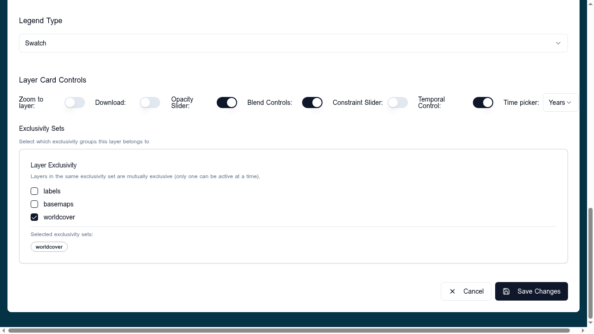

# Constraints

The **Constraints** section of a layer card defines additional raster masks that limit *where* a layer is rendered, based on threshold values pulled from another COG. A typical example: only show a vegetation index where elevation is below 2000 m, or where a land-cover class equals "forest".

## When to use

- Hide pixels outside a numeric range (continuous constraint).
- Show only specific class values (categorical constraint).
- Combine ranges with named labels for a UI slider (combined constraint).

If the user does not need to mask the layer interactively, leave Constraints empty.

## Configure

Expand **Constraints** in the layer card and add one or more entries. Each `ConstraintSourceItem` has:

- **URL** — the constraint COG.
- **Format** — `cog` (only COG is supported).
- **Label** — display name shown in the viewer's constraint UI.
- **Type** — one of:
    - `continuous` — numeric range with `min`, `max`, optional `units`.
    - `categorical` — discrete values listed in `constrainTo` as `{ label, value }`.
    - `combined` — named ranges in `constrainTo` as `{ label, min, max }`.
- **Interactive** — when `true`, the viewer exposes a slider/picker so the user can change the constraint at runtime. When `false`, the constraint is fixed.
- **Band index** — optional, defaults to band 1.

To expose the slider control set `layout.layerCard.controls.constraintSlider: true`.

## Validation

- `url`, `format`, `label`, and `type` are required.
- For `continuous`, both `min` and `max` should be set so the slider has a defined range.
- For `categorical`, `constrainTo` entries need `value`; for `combined` they need `min`/`max`.
- The constraint COG should align spatially with the displayed layer; misalignment causes apparent dropouts.

## Related

- [Statistics](../statistics/index.md) — same data-source shape, different role.
- [COG data sources](../data-sources/cog.md)
