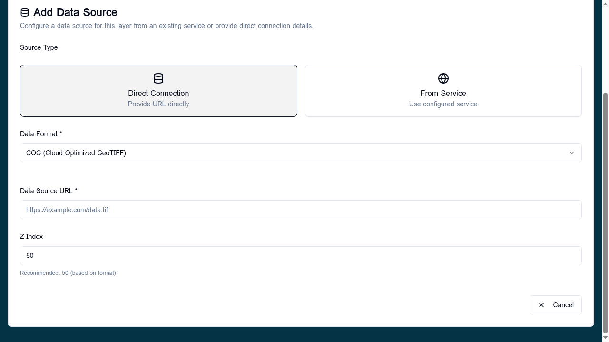
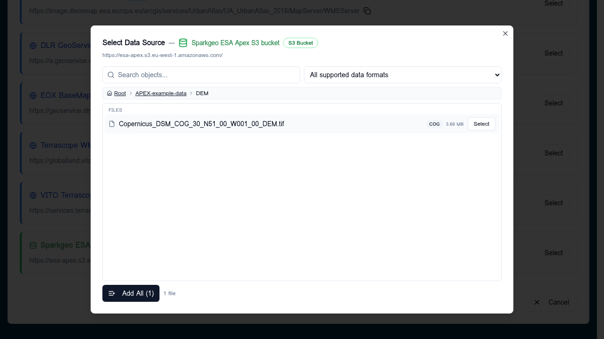

# COG (Cloud Optimized GeoTIFF)

A COG is a single GeoTIFF file laid out so that the APEx Geospatial
Explorer can stream just the tiles it needs over HTTP. COGs are the
preferred raster format for the builder.

## When to use

- Single-band or multi-band rasters served from object storage (S3, MinIO,
  OBS, Azure Blob via HTTPS).
- DEMs, classification maps, indices, hyperspectral cubes, RGB composites.
- Anywhere you would otherwise need a tile service but only have a static
  file.

## Add a COG

Open a Layer Card → **Datasets → Add Dataset**. The default **Source
Type** is **Direct Connection** and the default **Data Format** is COG.

| Field | What to fill in |
|-------|-----------------|
| Source Type | **Direct Connection** for a single COG; **From Service** if it lives inside a [configured S3 service](../services/adding-services.md). |
| Data Format | **COG (Cloud Optimized GeoTIFF)**. |
| Data Source URL | Public HTTPS URL ending in `.tif`/`.tiff`. |
| Z-Index | Stacking hint, default 50. Leave it unless you know you need to override it. |

## From an S3 service

Pick **From Service**, choose your S3 service, then drill into the bucket
in the [S3 browser](s3-browser.md). When the file's extension is `.tif`
the format is auto-detected as COG and the **Select** button activates.

## Validation

- The healthcheck issues a HEAD/range request and confirms the file
  returns 200 and looks like a COG (internal tiles + overviews).
- Files >2&nbsp;GB or with very many bands (hyperspectral) take longer to
  validate; the builder applies internal performance guards.
- If the COG is not actually cloud-optimised (no internal tiling) the
  layer may still load but render slowly.

## Visualisation

After adding the source, pick a styling tool in the layer card:

- Single-band → **Colormap** (or **Categories** for discrete values).
- Multi-band → **RGB composite**, configured per source under the
  [RGB composite](../layers/rgb-composite.md) section.

## Tips

- Prefer COGs that have internal overviews; they are dramatically faster
  to render at coarse zooms.
- Files served from HTTP without range support will fail to load — host
  COGs on S3, CloudFront, or any HTTPS server that honours `Range`.
