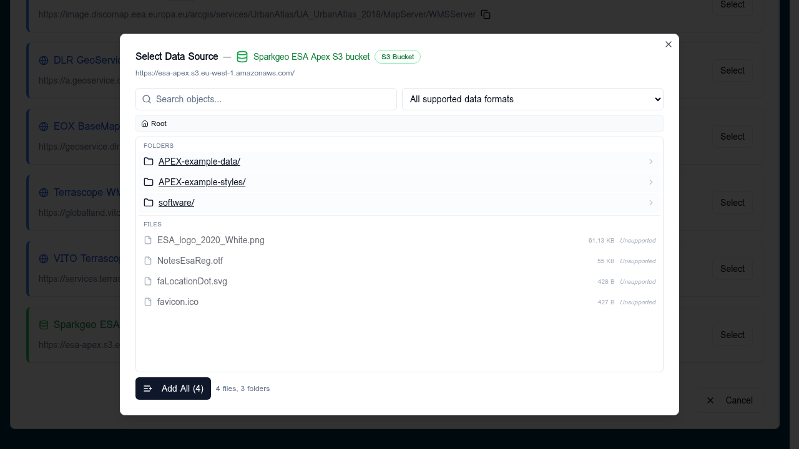
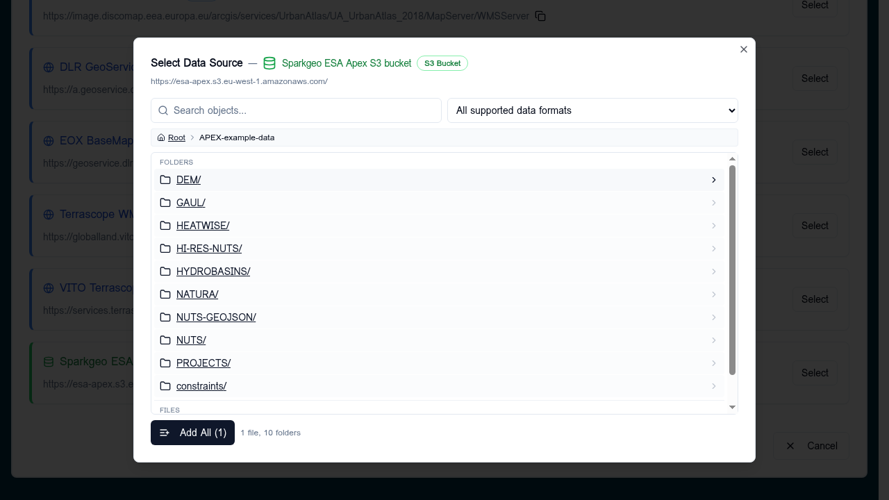

# S3 browser

A folder-style picker for any S3 service registered on the
[Services](../services/index.md) tab. Works against AWS S3, Huawei
OBS, MinIO, and other S3-compatible stores.

!!! info "What ends up in your config"
    The S3 bucket is a browsing aid only. When you select a file, the
    config stores its resolved direct URL — not a reference to the bucket.
    You can delete the S3 service entry afterwards without breaking layers
    built from it.

## Open the browser

In a layer card's data source form, choose **From Service** and select
your S3 service. The browser opens at the bucket root.

The header shows:

- The service name and bucket URL.
- A **Search objects** field (filters the current folder).
- A **Format filter** dropdown — defaults to *All supported data formats*,
  filter by COG, GeoJSON, FlatGeoBuf, CSV, etc.
- A **breadcrumb** showing the current path.

## Navigate

- Click any folder row to drill in. The breadcrumb updates so you can
  jump back any number of levels.
- Files are listed beneath folders. Each file shows its detected format
  (or *Unsupported*), size, and a per-row **Select** button.

## Select a file

Click **Select** on a file row. The dialog closes and the data source
form is populated with the file's URL and detected format.

## Bulk add

The **Add All (n)** button at the bottom adds every supported file in the
current view (after search and format filtering) as separate data
sources. Use this for time-series of many COGs in the same folder, or
when seeding a layer from a folder of FlatGeoBuf shards.

## Supported formats

Files are auto-detected by extension:

| Extension | Format |
|-----------|--------|
| `.tif`, `.tiff` | COG |
| `.geojson`, `.json` | GeoJSON |
| `.fgb` | FlatGeoBuf |
| `.csv` | CSV |
| anything else | *Unsupported* (greyed out, not selectable) |

## Tips

- Bucket listings need either public ACL or a CORS-friendly listing
  endpoint. If the browser shows nothing, check the service URL in the
  Services tab and the bucket's CORS policy.
- For signed URLs (presigned S3, MinIO temp creds), the browser strips
  the query parameters when storing the base URL — the deployed Explorer
  signs requests on its own.
