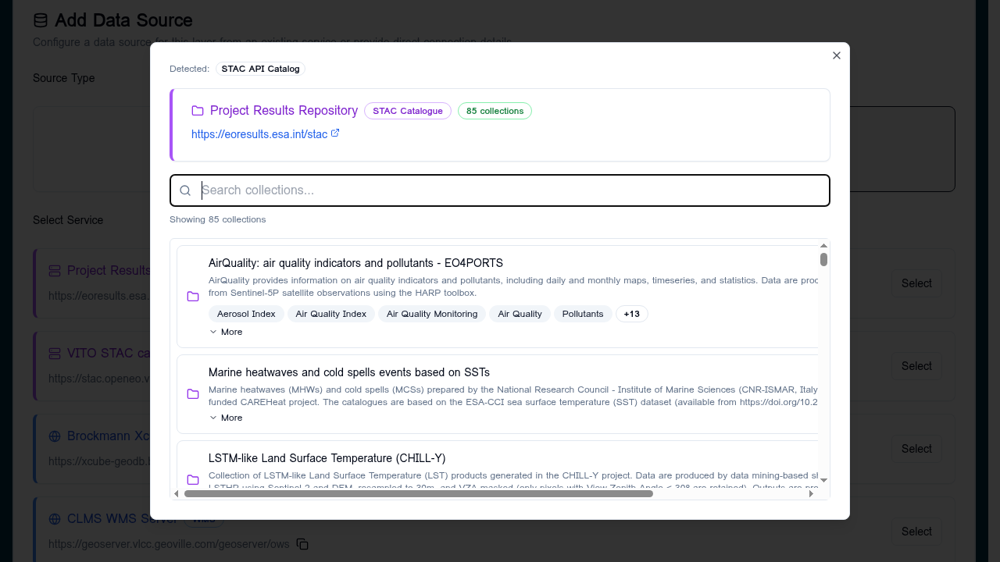
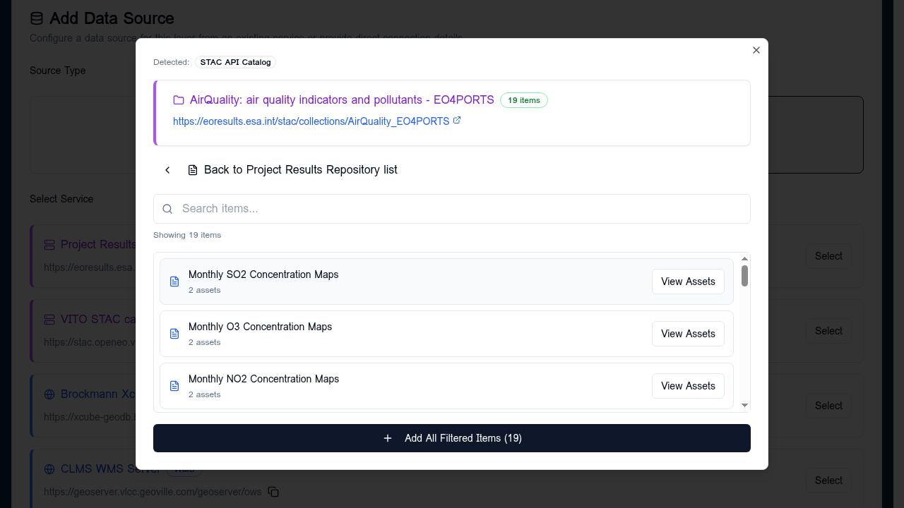
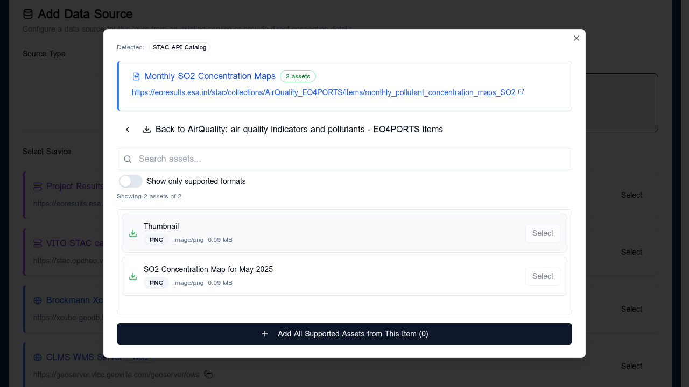

# STAC browser

A three-level picker over any STAC catalogue or API registered on the
[Services](../services/index.md) tab. Walks you from
**Catalogue → Collection → Item → Asset**.

!!! info "What ends up in your config"
    The STAC catalogue is a browsing aid only. When you select an asset,
    the config stores its resolved direct URL (COG, GeoJSON, FlatGeoBuf,
    CSV) — not a reference to the catalogue. You can delete the STAC
    service entry afterwards without breaking layers built from it.

## Open the browser

In a layer card's data source form, pick **From Service** and select your
STAC service. The browser opens at the catalogue's root collections list.

The header shows:

- The catalogue name and a STAC type badge (`STAC API Catalog`, `STAC
  Catalogue`, etc.).
- The catalogue URL — clickable, opens the live JSON in a new tab.
- A **Search collections** field.
- The collection count (e.g. *Showing 85 collections*).

## Drill into a collection

Click a collection to load its items. The header updates with the
collection title, item count, and a back button to the catalogue.

You can search items, then either:

- Click **View Assets** on a single item to see its assets, or
- Click **Add All Filtered Items (n)** to add every visible item as a
  separate data source — useful for time-series.

## Pick an asset

Items contain one or more **assets** (the actual file URLs). The asset
view lists them with format badges, MIME type, and size.

- Toggle **Show only supported formats** to hide previews and metadata
  files.
- Click **Select** on any asset to populate the data source form.

## Format detection

Each asset's format is detected from the actual MIME type returned by
HEAD when possible, falling back to the extension. Supported formats
match the rest of the builder: COG, GeoJSON, FlatGeoBuf, CSV; PNG/JPEG
appear as previews only.

## Direct STAC links

You can paste a direct STAC item URL or an openEO results URL into the
browser's URL field at any level — the builder figures out where in the
catalogue tree to open. See the
[STAC direct links](../reference/url-parameters.md) reference for the
supported shapes.

## Tips

- Catalogues with thousands of collections are paginated server-side. Use
  the search field rather than scrolling.
- If a collection's items take a long time to list, the underlying STAC
  API may be rate-limiting. Filter by date upstream where possible.
- Signed URLs are common in commercial STAC catalogues; the builder
  stores the base URL and re-signs at view time when supported.
