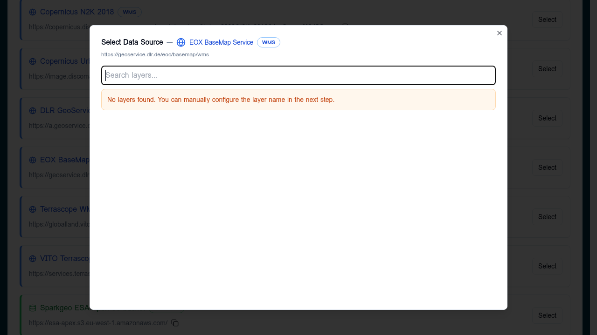

# WMS / WMTS / WFS

OGC services that the builder consumes via `GetCapabilities`. WMS and WMTS
return rendered raster tiles; WFS returns vector features.

## When to use

- **WMS** — server-rendered raster maps, e.g. EEA, Copernicus, GeoServer
  endpoints. Good when the publisher controls the styling.
- **WMTS** — pre-cached raster tiles. Faster than WMS for global basemaps.
- **WFS** — server-side vector queries. Use when the dataset is too large
  to ship as a single GeoJSON/FlatGeoBuf.

For all three you must add the service first on the
[Services](../services/index.md) tab so the builder can read its
capabilities.

## Add a WMS/WMTS/WFS layer

In a Layer Card → **Datasets → Add Dataset**, choose **From Service** and
pick the service. The builder loads the capabilities and shows a layer
picker.

- If layers are listed: search, click one, **Select**.
- If the picker reports no layers (capabilities blocked, CORS, or unusual
  schema), close it and use **Direct Connection** instead — the form will
  let you type the layer name by hand.

## Direct connection

Pick **Direct Connection**, set **Data Format** to WMS, WMTS, or WFS, and
provide:

| Field | Notes |
|-------|-------|
| Data Source URL | Base endpoint without query string (e.g. `https://example.org/geoserver/ows`). |
| Layer Name | The OGC layer or feature type identifier (`workspace:layer`). |

The placeholder in the URL field shows the expected shape per format.

## Validation

- The healthcheck calls `GetCapabilities` and confirms the named layer is
  present.
- Common failures: missing `https://`, the endpoint requires authentication,
  or CORS isn't enabled for the deployed Explorer's origin.

## Tips

- Prefer **WMTS** over **WMS** for basemaps — much lower latency.
- Pin the time/CRS in the layer URL when the service offers multiple, so
  the deployed Explorer always requests the version you tested with.
- For WFS, watch the response size; the deployed Explorer pulls the full
  feature collection in the viewport.
