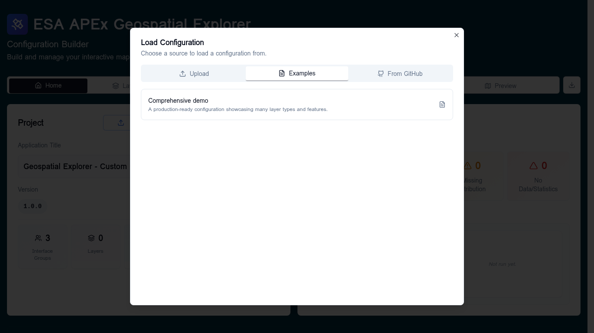

# Loading and saving

The Configuration Builder never auto-saves to a server — your work lives in
the browser session and is exported as a JSON file. There are four ways to
**load** an existing config and one way to **export**.

## Loading a config

From the **Home** tab click **Load** to open the **Load Configuration**
dialog.

Three sources are available:

| Source       | When to use it |
|--------------|----------------|
| **Upload**   | A `config.json` you already have on disk. |
| **Examples** | Start from the bundled **Comprehensive demo** — useful for learning the app or as a template. |
| **From GitHub** | Browse a configured GitHub repo (default: `ESA-APEx/apex_geospatial_explorer_configs`) and pick any `config.json` from any branch. |

While loading, the dialog shows a four-stage progress bar: **Parsing JSON →
Normalizing structure → Validating schema → Done**. If the schema validation
fails, the dialog hands the offending file to a recovery dialog where you can
fix or remove invalid entries.

## The unsaved-changes guard

Anything that would discard the current config (loading a different one,
clicking **New**, navigating away) prompts you with an **Unsaved Changes**
warning when there are recent unexported edits. Confirm to continue or
cancel and export first.

## Exporting

From the **Home** tab use the **Export** dropdown:

- **Quick Export (Default)** — downloads the current config as JSON immediately.
- **Export with Options…** — opens the [Export options](../configuration/export-options.md)
  dialog, where you can choose JSON ordering and other formatting options.

The exported file is what you ship to the APEx Geospatial Explorer host.

## Starting fresh

Click **New** on the **Home** tab to reset the builder to an empty
configuration. The unsaved-changes guard applies here too.
