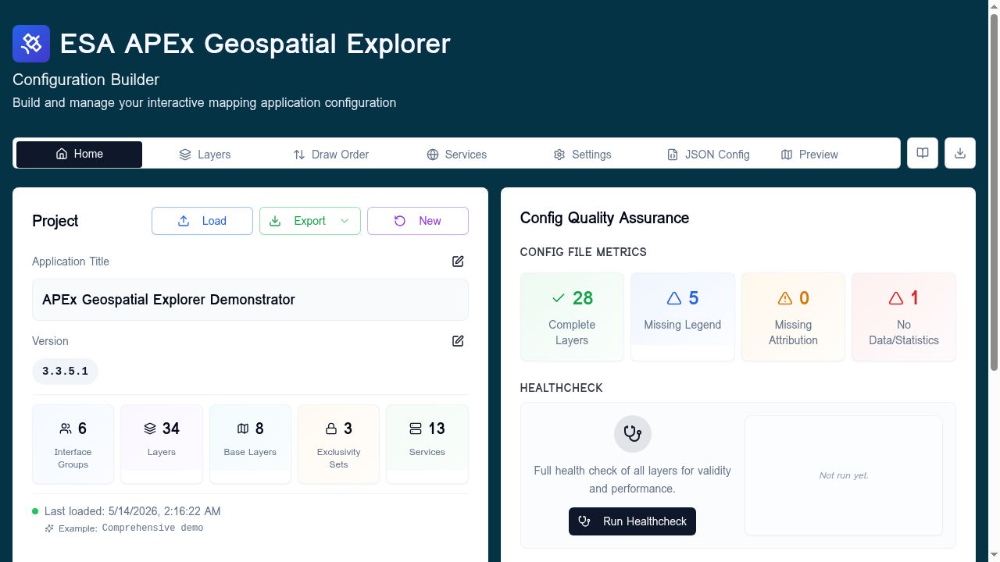

# Home tab overview
The **Home** tab is the project dashboard. It is where you load and save
configurations, edit project metadata, see what your config contains at a
glance, and launch the healthcheck.

!!! tip "Follow along"
    Screenshots on this page were taken with the **Comprehensive demo**
    config loaded. Load it from **Home → Load → Examples → Comprehensive
    demo** to reproduce them.

## Layout

The tab is split into two equal cards.

| Card | Purpose |
|------|---------|
| **Project** (left) | Load / Export / New, application title, version, and per-config statistics. |
| **Config Quality Assurance** (right) | Per-layer QA metrics and the entry point for **Run Healthcheck**. |

## Project card

### Load, Export, New

Three buttons sit at the top right of the **Project** card.

- **Load** opens the [Load Configuration](../getting-started/loading-saving.md)
  dialog. From here you can upload a local JSON file, pull from a URL, fetch a
  config from a GitHub repository, or pick one of the bundled examples.
- **Export** is a dropdown:
    - **Quick Export (Default)** — downloads the current config immediately as
      `<prefix>_YYYYMMDD_HHMM.json`. The `<prefix>` portion comes from the
      **Export filename prefix** field on the
      [Settings tab](../settings/index.md#config-export-settings); see
      [Loading and saving → Filename convention](../getting-started/loading-saving.md#filename-convention)
      for details.
    - **Export with Options…** — opens the
      [Export options](../configuration/export-options.md) dialog where you can control
      JSON ordering and other formatting choices.
- **New** clears the workspace back to an empty config. You will be warned if
  there are unsaved changes.

### Application title and version

Both fields are inline-editable: click the pencil icon, edit, then **Save**.

- **Application Title** — the human-readable name shown in the deployed
  APEx Geospatial Explorer header.
- **Version** — the config document version (free-form, but semantic
  versioning like `1.2.0` is recommended).

### Config statistics

A row of five compact counters summarises the config:

| Stat | What it counts |
|------|----------------|
| **Interface Groups** | Top-level groupings declared in [Settings](../settings/index.md). |
| **Layers** | Data-source layers, excluding base layers. |
| **Base Layers** | Background basemap layers. |
| **Exclusivity Sets** | Mutual-exclusion groups defined in Settings. |
| **Services** | Endpoints declared on the [Services](../services/index.md) tab. |

### Status info

When present, three status lines appear under the statistics:

- **Last loaded** — timestamp plus the source (upload, example, GitHub, URL).
- **Last exported** — when you most recently exported JSON from this session.
- **Loading configuration…** — shown while a load is in flight.

## Config Quality Assurance card

### Config file metrics

Four QA counters give you a one-glance view of issues that won't cause a
healthcheck failure but are worth fixing before you ship a config:

| Metric | Meaning | Click behaviour |
|--------|---------|-----------------|
| **Complete Layers** | Layers with everything filled in correctly. | — |
| **Missing Legend** | Layers without a legend definition. | Opens the list of affected layers. |
| **Missing Attribution** | Layers with no attribution string. | Opens the attribution dialog so you can fix them. |
| **No Data/Statistics** | Layers missing a `data` URL or, where required, a `statistics` URL. | Opens the list so you can jump straight to each layer. |

The counts update live as you edit the config.

### Healthcheck

The bottom panel is the entry point to the [Run Healthcheck](../services/healthcheck.md)
tool, which probes every URL in your config and reports per-layer **Data
Access** and **Performance** scores.

- Click **Run Healthcheck** to start. On the first run it opens the **Complete
  Layers** dialog and runs automatically.
- After a run, the right side of the panel shows a results summary
  (counts of pass / partial / fail for Data Access and good / average / poor
  for Performance). Click the summary to re-open the detailed dialog.
- The button label changes to **Re-run Healthcheck** once results exist.

For a full walk-through with screenshots see [Run Healthcheck](../services/healthcheck.md).

## When to come back to Home

- After loading a new config — confirm the title, version, and statistics
  match what you expected.
- After any meaningful edit — re-run the healthcheck.
- Before exporting — clear the four QA counters where you can, then re-run
  the healthcheck so the consumer of your config sees a clean baseline.
