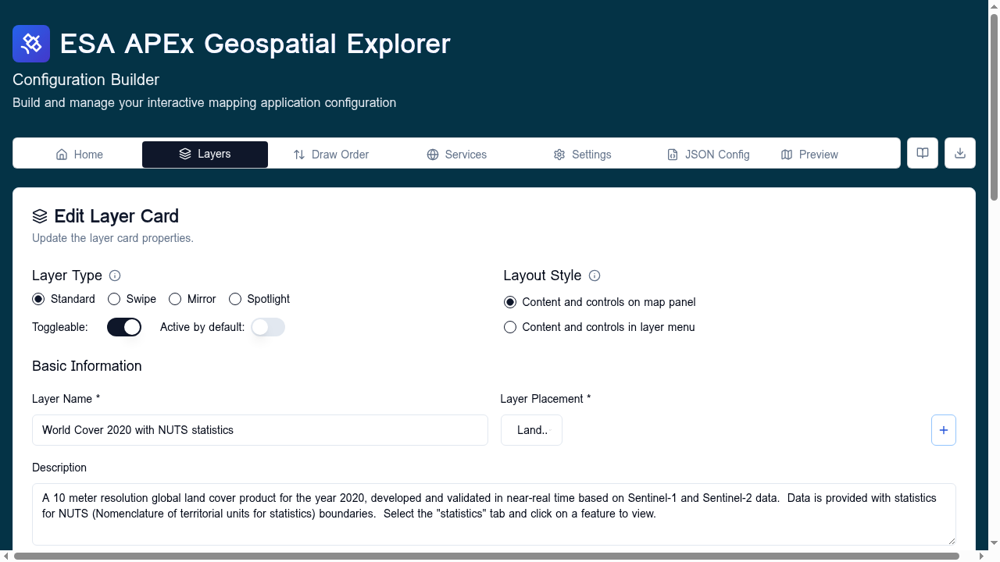

# Base layers

Base layers are the basemap that sits underneath all other layers on the
map. They are managed separately from regular layer cards because only one
base layer can be visible at a time, and they typically have no toggleable
visibility, no statistics, and no constraints.

## When to use

Use a base layer for any map background the user picks from a basemap
selector — for example:

- OpenStreetMap, Carto, or Stamen tile sets (XYZ)
- A WMTS topographic or satellite background
- A custom organisation basemap served as XYZ or WMS

Use a [standard layer card](standard-layers.md) instead when the data
should be **toggleable**, stack with other layers, or carry styling,
statistics, or constraints.

## Configure

Each base layer has:

- **Name** — shown in the basemap picker.
- **Preview image** — optional thumbnail (`preview` URL) shown next to the
  name in the picker.
- **Data source** — usually a single XYZ, WMTS, or WMS source. Multiple
  sources are allowed but uncommon.
- **Attribution** — required text (and optional link) credited on the map.

Layout, statistics, constraints, and most layer-card controls do not apply.
The `isBaseLayer: true` flag at the top of the layer marks it as a basemap
rather than a data overlay.

## Validation

- At least one data source is required.
- Attribution text is required.
- The first base layer in the list is the default selection on map load.

## Add a base layer

1. **Open the Add New Layer screen** — click **Add Layer** at the *top* of
   the Layers tab. This is important: when you launch Add Layer from inside
   an interface group, the second tile becomes **Import Layer Card** and
   the **Base Layer** option is hidden.
2. **Pick the *Base Layer* tile** in the type selector.
3. **Fill in the slim base-layer form**:
    - **Name** — what the basemap picker will show.
    - **Preview image URL** — optional thumbnail.
    - **Data source** — provide the URL and pick the format (XYZ, WMTS, or
      WMS are typical).
    - **Attribution** — required.
4. **Save Layer**. The new base layer appears in the **Base Layers**
   section at the top of the Layers tab.
5. To make a base layer the default selection on map load, drag it to the
   top of the Base Layers list.

## Related

- [Layers](types/index.md) — overview of the three layer types.
- [Standard layers](standard-layers.md) — for toggleable data overlays.
- [XYZ](../data-sources/xyz.md) and
  [WMS / WMTS / WFS](../data-sources/wms-wmts-wfs.md) — common base-layer
  source formats.
