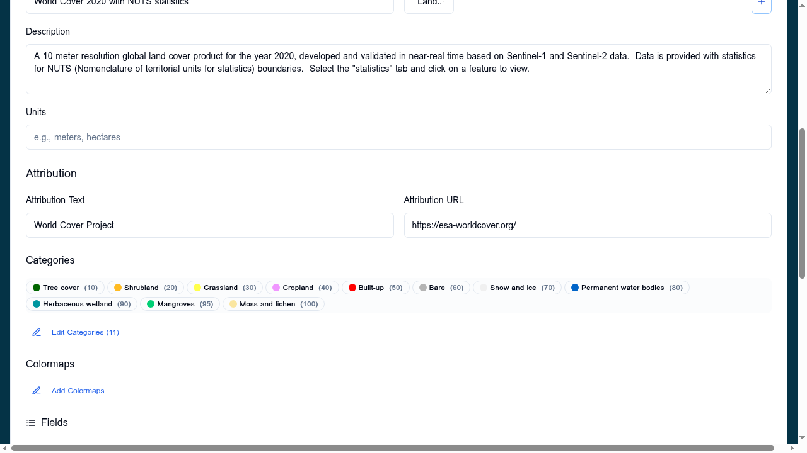
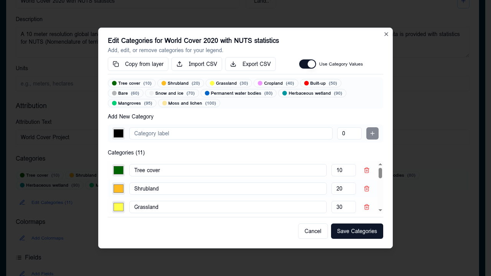

# Categories

The **Categories** sub-section of the layer card's [Data Visualisation](data-visualisation.md) panel styles rasters whose pixel values represent **discrete classes** (e.g. ESA WorldCover land-cover codes, soil type, administrative region).

Each category row defines:

- **Value** — the pixel value (integer)
- **Label** — human-readable name (e.g. `Tree cover`, `Cropland`)
- **Colour** — fill colour for that class

## Configuring categories

1. Open the layer card → expand **Data Visualisation**
2. Click the **+** next to **Categories**
3. Add rows for each pixel value, or use **Copy from another layer** if a sibling layer already has the right categories
4. Save — the badge in the layer card shows the category count (e.g. `11 classes`)

## Copy from another layer

The category editor includes a **Copy from layer** action that lists all layers with existing categories. Useful when several products share the same legend (e.g. multiple WorldCover years).

## Tips

- Values not listed are rendered transparent
- Order is presentational only — the renderer matches by `value`
- Hex colours are normalised to `#rrggbb` on save

## When categories don't fit

- For continuous numeric values → use [Colormaps](colormaps.md)
- For three-band imagery → use [RGB composite](rgb-composite.md)
- For vector data → use [Vector styling](vector-styling.md)
