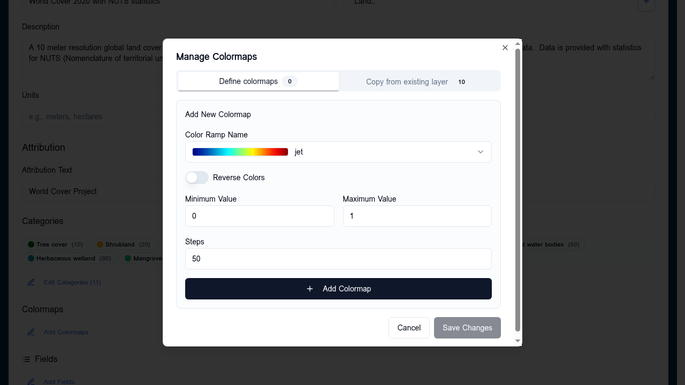

# Colormaps

The **Colormap** sub-section of the layer card's [Data Visualisation](data-visualisation.md) panel styles rasters whose pixel values are **continuous numeric** (e.g. NDVI, elevation, temperature). A colormap maps the value range to a gradient.

## Configuring a colormap

1. Open the layer card → expand **Data Visualisation**
2. Click the **+** next to **Colormap**
3. Pick a preset (Viridis, Plasma, Turbo, RdBu, …) or build a custom ramp
4. Set the **min** and **max** of the input range — values outside are clamped
5. Optional: enable **reverse** to flip the gradient
6. Save

## Custom ramps

Custom ramps are an ordered list of `(stop, colour)` pairs. The renderer interpolates linearly between adjacent stops. Use stops at `0` and `1` for a normalised input, or use the layer's value range directly.

## Choosing a preset

| Data shape | Recommended preset |
|---|---|
| Sequential, low-to-high (NDVI, biomass) | Viridis, Plasma, Magma |
| Diverging around a midpoint (anomaly, change) | RdBu, BrBG, PiYG |
| Cyclic (aspect, phase) | Twilight, HSV |
| High-contrast / categorical-like continuous | Turbo |

## When colormaps don't fit

- For discrete classes → use [Categories](categories.md)
- For three-band imagery → use [RGB composite](rgb-composite.md)
- For vector data → use [Vector styling](vector-styling.md)
