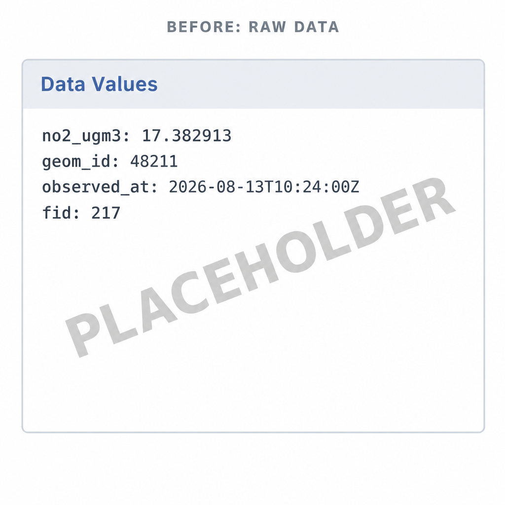
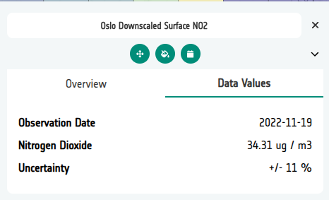

# Data Values (vector)

When a user clicks a vector feature in the Geospatial Explorer — a country
polygon, a monitoring site, a building footprint — the **Data Values** panel
lists that feature's properties. What it shows there is entirely up to you.



Left unconfigured, the panel presents the data exactly as it is stored: raw
property names (`no2_ugm3`), full-precision numbers (`17.382913`), ISO
timestamps, and internal fields like `fid` or `geom_id` that mean nothing to
a reader. That is faithful, but not friendly — and the Explorer has no way
of knowing what your data means or how you would like it presented.

The Configuration Builder lets you customise the display so the same
feature reads like this instead:



*[Placeholder screenshots — replace with real Explorer captures.]*

## What you can change

Each field of a vector data source can be configured independently:

| Option | What it does |
|--------|--------------|
| **Display label** | Replaces the raw property name with a prettier version, e.g. `no2_ugm3` → `NO₂`. |
| **Prefix / Suffix** | Adds text before or after the value — units (` µg/m³`, ` %`, `°C`), qualifiers (`≈ `), anything the value needs for context. |
| **Precision** | Rounds numeric values to a fixed number of decimal places (e.g. `17.382913` → `17.4`). |
| **Type** | Marks a field as `Date` or `DateTime` so the timestamp is formatted for reading rather than shown as raw ISO 8601. |
| **Display order** | Controls the sequence the fields appear in the panel — set by arranging the rows in the fields editor. |
| **Hide** | Removes a field from the panel entirely — ideal for internal IDs, geometry references and other noise. A hidden field stays in the config (stored as `null`), so unhiding it later restores everything. |

!!! tip "Styling is separate"
    Data Values controls what users read when they query a feature. How
    features look on the map — colours, strokes, interpolation — is
    [Vector styling](vector-styling.md).

## How it's done

In the Configuration Builder, open the layer card for a vector layer
(GeoJSON, FlatGeoBuf or WFS) and open the **Manage Fields** editor. Fields
can be populated automatically from the source file with **Populate field
details** — if the layer has several vector files, a searchable picker lets
you choose which one to read the fields from — and existing field settings
can be copied from another layer with **Copy from layer**.

The editor presents one row per field:

- **Field name** — the property name in the data, shown in monospace.
- **Display label, Prefix, Suffix** — inline text inputs for the readout.
- **Precision** — decimal places for numeric values.
- **Type** — `default`, `Date` or `DateTime`.
- **Hide** — a toggle; hidden rows stay in the table, greyed out.
- Rows are arranged with the drag handle or the up/down chevrons, and that
  order becomes the display order in the Explorer.

## Where the settings live

Field settings are stored on the data source under `meta.fields`, keyed by
the raw property name. A string is all it takes for a simple rename; an
object carries the full configuration, and `null` hides the field:

```json
"meta": {
  "fields": {
    "no2_ugm3": { "label": "NO₂", "suffix": " µg/m³", "precision": 1, "order": 1 },
    "observed_at": { "label": "Observed", "type": "date", "format": "dd MMMM yyyy, HH:mm", "order": 2 },
    "geom_id": null,
    "fid": null
  }
}
```

Because the settings live in the config, they travel with import, export
and JSON editing like everything else.

## Related

- [Vector styling](vector-styling.md) — how features look on the map
- [Standard layers](standard-layers.md) — where vector layers are configured
