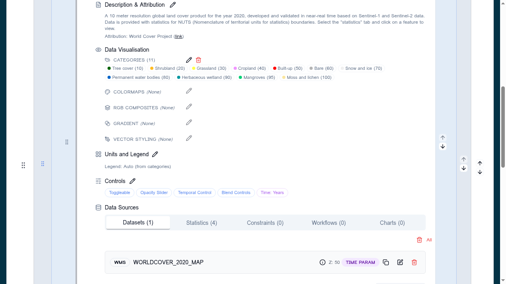

# Data visualisation overview

The **Data Visualisation** section of the layer card (Eye icon) is where you control how a layer is *rendered* on the map — colours, classifications, RGB band combinations, and vector styling.

## Mutually exclusive styling tools

For each raster layer, only **one** styling tool can be active at a time. The sub-sections appear in the layer card in the same order as the UI:

1. **Categories** — discrete classes with labels and fixed colours
2. **Colormaps** — continuous gradient applied to a single band
3. **RGB Composite** — three bands rendered as Red / Green / Blue channels
4. **Gradient** — simple two-stop gradient
5. **Vector Styling** — non-exclusive; only applies to vector sources (GeoJSON, FlatGeoBuf, WFS) and can coexist with any raster setting on layers that mix sources

Activating one raster tool clears the others.

!!! tip "Why exclusive?"
    A pixel can only be one colour. Letting two raster styling tools run at once would force the renderer to pick one silently, hiding the other from the configuration author.

## The section layout

Each sub-section shows:

- A **label** (Categories, Colormap, RGB Composite, Gradient, Vector Style)
- A **summary badge** of the current setting (e.g. coloured R/G/B band numbers, colormap swatch, category count)
- **Pencil** (edit) and **Trash** (clear) icons aligned to the right

Empty sub-sections show an "Add…" affordance instead of the badges.

## Choosing a tool

| Source type | Recommended starting point |
|---|---|
| Categorical raster (land cover, soil class) | **Categories** |
| Single-band raster (e.g. NDVI, DEM) | **Colormap** |
| Multi-band imagery (Sentinel-2, Landsat, hyperspectral) | **RGB Composite** |
| GeoJSON / FlatGeoBuf points or polygons | **Vector Style** + **Vector Fields** |

See the per-tool pages:

- [Categories](categories.md)
- [Colormaps](colormaps.md)
- [RGB composite](rgb-composite.md)
- [Vector styling](vector-styling.md)
- [Vector fields](vector-fields.md)

## Clearing a setting

Pressing the **Trash** icon resets that tool's underlying configuration:

- Categories and Colormaps → empty array on the layer
- RGB Composite → bulk-removes the `convertToRGB` flag and `bands` array from every data source belonging to the layer
- Vector Style → removes the inline style block

Clearing one tool does **not** automatically activate another — the layer falls back to the viewer's default rendering until you pick a new tool.
