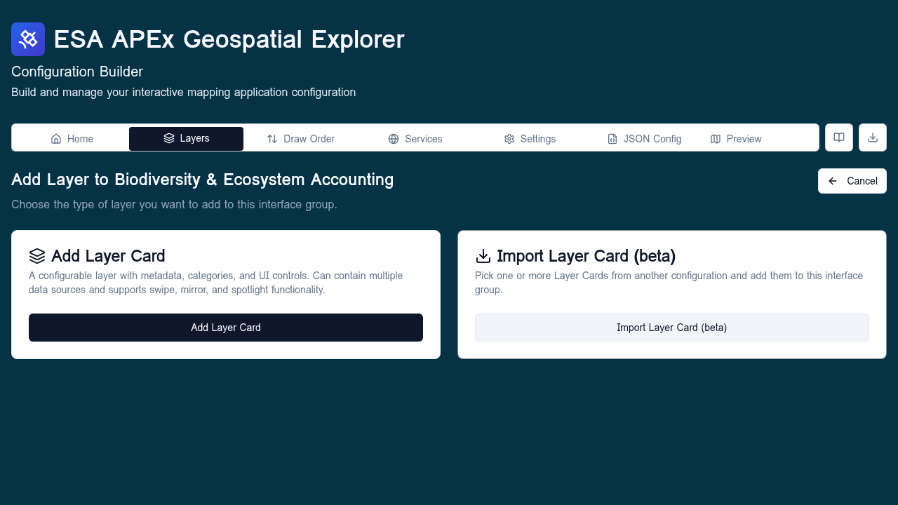
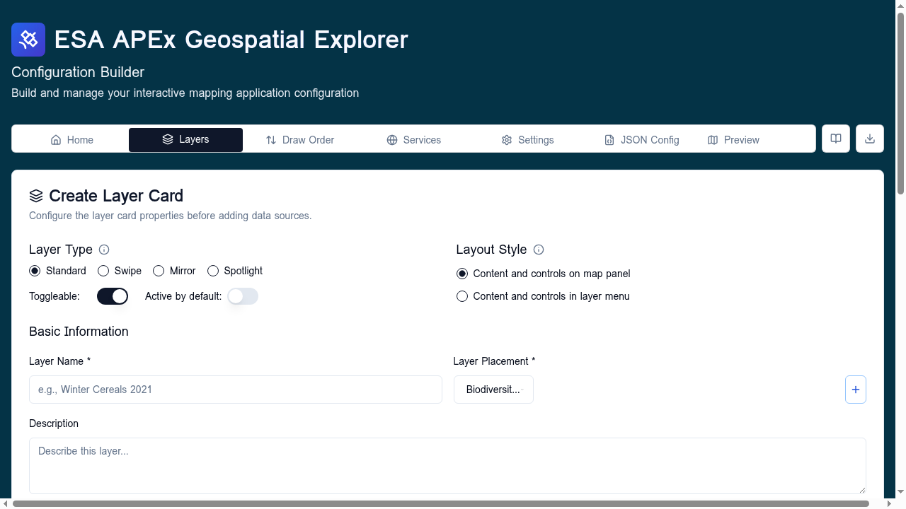

# Standard layers

A **standard layer** is the default kind of layer card — a toggleable,
styled overlay that the user picks from the layer panel. It is the right
choice for almost any data overlay that is not a basemap or a swipe
comparison.

!!! tip "Follow along"
    Screenshots on this page were taken with the **Comprehensive demo**
    config loaded.

## What a standard layer carries

| Section | Purpose |
|---------|---------|
| **Basic info** | Title, description, interface group, optional sub-interface group. |
| **Data sources** | One `data` source plus optional `statistics`. RGB composites and time-series use multiple sources here. |
| **Visualisation** | Exactly one of: colormap, RGB composite, vector styling, or categories. See [Data visualisation](data-visualisation.md). |
| **Legend, attribution, fields, controls** | Optional but they clear Config QA flags. |

### Sources expected by sub-type

| Sub-type | Sources |
|----------|---------|
| Standard raster or vector | One `data` source, optional `statistics`. |
| RGB composite | Three or more raster sources, one per band. |
| Time-series | One `data` source plus per-timestamp variants. |

## Add a standard layer

### Step 1 — Open the Add New Layer screen

There are two entry points:

- **Layers tab → Add Layer** (top of the tab) — opens the type selector
  with no preselected interface group.
- **Layers tab → "+" inside an interface group** — opens the type selector
  with that group preselected; the screen header reads *Add Layer to
  &lt;group name&gt;*.

The selector shows two tiles. Pick **Add Layer Card**.

### Step 2 — Fill in the editor

The layer editor opens. Work through the sections top to bottom.

**Basic info**

- **Title** — the label shown in the layer panel.
- **Description** — markdown is supported and rendered in the deployed
  Explorer's info panel.
- **Interface group** and optional **Sub-interface group**. Sub-groups are
  free text — type the same value on multiple cards to group them.
- **Layer type** — leave on **Standard** (or pick **Swipe** to switch to
  the [Swipe layer](swipe-layers.md) flow).

**Data sources**

Click **Add Data Source** to open the [Data Source form](#step-3-the-data-source-form).
Add as many as the sub-type needs (see the table above).

**Visualisation**

Pick exactly one styling tool — they are mutually exclusive:

- **Colormap** — for single-band rasters.
- **RGB composite** — multi-band raster colour mixing.
- **Vector styling** — rule-based fills, strokes, point symbols.
- **Categories** — discrete-value colour classification.

See [Data visualisation](data-visualisation.md) for the trade-offs.

**Legend, attribution, fields, controls**

Lower sections cover legend image, attribution string, vector field labels,
and UI controls (opacity slider, swipe handle, etc.). All optional but
populating them clears Config QA flags on the [Home tab](../home/index.md).

**Save**

Click **Save Layer** to add the card. The Layers tab updates immediately
and the new card scrolls into view.

### Step 3 — The Data Source form

The form has two paths.

**Direct connection.** Provide a URL and pick the format. Use this when the
data is a single standalone file — a one-off COG, GeoJSON, FlatGeoBuf, CSV,
or XYZ template.

**From an existing service.** Pick one of the services declared on the
[Services](../services/index.md) tab. The form then offers:

- For **WMS/WMTS/WFS** — a layer/feature picker populated from
  `GetCapabilities`.
- For **STAC** — the [STAC browser](../data-sources/stac-browser.md).
- For **S3** — the [S3 browser](../data-sources/s3-browser.md).

After you pick the layer, the form pre-fills the URL and any time-series
or band metadata it can detect.

**Statistics source.** For COG-backed raster layers you can optionally add
a **Statistics** source: a FlatGeoBuf or GeoJSON of zonal-statistics
features. Click **Add Statistics Source** instead of **Add Data Source** to
start the form in statistics mode.

## Import Layer Card (beta)

When you launch **Add New Layer** from inside an existing interface group,
the second tile becomes **Import Layer Card** instead of **Base Layer**.
This lets you copy one or more standard layer cards from another
configuration into the current group.

1. Pick a donor configuration (file upload, URL, GitHub repo, or example).
2. The donor's layer cards are listed grouped by their original interface
   group. Tick the cards you want.
3. Click **Import** — the chosen cards are appended to the current group,
   bringing their data sources, styling, and metadata with them.

Imported services are added to the current config's service list if they
are not already present. Duplicates are deduped by URL.

## After saving

- Run the [healthcheck](../services/healthcheck.md) to confirm the new
  layer reaches its data source.
- Open [GE Preview](../configuration/preview.md) to see the layer rendered
  in the actual APEx Geospatial Explorer.
- If the layer fails to render, double-check the data source URL, that
  it appears in the right interface group, and that the chosen
  visualisation matches the data type.

## Related

- [Layers](types/index.md) — overview of the three layer types.
- [Swipe layers](swipe-layers.md) — for side-by-side raster comparison.
- [Base layers](base-layers.md) — for basemaps.
- [Data visualisation](data-visualisation.md) — colormaps, RGB composite,
  vector rules, categories.
