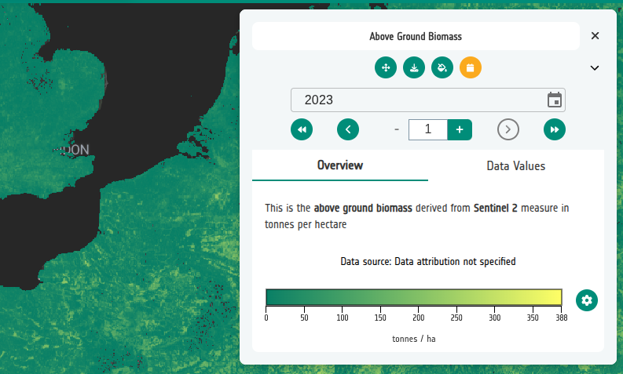
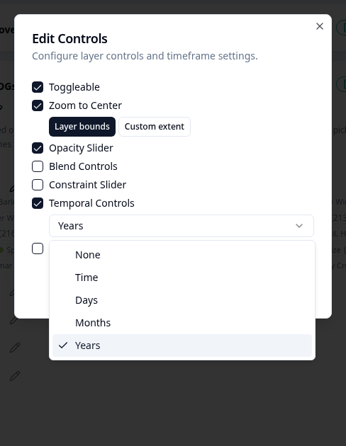
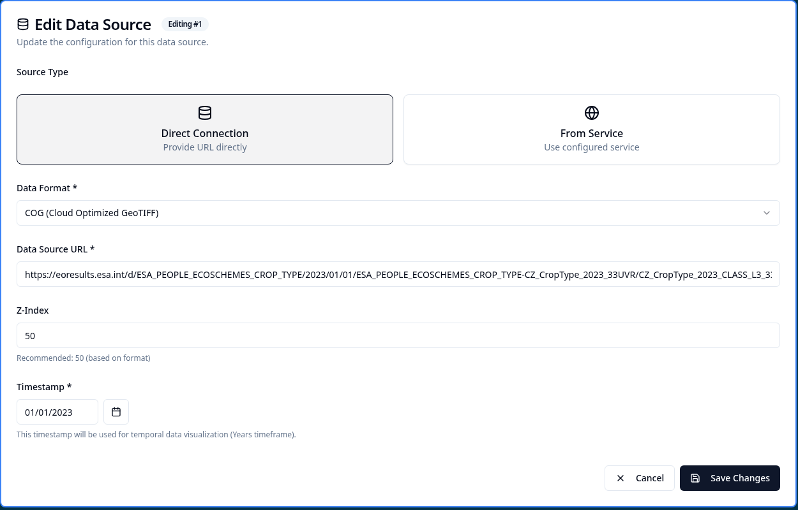
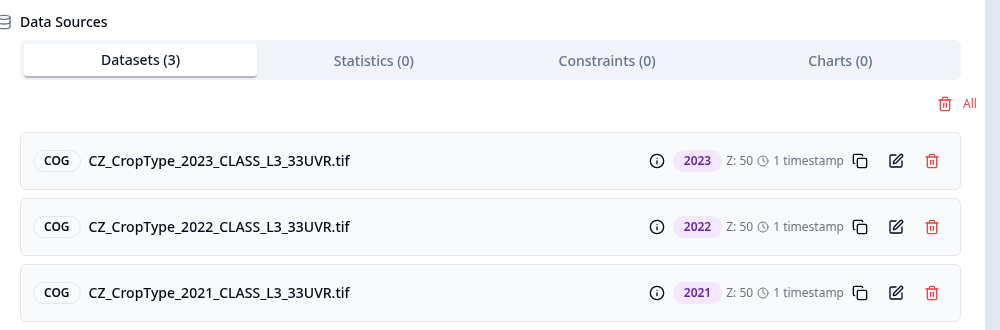

# Time Series

A **time series layer** is a layer whose data changes over time. The Geospatial Explorer shows a temporal control that steps through the available time periods, for example moving from one day, month, or year to the next.

Time series layers can be set up in three ways:

- **Individual timestamped datasets** — COGs, GeoJSON, FlatGeoBuf, CSV, or other supported formats, where each dataset is given a manual timestamp in the configuration.
- **STAC collections** — a STAC collection whose items already carry timestamps. The Configuration Builder can either copy each item's datetime into the layer's datasets, or, from Geospatial Explorer v4.2 onwards, keep the STAC collection itself as a single data source so the Explorer dynamically builds the timestamp set on load. The dynamic approach is best for collections that are continuously updated, because newly added items appear automatically without re-exporting the configuration.
- **Services with a time parameter** — WMS or WMTS layers that advertise a `TIME` dimension, either as a list of explicit dates or as a start/end/interval.




## Setting the timeframe

The **timeframe** does two things in the Geospatial Explorer:

1. It controls how the temporal control formats the current date in the user interface.
2. It determines the interval the control uses when stepping through the data.

**Display format.** Depending on the timeframe, the Explorer shows the date as:
- a year, for example **2026**;
- a year and month, for example **2026-06**;
- a full date, for example **2026-06-01**.

**Stepping interval.** The timeframe also sets the unit used when moving forwards or backwards. For example, if a WMS or WMTS layer's `TIME` dimension advertises daily increments, setting the timeframe to **Days** steps through every explicit day and shows the full date. Setting it to **Months** instead jumps to the nearest date one month ahead or behind the current position, and the UI shows only the month, not the full date.

When you set timestamps manually — for example 1 January 2025 and 1 January 2026 — choosing **Years** as the timeframe tells the Explorer to treat those as yearly products and display only the year, even though each stored timestamp is a complete date.

Layer Card → **Controls → Temporal control** → choose the granularity:




| Granularity | Use for |
|-------------|---------|
| **None** | No temporal control. |
| **Time** | Sub-day intervals, for example hourly or minute-by-minute data. |
| **Days** | Daily datasets or services. |
| **Months** | Monthly composites, for example climate summaries. |
| **Years** | Yearly products, for example annual land cover maps. |

When the granularity is **Time**, the optional **time precision** setting (Hours / Minutes) lets you narrow whether the control steps by whole hours or minutes.

The sequence of timestamps can be **continuous** or **discontinuous**. A continuous sequence has no gaps (for example every day in a month); a discontinuous sequence jumps between available dates (for example only the first of each month, or only years where a product was published). The control always uses whatever dates are present or advertised by the service.

## Default time period

Once a timeframe is enabled, a **Default Time Period** picker appears. This sets:

- The timestamp that new datasets in the layer inherit by default.
- The initial time period selected when the layer is first opened in the Geospatial Explorer.

Timestamps are stored internally as Unix timestamps (seconds since 1970-01-01), but you can enter them as normal calendar dates in the editor.

## Attaching timestamps to datasets

### Manual timestamps

Each data source in the layer can carry one or more timestamps:

1. Add the layer's datasets as normal.
2. Edit a dataset and set its timestamp to the matching date.
3. When the granularity is **Years**, **Months**, or **Days**, only the matching part of the date is shown in the control.



Each dataset in the layer then shows its own date and timestamp count in the dataset list, making it easy to check the sequence at a glance.




### STAC item timestamps

When assets are added from the [STAC browser](../data-sources/stac-browser.md), the Configuration Builder copies each item's `datetime` onto the resulting dataset automatically.


!!! warning "Configure the timeframe first"
    The temporal control must be enabled **before** adding STAC assets, otherwise the item datetimes are not copied into the datasets.

### Dynamic STAC collection as a data source

From Geospatial Explorer v4.2, you can add the STAC collection itself as a single data source instead of copying individual items. The Explorer queries the collection at load time and builds the set of available timestamps dynamically.

Use this approach when the collection is updated continuously: new items will appear in the Explorer without you needing to re-export the configuration.

### WMS / WMTS `TIME` parameters

Some WMS or WMTS layers advertise a time dimension in their `GetCapabilities` response. When the layer uses a `TIME` parameter:

1. Add the dataset as **Direct Connection → WMS** or **WMTS**.
2. The builder probes `GetCapabilities` and, if a time dimension is advertised, enables **Use TIME parameter** automatically.
3. The extent and granularity are shown in the dataset metadata dialog.
4. Set the layer's timeframe to match the advertised granularity.


See [WMS / WMTS / WFS](../data-sources/wms-wmts-wfs.md) for more on service-based data sources.

### Increment steps

The temporal control can step forward more than one unit at a time by setting the **Increment steps** value. For example, with daily granularity and an increment of `30`, the control jumps forward 30 days at a time, which is useful for comparing monthly conditions.

## JSON reference

The following fields are persisted in the configuration JSON:

| Field | Level | Meaning |
|-------|-------|---------|
| `timeframe` | Layer | `None`, `Time`, `Days`, `Months`, or `Years`. |
| `defaultTimestamp` | Layer | Unix timestamp used as the initial/default period. |
| `timePrecision` | Layer | Optional sub-day precision: `Hours` or `Minutes`. |
| `timestamps[]` | Dataset | Array of Unix timestamps attached to a dataset. |
| `useTimeParameter` | Dataset | `true` when the dataset uses the service's `TIME` dimension. |

```json
{
  "id": "abg-europe",
  "name": "Above Ground Biomass",
  "timeframe": "Years",
  "defaultTimestamp": 1672531200,
  "data": [
    {
      "url": "https://example.com/agb-2021.tif",
      "format": "cog",
      "zIndex": 50,
      "timestamps": [1609459200]
    }
  ]
}
```

## Troubleshooting

- **The temporal control does not appear.** Check that the layer's `timeframe` is not set to `None`.
- **Timestamps are missing from STAC datasets.** Make sure the timeframe was set *before* the STAC assets were added.
- **Control shows the wrong granularity.** Verify that the layer timeframe matches the actual interval in the datasets or service.
- **WMS / WMTS `TIME` parameter is not detected.** The service must advertise the time dimension in `GetCapabilities`; manually enabled services may need their capabilities reloaded.

## Related

- [Standard layers](standard-layers.md)
- [Data visualisation](data-visualisation.md)
- [WMS / WMTS / WFS data sources](../data-sources/wms-wmts-wfs.md)
- [STAC browser](../data-sources/stac-browser.md)
- Workshop 6: Time Series — step-by-step exercises covering manual timestamps, STAC timestamps, and WMS / WMTS time parameters.
