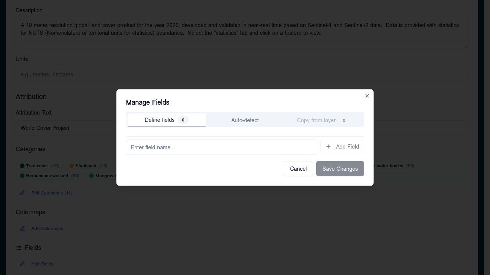

# Vector fields

The **Fields editor** controls which feature properties appear in the APEx Geospatial Explorer's info panel and how each value is labelled and formatted. It is independent of [Vector styling](vector-styling.md): styling controls how a feature looks on the map, fields control what users see when they click a feature.



## When to use

- Hide noisy or internal properties (`fid`, `geom_id`, raw timestamps)
- Give properties friendlier display labels (e.g. `co2_t_yr` → `CO₂ (tonnes/year)`)
- Add prefix/suffix units (`%`, `°C`, `km²`)
- Round numeric values to a sensible precision
- Format dates and timestamps consistently

## Opening the editor

In the layer card for any vector source (GeoJSON, FlatGeoBuf, WFS), click the inline **Fields** edit trigger. The dialog opens with one row per detected property.

### Auto-detection

Fields are detected directly from the data source URL on first open:

- **FlatGeoBuf** — read from the file header (no full download)
- **GeoJSON** — inferred from the first feature's `properties` object

If detection fails (CORS, network error, empty source) you can add fields manually by name.

## Field configuration

Each row exposes the following options:

| Option | Type | Purpose |
|---|---|---|
| **Visible** | toggle | Set to off to hide the field from the info panel (stored as `null` in config) |
| **Label** | text | Display name shown in the info panel |
| **Prefix** | text | Prepended to the value (e.g. `≈ `) |
| **Suffix** | text | Appended to the value (e.g. ` °C`) |
| **Precision** | integer | Decimal places for numeric values |
| **Order** | integer | Position in the info panel (lower = higher) |
| **Type** | select | `string` (default) or `date` |
| **Format** | text | When `type = date`, a [date-fns format string](https://date-fns.org/v2/docs/format) (e.g. `yyyy-MM-dd`) |

## Schema

The configuration is persisted under the data source's `meta.fields` as a record:

```json
"meta": {
  "fields": {
    "name": { "label": "Site Name", "order": 1 },
    "co2_t_yr": { "label": "CO₂", "suffix": " t/yr", "precision": 1, "order": 2 },
    "observed_at": { "label": "Observed", "type": "date", "format": "yyyy-MM-dd", "order": 3 },
    "fid": null
  }
}
```

A `null` value hides the field. An object with no properties uses the raw property name as the label.

## Tips

- Define fields once per source and the configuration travels with import/export and JSON edits.
- Order is sparse — gaps are fine; fields without an `order` go to the bottom alphabetically.
- Date format strings are case-sensitive — `YYYY` is wrong, use `yyyy`.
