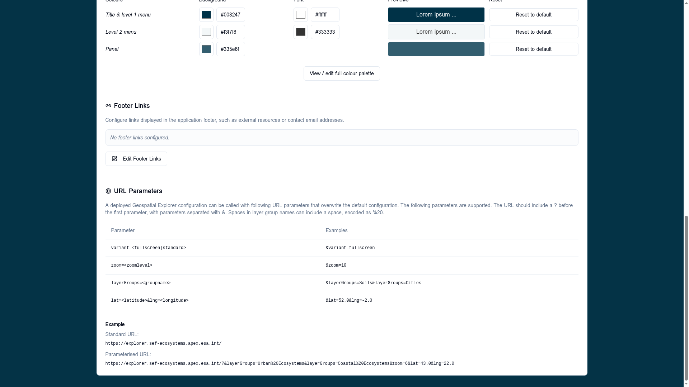

# URL parameters

A deployed APEx Geospatial Explorer reads a small set of query-string
parameters on load. These **override** the defaults baked into the
configuration so you can deep-link to a specific view, layer set, or
layout without editing the JSON.

The same reference table is rendered in-app on the [Settings tab](../settings/index.md)
so it travels with the config.



## Supported parameters

| Parameter | Example | Effect |
|-----------|---------|--------|
| `variant=<fullscreen\|standard>` | `&variant=fullscreen` | Overrides the [layout variant](../configuration/layout.md). `fullscreen` hides the chrome around the map; `standard` shows the configured sidebar. |
| `zoom=<level>` | `&zoom=10` | Sets the initial map zoom. Integer in the map's zoom range. |
| `layerGroups=<group-name>` | `&layerGroups=Soils&layerGroups=Cities` | Activates one or more **interface groups** at start. Repeat the parameter to enable multiple groups. |
| `lat=<latitude>&lng=<longitude>` | `&lat=52.0&lng=-2.0` | Sets the initial map centre. Decimal degrees. Both values must be supplied together. |

## Syntax rules

- The query string must start with `?`. Subsequent parameters are joined
  with `&`.
- Spaces in interface group names must be percent-encoded as `%20`
  (`Urban Ecosystems` → `Urban%20Ecosystems`).
- Unknown parameters are silently ignored — safe to add tracking or
  campaign parameters alongside.
- Parameters that fail to parse (for example `zoom=abc` or
  `lat=999`) fall back to the configured default for that field.

## Examples

Standard URL — uses every default from the config:

```
https://explorer.sef-ecosystems.apex.esa.int/
```

Parameterised URL — open in fullscreen, with two interface groups
active, centred at 43°N 22°E and zoomed to level 6:

```
https://explorer.sef-ecosystems.apex.esa.int/?&layerGroups=Urban%20Ecosystems&layerGroups=Coastal%20Ecosystems&zoom=6&lat=43.0&lng=22.0
```

## Building a deep link

1. Configure the view you want in the explorer (active groups, centre,
   zoom).
2. Read the resulting URL parameters from the address bar — the explorer
   keeps `lat`, `lng`, and `zoom` in sync as you pan and zoom.
3. Copy that URL as your share / bookmark / embed link.

!!! note "Layer-level state"
    Per-layer toggles (visibility, opacity, time slider position) are
    **not** part of the URL parameter contract today. Use interface
    groups to express "open this collection of layers".
