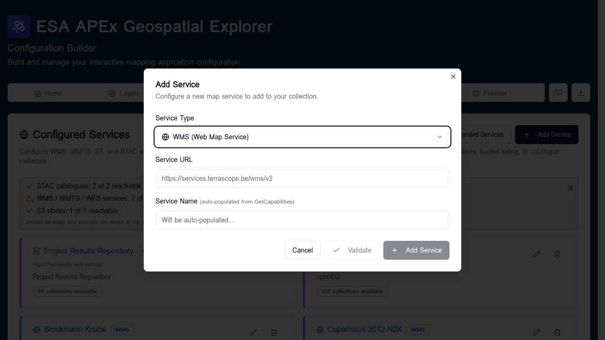

# Adding services

This page covers the **Add Service** dialog on the
[Services](index.md) tab.

## Open the dialog

On the **Services** tab, click **Add Service** in the top right. The dialog
opens with **Service Type** preselected to **WMS**.

## Step 1 — Choose the service type

The **Service Type** dropdown offers:

| Option | Use for |
|--------|---------|
| WMS | Web Map Service endpoints. |
| WMTS | Web Map Tile Service endpoints. |
| S3 | An S3 bucket containing COG, GeoJSON, FlatGeoBuf, or CSV files. |
| STAC | A SpatioTemporal Asset Catalog. |
| JSON or XML File Upload (beta) | A one-off upload of a saved capabilities or catalogue file. |

For an existing service the type is locked — to change type, delete and
re-add.

## Step 2 — Provide the URL

For everything except **JSON or XML File Upload**:

- **Service URL** — the endpoint address. The placeholder shows the expected
  shape for the selected type (for example a base WMS URL, an S3 bucket
  root, or a STAC catalogue root).
- **Service Name** — a label you will see in dropdowns when building layers.
    - For **WMS**, **WMTS**, **WFS**, and **STAC** the name is auto-populated
      from `GetCapabilities` or catalogue metadata. You can override it.
    - For **S3** you set it yourself (for example, `ESA APEx S3 Bucket`).

For **JSON or XML File Upload**, instead of a URL you select a local file
containing an S3 listing, STAC catalogue, or service capabilities document.

## Step 3 — Validation

The dialog validates as you type:

- **Validating…** — the builder is reaching the endpoint.
- **Reachable** (green) — the endpoint responded correctly. A short message
  describes what was found (for example, the catalogue title or the number
  of layers reported).
- **Unreachable** (red) — the endpoint failed. The error message is shown
  inline. Common causes: typo in the URL, missing `https://`, CORS block, or
  the service is offline.

You can save an unreachable service if you know it will come up later, but
it will fail the healthcheck until it does.

## Step 4 — Save

Click **Add Service** to save. The dialog closes and the new service appears
in the **Configured Services** list with its validation status.

## Editing or removing a service

In the services list, each row has:

- **Edit** — re-opens the dialog with name/URL editable. Service type is
  locked.
- **Delete** — removes the service. Layers that referenced it will need to
  be re-pointed at a different service.

## Type-specific tips

### WMS / WMTS / WFS

Point at the base endpoint (the one that responds to `?service=...&request=GetCapabilities`).
Do not include the layer name or query string — those are picked per-layer.

**What gets saved:** the config stores the service URL plus the chosen
layer name. Editing the service URL re-points every layer that uses it.

### STAC

Point at the catalogue root (the URL that returns the root `Catalog`
or `Collection` JSON). The builder will read the title and use it as the
service name.

**What gets saved:** the STAC service is used to browse the catalogue in
the builder. When you add an item, the resolved asset URL (COG, GeoJSON,
FlatGeoBuf, CSV) is written into the layer. The STAC service entry itself
is not required at runtime — you can delete it after the layers are
configured without breaking them.

!!! note "Coming soon"
    Future releases will allow a STAC **collection** to be referenced
    directly as a live data source — for example, to feed the items in a
    collection into the temporal control as a time series.

### S3

Point at the bucket root URL. Both AWS-flavour (Amazon S3, OBS) and
S3-compatible stores like MinIO are supported. Once added, you can browse
the bucket from the [S3 browser](../data-sources/s3-browser.md) when
adding layers.

**What gets saved:** like STAC, the S3 service is a browsing aid. When you
pick a file, its resolved URL is written into the layer; the S3 service
entry can be removed later without affecting those layers.

### JSON or XML upload

Use this when an endpoint is firewalled but you have a saved capabilities
document, or when you want to seed a config offline. Upload `.json` or
`.xml`. The builder parses it and creates the service entry.

## After adding a service

- The service is now selectable wherever a service of that type is needed
  on the [Layers](../layers/standard-layers.md) tab.
- Run the [healthcheck](healthcheck.md) to confirm everything still passes.
