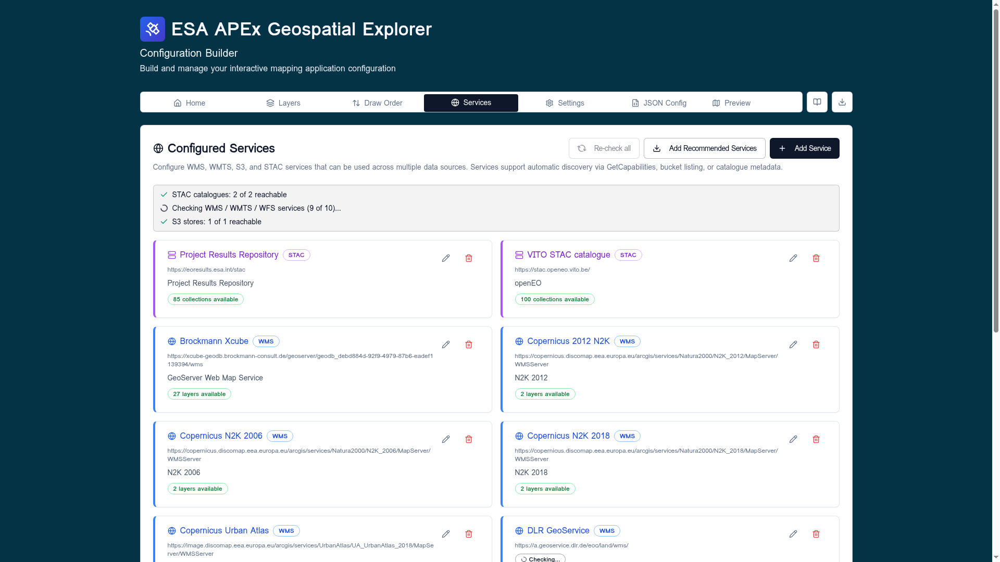

# Service diagnostics

Every service on the [Services](overview.md) tab is probed independently so
you can tell, at a glance, which endpoints are healthy and which are
failing — without having to run a full layer
[Healthcheck](healthcheck.md).

## The validation summary

The banner at the top of the **Configured Services** card aggregates
results across the whole config:

- **STAC catalogues** — `N of M reachable`.
- **WMS / WMTS / WFS services** — counts as each `GetCapabilities` call
  resolves; a spinner is shown while the batch is still running.
- **S3 stores** — `N of M reachable`.

A row turns red when a service fails any probe so you can spot it without
scanning the whole list.

## Per-service probes

Each service card runs a focused set of checks for its type:

| Service type | Probes |
|--------------|--------|
| WMS / WMTS / WFS | URL well-formed, mixed-content check, network reachability, `GetCapabilities` parses, layer count populated. |
| STAC | URL well-formed, root document fetch, collection enumeration, total item count. |
| S3 | URL well-formed, bucket listing, format detection on listed objects. |

A successful probe attaches a green badge — for example
`27 layers available`, `85 collections available`, or `Bucket reachable`.
A failed probe marks the row in red and surfaces a short reason such as
**Mixed content**, **Timeout**, **HTTP 404**, **Network error**, or
**Invalid URL**.

## Failure categories

The classifier (see `src/utils/serviceDiagnostics.ts`) maps low-level
errors into a short list of human-readable categories:

- **invalid-url** — the URL string itself is malformed.
- **mixed-content** — an `http://` endpoint called from an `https://`
  builder; the browser blocks the request before it reaches the network.
- **network** — DNS failure, offline, CORS, or transport reset.
- **timeout** — the request was aborted before the server responded.
- **http-error** — the server replied with `4xx` or `5xx`.
- **parse-error** — the response body was not the expected
  capabilities / catalogue document.

The same categories drive the more detailed per-layer breakdown in the
[Run Healthcheck](healthcheck.md) dialog.

## Re-running probes

Click **Re-check all** in the card header to clear cached results and
re-run every probe — useful after editing a URL or after an external
endpoint has come back online. Probes for an individual service also
re-run when you edit and save its URL.

!!! tip
    A service that is **reachable but slow** still validates green here.
    Performance grading happens at the layer level — see [Run
    Healthcheck](healthcheck.md#performance) for the latency thresholds.
