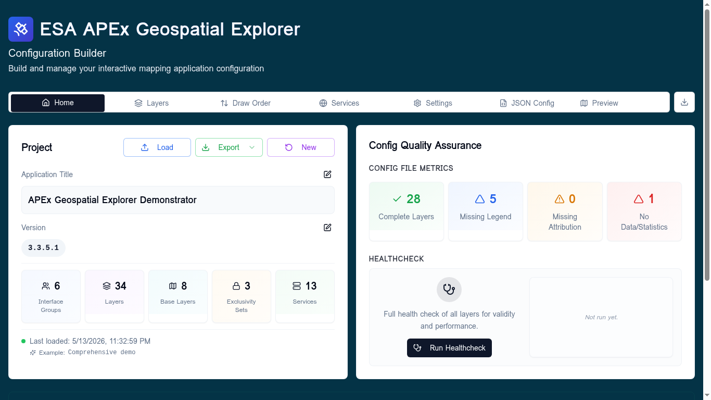
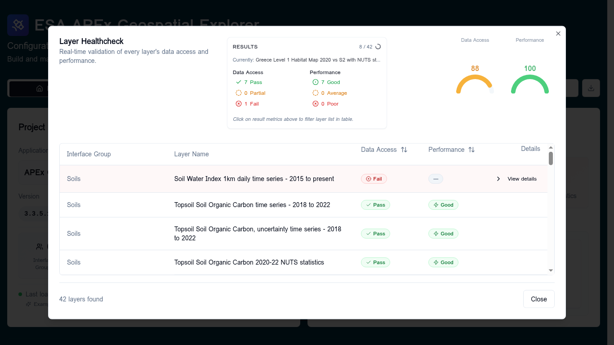
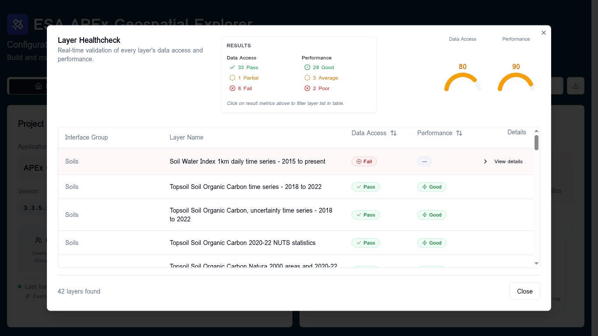
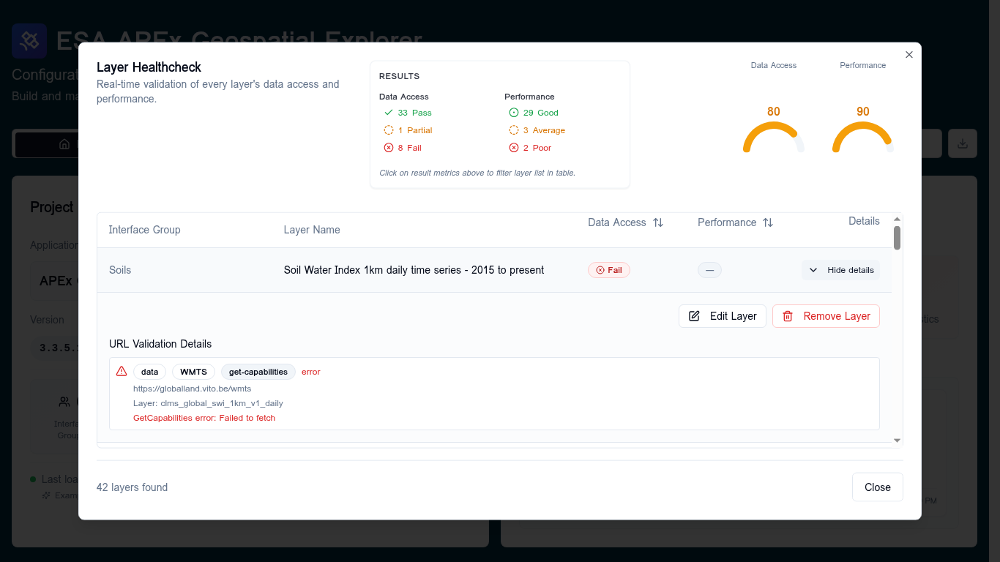
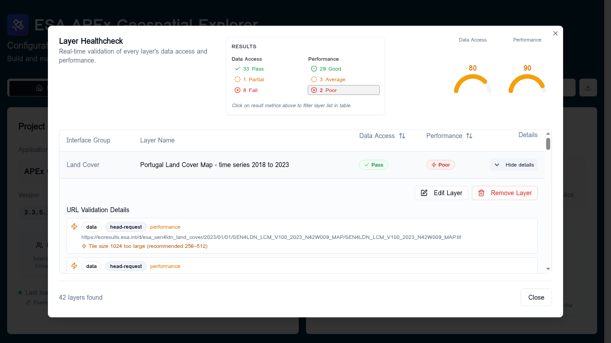
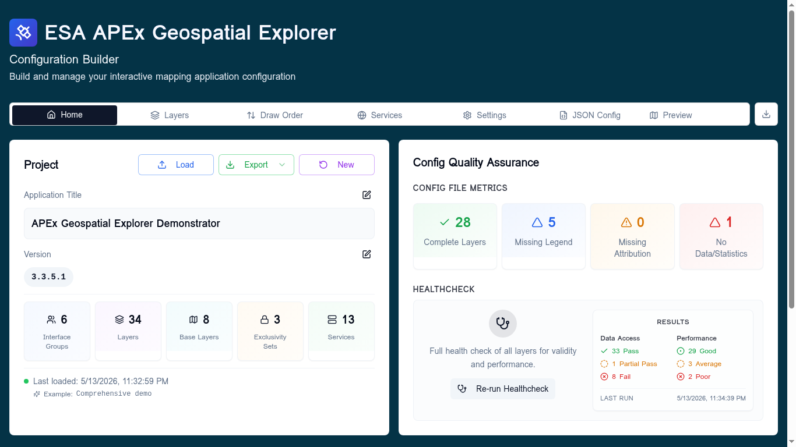

# Run Healthcheck

The **Run Healthcheck** tool validates every layer in your configuration in a
single batch and reports two independent scores:

- **Data Access** — can the URL be reached and does it respond correctly?
- **Performance** — once reached, will it perform well in the viewer?

Use it after you load or modify a config to see, at a glance, which layers are
broken, which are slow, and which are healthy.

!!! tip "Follow along"
    All screenshots on this page were taken with the **Comprehensive demo**
    config loaded. Load it yourself from **Home → Load → Examples →
    Comprehensive demo** to reproduce them.

## When to use it

- Right after loading a config from disk, GitHub, or a URL.
- After adding or editing services and layers, to confirm nothing regressed.
- Before exporting a config that will be shipped to the public viewer.

## Launching the healthcheck

The entry point lives on the **Home** tab, in the **Config Quality Assurance**
card on the right. Click **Run Healthcheck**.

The **Layer Healthcheck** dialog opens and starts validating layers immediately.
You do not need to configure anything — the run uses your current `sources` and
`services` definitions.

## Watching a run in progress

The dialog runs validation in display order (Interface Group, then layer
position) so the order in the table matches what you see on the **Layers** tab.

While the run is active you will see:

- A progress counter (`8 / 42`) and a spinner in the **Results** card header.
- The **currently checking** layer name, updated as each layer starts.
- The **Data Access** and **Performance** gauges on the right, recomputed live
  as results come in.
- Per-row badges that move from **Queued → Checking… → final status**.

You can leave the dialog open while it runs; you cannot close it accidentally
because progress is incremental and resumable on the next run.

## Reading the results

When the run finishes the gauges, summary, and table are all populated.

### The score gauges

Two semicircular gauges in the dialog header summarise the run as a 0–100
score:

| Score range | Colour | Meaning |
|-------------|--------|---------|
| 95 – 100    | Green  | Healthy — safe to ship |
| 80 – 94     | Amber  | Mostly healthy, some issues to investigate |
| 70 – 79     | Amber  | Noticeable degradation |
| Below 70    | Red    | Significant issues — review before publishing |
| `—`         | Grey   | Not enough scorable layers to compute |

Each score is a weighted average over all layers that have a meaningful
result; layers reported as **N/A** (e.g. layers with no URLs to check) are
excluded so they do not skew the score.

### Data Access status

Per layer, **Data Access** rolls up the reachability of every URL on the
layer (data URLs and statistics URLs).

| Status         | When it is reported |
|----------------|---------------------|
| **Pass**       | All checkable URLs returned a successful response. |
| **Partial Pass** | At least one URL succeeded but at least one failed. |
| **Fail**       | No URLs are reachable. |
| **N/A**        | The layer has no URLs to validate, or all of them were skipped. |

### Performance status

**Performance** is only computed when Data Access is not **Fail** — there is no
point in measuring performance on something that does not load.

| Status     | When it is reported |
|------------|---------------------|
| **Good**   | No performance warnings on any URL. |
| **Average** | Exactly one performance warning across the layer. |
| **Poor**   | Two or more performance warnings, **or** any pixel-interleaved (BIP) COG (these are always treated as Poor regardless of count). |
| **—**      | Not measured (Data Access was Fail or N/A). |

Common performance warnings include payload size above the **2 MB advisory
threshold**, oversized internal tile sizes on COGs, missing overviews, and
pixel-interleaved storage layouts.

## Drilling into a single layer

Click **View details** on any row to expand it. The expanded panel lists every
URL the healthcheck probed, the request type used (`head-request`,
`get-capabilities`, etc.), and the underlying error or warning message.

### A failing layer (Data Access = Fail)

In this example the layer's WMTS endpoint returned `Failed to fetch` from a
GetCapabilities probe. Typical root causes:

- The service URL has changed or the endpoint is offline.
- The host blocks browser requests with a missing or restrictive CORS header.
- A typo in the layer identifier (`Layer:` shown under the URL).

### A slow but reachable layer (Performance = Poor)

This COG **passes** Data Access — the file loads — but it is flagged
**Poor** for performance. The expanded view spells out why:
`Tile size 1024 too large (recommended 256–512)`. Re-tiling the COG with
smaller internal tiles will move it to **Good**.

## Filtering the table

The **Results** card doubles as a quick filter. Click any of the count chips
(e.g. **2 Poor**, **8 Fail**) to restrict the table to just those layers.
Click the same chip again to clear the filter. The two columns of chips are
mutually exclusive — selecting one in **Performance** clears any active
**Data Access** filter.

You can also sort the table by clicking the **↕** icon in either the
**Data Access** or **Performance** column header. **Worst first** puts
problems on top so they are easy to triage; **Best first** confirms what is
healthy.

## Acting on results

From an expanded row you can:

- **Edit Layer** — jumps to the layer's card on the **Layers** tab so you can
  fix URLs, swap services, or adjust settings without leaving your place.
- **Remove Layer** — deletes the layer from the config. You will be asked to
  confirm; this is the right choice for layers whose source is permanently
  gone.

Both actions update the underlying config immediately. Your healthcheck
results stay visible until you run again, so you can keep working through the
list.

## Re-running

After fixing issues, return to the **Home** tab and click **Re-run
Healthcheck**. The button label changes to **Re-run Healthcheck** as soon as
any results exist for the current config, and the previous run's summary stays
visible on the Home tab until the new one completes.

You can also click the **Results** card on the Home tab to reopen the dialog
in **view-only** mode without re-running, which is useful when you just want
to look up a previous result.

## Common failure modes and what to do

| Symptom in details panel | Likely cause | What to try |
|--------------------------|--------------|-------------|
| `Failed to fetch` on a GetCapabilities probe | CORS blocked, endpoint down, or DNS failure | Open the URL in a new browser tab; if it loads there but fails here, it is almost certainly CORS. Ask the service operator to allow your origin. |
| HTTP `403` from an S3-hosted asset | Bucket policy denies anonymous reads | Verify the object is public, or switch to a presigned URL workflow. |
| `Tile size NNN too large (recommended 256–512)` | COG was generated with an unusually large internal tile size | Re-tile the COG with `gdal_translate -co BLOCKXSIZE=512 -co BLOCKYSIZE=512`. |
| `Pixel-interleaved` warning | COG uses BIP interleave, which is slow to render | Re-tile with `INTERLEAVE=BAND` (BSQ). |
| `Large file: NN MB` | Static asset above the 2 MB advisory threshold | Consider tiling the asset or splitting the dataset by region or time. |
| `Timed out` | Service responded but took too long | Often transient — re-run. Persistent timeouts usually mean the service needs a CDN in front of it. |

## Related

- [Diagnostics](diagnostics.md) — per-service probe results, run from the
  Services manager.
- [Adding services](adding-services.md) — register endpoints that the
  healthcheck can validate against.
- [Layers → Overview](../layers/overview.md) — where to fix layer-level
  configuration once the healthcheck identifies a problem.
- [Troubleshooting](../reference/troubleshooting.md) — broader recovery tips
  beyond healthcheck-specific errors.
