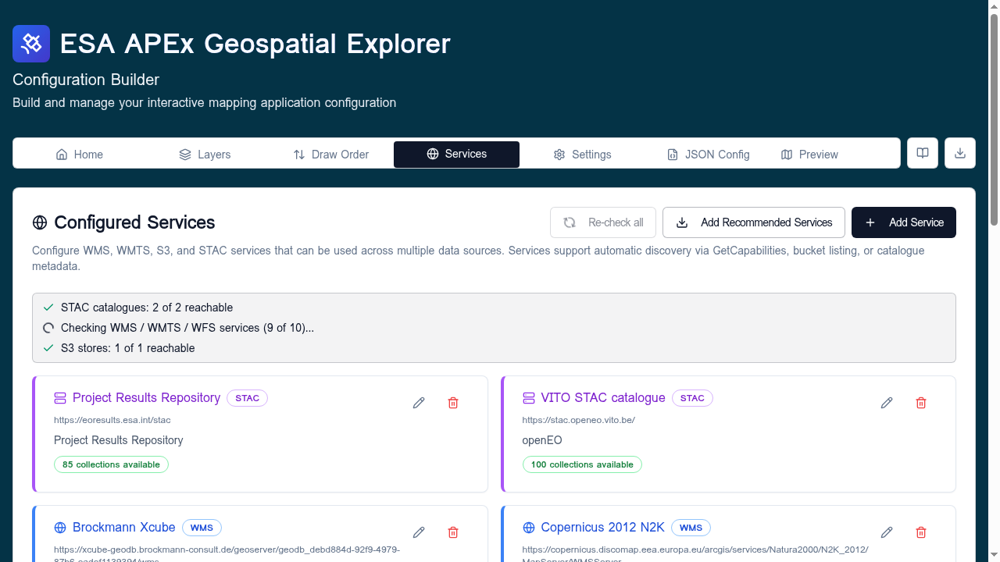
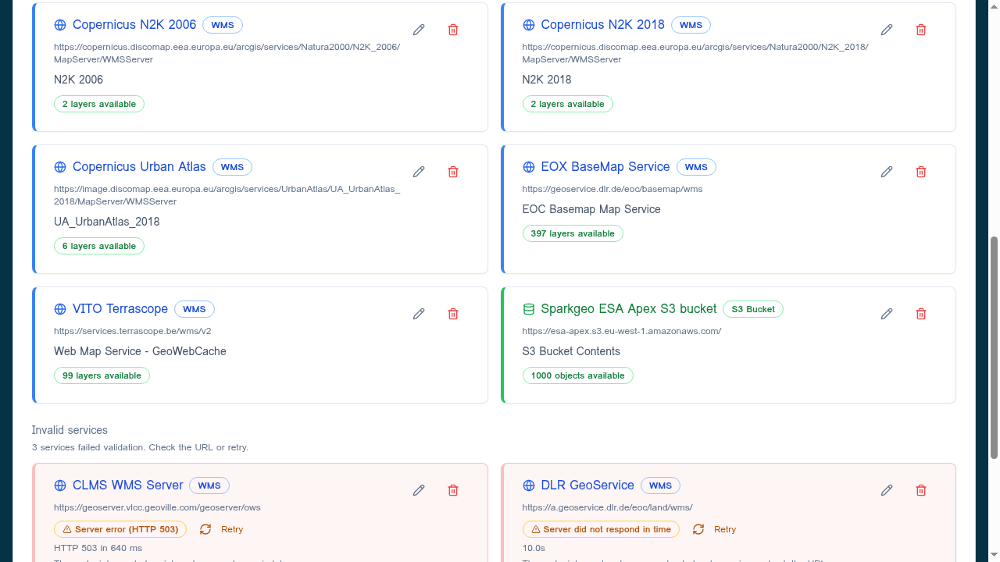

# Services overview

A **service** is a reusable endpoint definition registered in the config
builder. Services play different roles depending on their type — some are
referenced live by layers at runtime, others are purely a convenience for
finding data while you build the config.

!!! tip "Follow along"
    Screenshots on this page were taken with the **Comprehensive demo**
    config loaded.

## How services are used

Services fall into three categories:

| Service type | Role | What gets saved in the config |
|---|---|---|
| **WMS / WMTS / WFS** | Live endpoint reference. The chosen layer from the service *is* the data source. | The service URL plus the chosen layer name. Edit the URL once and every layer that uses it re-points. |
| **STAC catalogue / S3 bucket** | Discovery aid in the builder only. Lets you browse the catalogue/bucket to find COG, GeoJSON, FlatGeoBuf, or CSV assets. | The resolved direct URL of each picked file. The catalogue/bucket entry is not needed at runtime — you can delete it after layers are configured without breaking them. |
| **STAC collection** *(coming soon)* | Live reference to a STAC collection as the data source — for example, to feed a time series into the temporal control. | The collection URL. |

## What a service captures

A service entry stores three things:

1. The **type** of endpoint (WMS, WMTS, WFS, STAC catalogue, or S3 bucket).
2. The **URL** to reach it.
3. A **name** you choose, used in dropdowns when you build layers.

For OGC services and STAC catalogues, the builder performs automatic
discovery — `GetCapabilities` for OGC and catalogue metadata for STAC —
and populates the service name for you.

## Where services live

The **Services** tab lists every service in the current config. The header
of the **Configured Services** card has three buttons:

| Button | Purpose |
|--------|---------|
| **Re-check all** | Re-runs validation against every service (STAC, OGC, S3). Useful after editing endpoints. |
| **Add Recommended Services** | Bulk-adds a curated list of common public services. See [Recommended services](recommended.md). |
| **Add Service** | Opens the **Add Service** dialog. See [Adding services](adding-services.md). |

Below the header, each service is shown as a row with its name, URL, type
badge, and per-service validation status.

## Supported service types

| Type | Used for | Discovery |
|------|----------|-----------|
| **WMS** | Map images served per request from a WMS endpoint. | `GetCapabilities` |
| **WMTS** | Pre-tiled raster pyramids. | `GetCapabilities` |
| **WFS** | Vector features served from a WFS endpoint. | `GetCapabilities` |
| **STAC** | Catalogues of imagery and assets. | Catalogue root metadata. |
| **S3** | Public/private S3 buckets containing COG, GeoJSON, FlatGeoBuf, or CSV files. | Bucket listing. |
| **JSON or XML upload (beta)** | One-off ingest of a saved capabilities or catalogue document. | n/a |

Direct-URL data sources (a single COG, GeoJSON, FlatGeoBuf, XYZ, or CSV file)
do not need a service entry — you can add them straight from the
[Layers](../layers/adding-layers.md) tab.

## Validation states

Each service shows one of:

- **OK** — reachable, returned a valid response.
- **Checking…** — a re-check is in flight.
- **Failed** — could not reach the endpoint, or the response was unusable.
  The error message is shown inline.

Use **Re-check all** after a network change or when you suspect an upstream
endpoint has moved.

## When to use services vs. direct URLs

- For **WMS / WMTS / WFS**, always use a service — it is the only way to
  point a layer at that kind of endpoint, and editing the URL re-points
  every layer that references it.
- For **STAC catalogues** and **S3 buckets**, add a service when you want
  to browse the catalogue/bucket from the builder UI to find assets.
  Once the layers are configured, the resolved file URLs are what live in
  the config — the service entry can be removed later without affecting
  those layers.
- Use a **direct URL** when the layer is a single standalone file (a one-off
  COG, GeoJSON, FlatGeoBuf, CSV, or XYZ tile pattern) and you do not need
  the browser UI to find it.

## Next steps

- [Adding services](adding-services.md) — walk-through for adding each type.
- [Recommended services](recommended.md) — bulk-import the curated list.
- [Run Healthcheck](healthcheck.md) — validate every service plus every layer.
