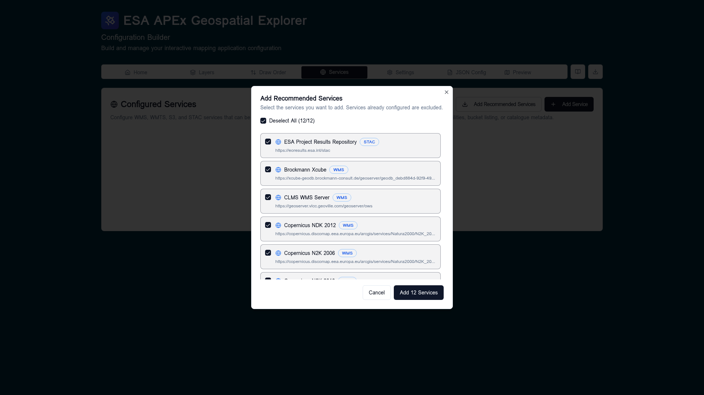

# Recommended services

The **Add Recommended Services** dialog is a one-click way to seed a new
configuration with a curated catalogue of public APEx-friendly endpoints —
STAC catalogues, OGC WMS servers, and S3 buckets that are known to validate
cleanly in the builder.

## Opening the dialog

On the [Services](index.md) tab, click **Add Recommended Services** in
the **Configured Services** card header.

The dialog lists every recommended service that is **not already present**
in the current config — services you have already added are filtered out so
they cannot be duplicated.

## Selecting services

- All entries are **selected by default**. Use the **Deselect All / Select
  All** checkbox in the header to flip the whole list at once.
- Each row shows the service **name**, **type badge** (STAC, WMS, S3), and
  **URL**. Click the row checkbox to include or exclude an individual
  service.
- The footer button label updates as you toggle (`Add 12 Services`,
  `Add 3 Services`, etc.). The button is disabled when nothing is selected.

## What gets added

Confirming inserts each selected service into `config.services` with its
recommended `name`, `url`, `sourceType`, and `format`. After insertion the
builder immediately runs the same validation pipeline used by **Re-check
all** — STAC `GetCapabilities`-equivalent calls, OGC `GetCapabilities`, and
S3 listings — so the new services pick up reachability and capability
metadata without a page reload.

If a recommended service later becomes unreachable or moves, edit it from
the **Services** tab like any other entry; nothing about a "recommended"
service is special after it is added.

## When to use it

- Bootstrapping a brand-new config so you have working layers to play with.
- Reproducing a healthcheck issue against a known-good baseline.
- Comparing your own service performance against the public set.
