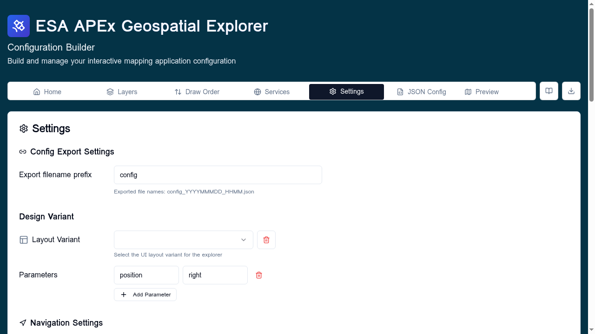
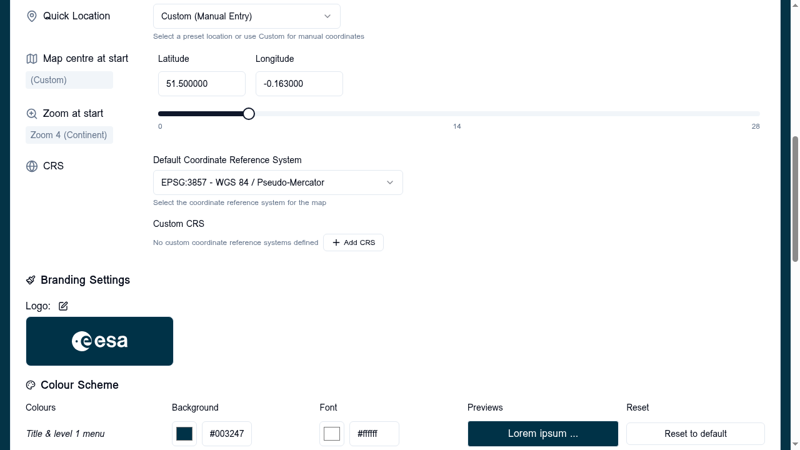

# Settings

The **Settings** tab holds top-level configuration that applies to the
whole APEx Geospatial Explorer instance: export filename, design variant,
navigation defaults, custom Coordinate Reference Systems (CRS), branding,
footer links, and URL parameters reference.

!!! tip "Follow along"
    Screenshots on this page were taken with the **Comprehensive demo**
    config loaded. Load it from **Home → Load → Examples → Comprehensive
    demo** to reproduce them.

The tab is one long card, organised into subsections. Each subsection is
covered below.

## Config Export Settings

- **Export filename prefix** — the prefix used when you click **Export** on
  the [Home tab](../home/index.md). Exported filenames follow the pattern
  `<prefix>_YYYYMMMDD_HHMM.json`. Pick something short and meaningful, for
  example `config_biodiversity` → `config_biodiversity_2025NOV14_1530.json`.

For sort order and field-ordering options at export time see
[Export options](../configuration/export-options.md).

## Design Variant

Pick one of the predefined UI variants for the deployed Explorer (for
example, full-screen vs. side-panel layouts). The choice is persisted in
the config's `layout.design` field. See [Layout](../configuration/layout.md) for the visual
differences between variants.

## Navigation Settings

Set the map's initial state.

### Quick Location

Pick a preset region from the dropdown:

- **Custom (Manual Entry)** — type your own latitude/longitude.
- **Global & Continents** — world view and continental presets.
- **Major countries** — country-level presets.

Picking a preset fills the Map centre and a sensible Zoom for that scale.

### Map centre at start

Latitude (−90 to 90) and Longitude (−180 to 180). Both fields validate as
you type and show a tooltip when out of range. Switches to "(Custom)" when
you edit the values manually.

### Zoom at start

A slider from 0 (whole world) to 28 (street level). The current zoom level
is shown alongside; hover for the level number. The OpenLayers reference
markers at 0, 14, and 28 are shown under the slider.

### CRS (Coordinate Reference System)

Two controls:

- **Default Coordinate Reference System** — the CRS the map uses on load.
  Pick from the built-in list (EPSG:3857, EPSG:4326, common polar and
  national grids) or any custom CRS you have added.
- **Custom CRS** — list of project-defined CRSes shown as removable pills.
  Click **+ Add CRS** to register a new one (proj4 definition required).
  See [Projections / CRS management](#) — managed inline here.

Adding a custom CRS opens a dialog asking for an EPSG-style code and a
proj4 string. Once added, it becomes available in the **Default CRS**
dropdown and to every layer in the config.

## Branding Settings

### Logo

Click the pencil icon next to **Logo:** to edit. Paste an image URL (SVG
recommended) and click **Save**. The preview swatch shows the logo against
your primary background colour.

### Colour Scheme

A grid lets you set three colour pairs that drive the deployed Explorer's
chrome:

| Row | Background | Font | Used for |
|-----|------------|------|----------|
| Title & level 1 menu | Primary background | Primary font | Header bar, top-level tabs |
| Level 2 menu | Background | Secondary font | Sub-navigation |
| Panel | Secondary background | — | Side panels, modals |

Each row has a hex colour picker plus a text input. The **Previews** column
shows what the resulting combination looks like. **Reset to default**
restores the original brand colour for that slot.

For finer control, click **View / edit full colour palette** to open the
advanced colour scheme dialog (CSS custom properties, hover/active states,
borders, etc.).

## Footer Links

A live preview of the current footer links is shown as badges (with mail or
external-link icons depending on URL scheme). Click **Edit Footer Links** to
open the [Footer Links](../configuration/footer-links.md) editor, which supports per-page
link sets.

## URL Parameters

A reference table of query-string parameters the deployed Explorer accepts
to override the config at load time (for example `?variant=fullscreen`,
`?center=...`, `?zoom=...`, `?layers=...`). For the canonical reference see
[URL parameters](../reference/url-parameters.md).

## Interface Groups

The [Interface Groups](../configuration/interface-groups.md) panel is rendered as a separate
card on this tab. It controls the top-level structure of the layer panel.
See its dedicated page for the full walk-through.
