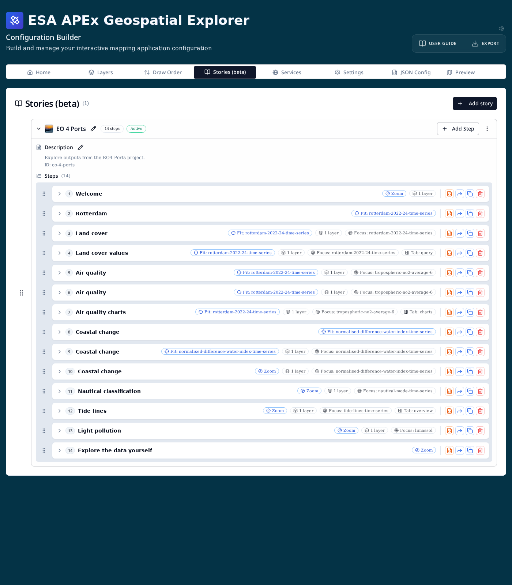
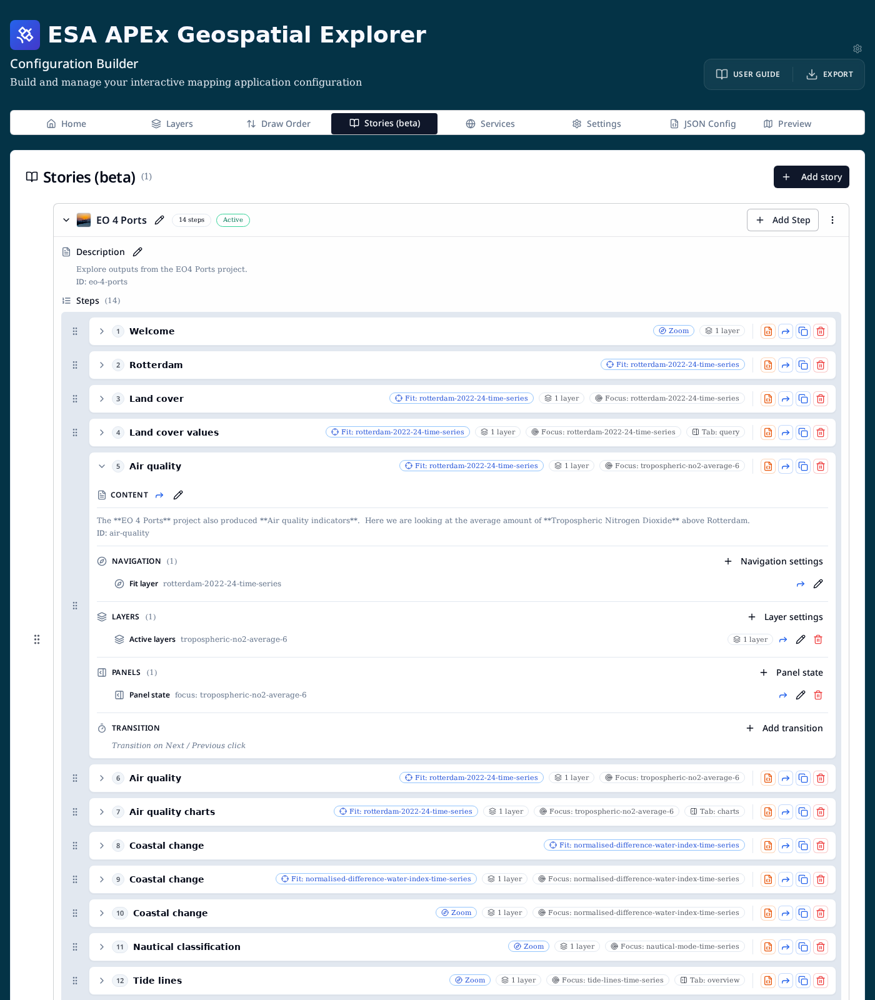
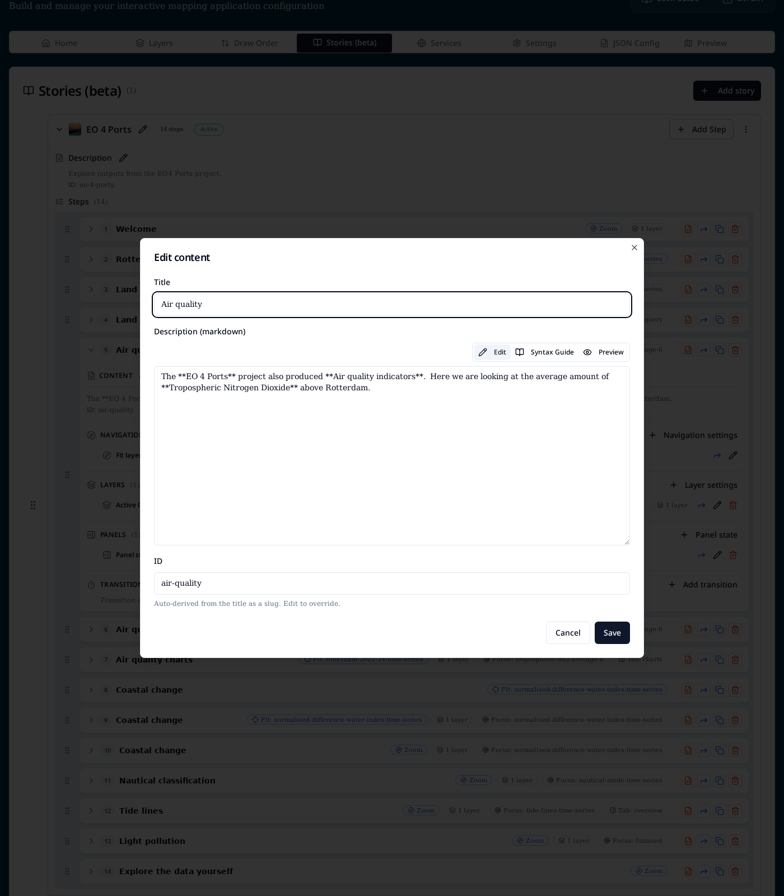
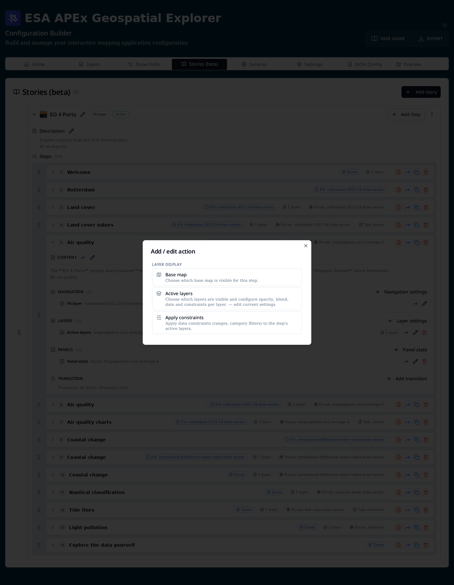
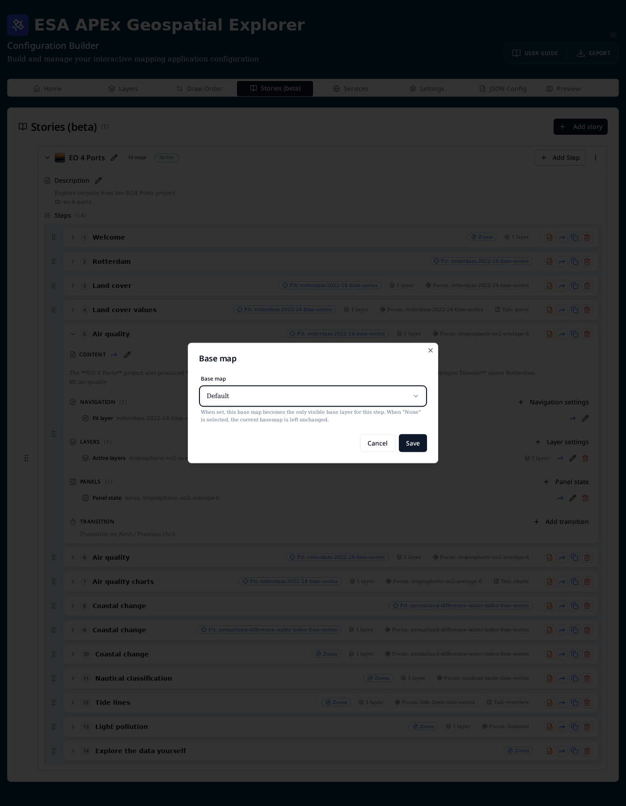
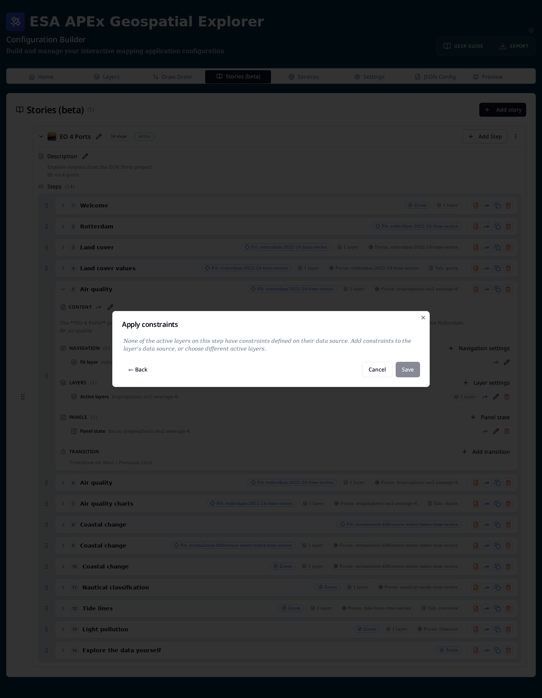
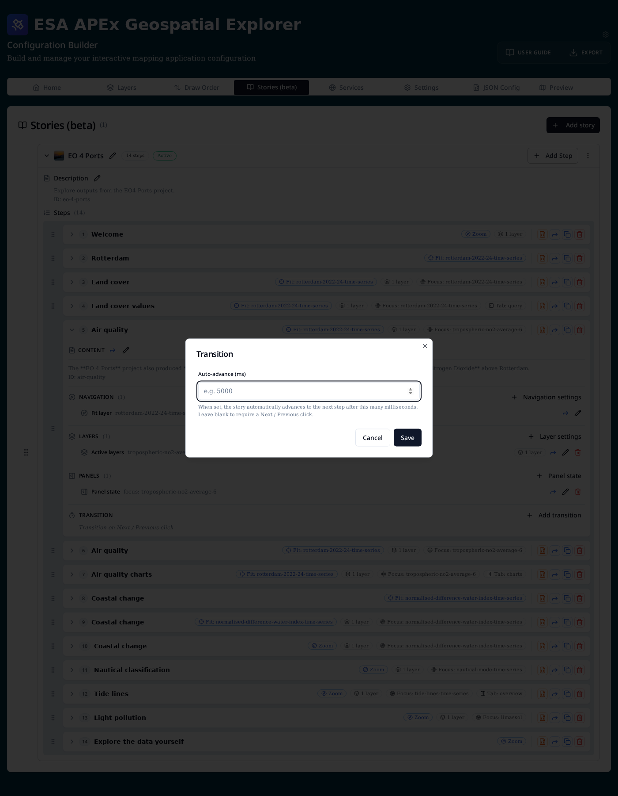
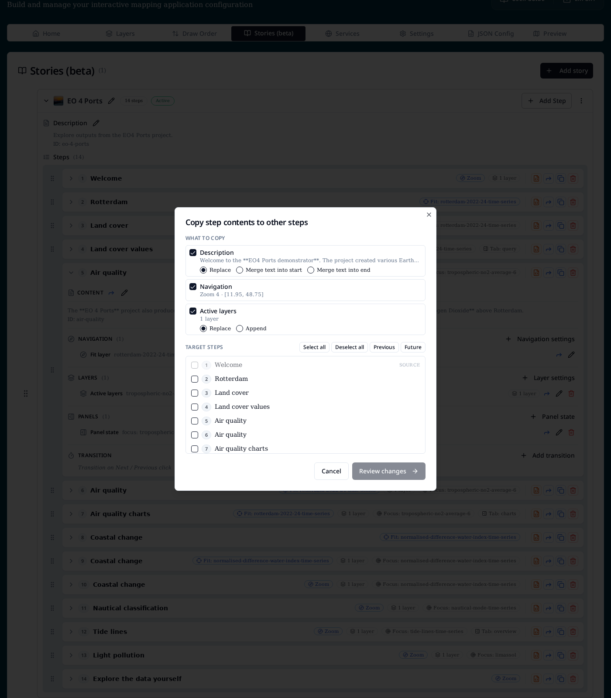
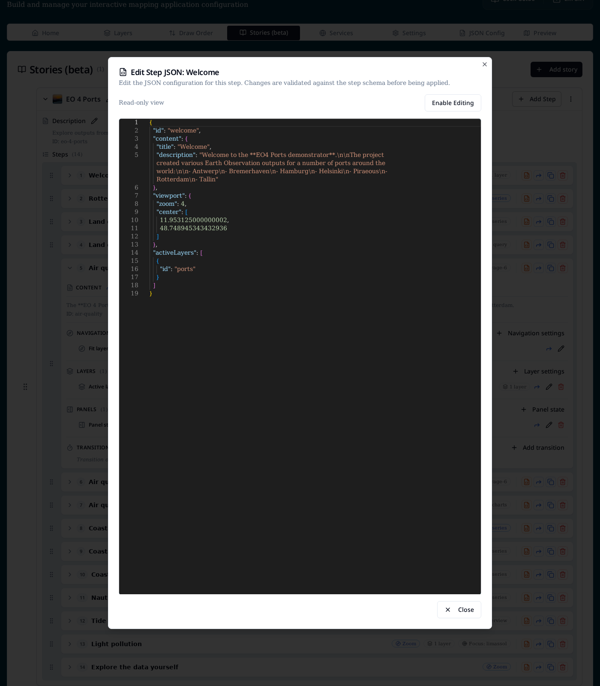
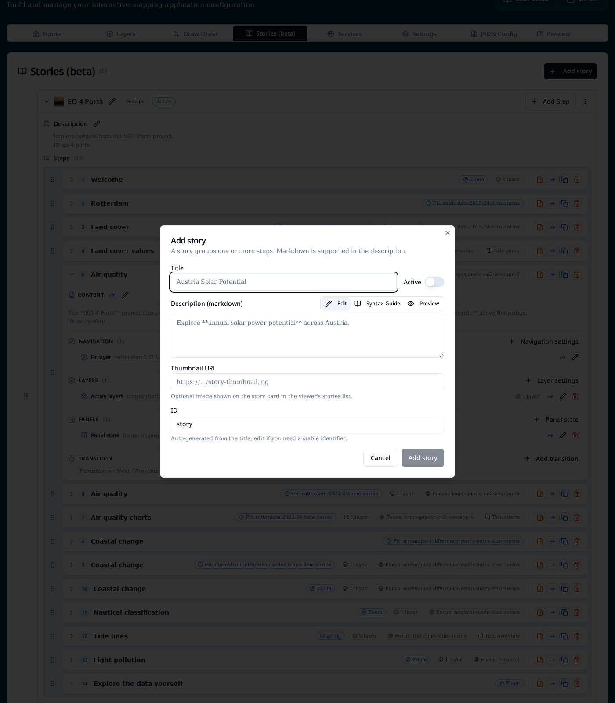

# Stories

Stories are guided, step-by-step map experiences. A story is an ordered
sequence of **steps**, and each step drives what the map shows through a
set of **actions**: where to look, which layers are on, which base map is
underneath, what the info panel is doing, and whether the step auto-advances.

At runtime users navigate through the steps with the previous / next
controls, and the URL reflects the current step (`/stories/{id}?step=3`).

## Concepts

- **Story** — a titled sequence of steps with an `id`, an optional
  Markdown description, an optional thumbnail, and an `Active` flag that
  makes the app open the story on load.
- **Step** — one frame of the story. Owns its own content (title +
  Markdown) plus a bag of **actions**.
- **Action** — one aspect of what a step does. Actions are grouped into
  four categories:
    - **Navigation** — where the map goes (zoom + centre, fit a layer, or
      fit an explicit extent).
    - **Layer display** — which overlay layers switch on
      (**Active layers**), which **Base map** is used, and any **Apply
      constraints** (per-layer ranges / category filters).
    - **Panels** — the info-panel state (focus layer, expanded / locked
      control sections, active tab).
    - **Transition** — whether the step **Auto-advances** to the next
      step after a delay instead of waiting for a click.
- **Layout variant** — `fullscreen` renders story content as a map
  overlay; `standard` renders it in the sidebar. Set via
  `layout.design.variant` or the `?variant=` URL parameter.

## The Stories tab

The **Stories (beta)** tab lists every story in the config as a card. Each
card shows the title, step count, and an **Active** badge when the story is
the initial one.



The tab is hidden by default. Turn it on from **Settings → App settings →
Show Stories (beta) tab** while it is in beta.

From the tab you can:

- **Add story** (top right) — open the story dialog to create a new story.
- **Add Step** (per story) — append a step to that story.
- **Edit** (pencil next to the title / description) — rename a story or
  edit its Markdown description.
- **Drag** (grip handle) — reorder stories, or reorder steps within a
  story.
- **Per-step icons** (right of each row) — from left to right:
    - <span title="Edit JSON">🟧</span> Edit the raw step JSON.
    - <span title="Copy to other steps">🔵</span> Copy any of the step's
      settings to other steps in the same story.
    - Duplicate the step.
    - Delete the step.

## Step summary badges

Each step row summarises what the step does without having to expand it:

- **Viewport** — `Fit: <layer id>`, `Zoom`, or a fitted extent.
- **N layers** — count of overlay layers switched on for the step.
- **Base map** — appears when the step overrides the base layer.
- **Constraints** — total number of per-layer constraints applied.
- **Focus** — which layer the info panel focuses on.
- **Tab** — which info-panel tab opens (`overview`, `query`, `charts`, …).

## Expanding a step

Expanding a step reveals its **Content** block plus one section per action
category — Navigation, Layers, Panels and Transition. Every section has
its own **+ Add …** button on the right; each action row within a section
has its own edit, copy-to-other-steps and remove controls.



The **Transition** section is special: while it is empty it shows the
italic hint *"Transition on Next / Previous click"* so it is obvious that
the step waits for user input until you add an auto-advance.

## Editing step content

Click the pencil in a step's **Content** header to edit its title,
Markdown body, and ID.



Fields:

- **Title** — heading shown in the story panel.
- **Description (markdown)** — body copy for this step. Supports the same
  Markdown as story descriptions, with **Edit**, **Syntax Guide** and
  **Preview** modes.
- **ID** — slug used in URLs and validation messages. Auto-derived from
  the title, editable.

The Forward icon next to the Content header copies the description to any
other steps in the story — see [Copying settings between
steps](#copying-settings-between-steps).

## Adding actions

Each action-category header has a **+** button that opens the Add / edit
action dialog scoped to that category. From here you can add a new action
or jump into an existing singleton to edit it.



The available actions are:

| Category | Action | What it controls |
| --- | --- | --- |
| Navigation | Navigation | Map viewport: Zoom + centre, Fit layer, or Fit extent. |
| Layer display | Base map | Force a specific base map for this step. |
| Layer display | Active layers | Which overlay layers are on, plus per-layer opacity, blend, date and constraints. |
| Layer display | Apply constraints | Aggregated editor for the constraints on all active layers. |
| Panels | Panel state | Info-panel focus layer, expanded / disabled control sections, and active tab. |
| Transition | Auto-advance | Milliseconds before automatically advancing to the next step. |

### Base map

Choose a single base map for the step. **Default** leaves whatever the
user (or a previous step) selected untouched.



### Apply constraints

Constraints are defined on the layer's data source (ranges, category
filters, …). The step-level Apply constraints editor lets you switch on a
subset of those defined constraints for the step's active layers. If none
of the active layers has any source-level constraints the dialog explains
that and links back to the data source configuration.



### Transition (auto-advance)

Set a duration in milliseconds. When the story reaches this step it waits
that long, then automatically moves to the next one. Auto-advance is
ignored on the final step, and is cleared as soon as the user navigates
manually.



## Copying settings between steps

The blue Forward icon — both on the step row and on individual actions —
opens the **Copy step contents to other steps** dialog.



**What to copy** lists every facet the source step actually has. Toggle
the ones you want to push. Two facets have a merge strategy:

| Facet | Strategies |
| --- | --- |
| Description | **Replace**, **Merge text into start**, **Merge text into end** |
| Active layers | **Replace**, **Append** |
| Constraints | **Replace**, **Append** |
| Everything else (Navigation, Base map, Panel state, Transition) | Always overwrite |

**Target steps** lets you tick individual steps or use **Select all**,
**Deselect all**, **Previous** (all steps before this one) and **Future**
(all steps after). The source step is always locked out. **Review
changes** shows a per-target preview before you commit.

## Editing the raw step JSON

For power users, the orange JSON icon on each step opens the **Edit Step
JSON** dialog. It opens read-only and can be switched into editable mode;
changes are validated against the step schema before being applied.



## Adding a story

**Add story** opens a dialog with the story-level fields:

- **Title** — display name shown in the story browser.
- **Active** toggle — makes this the story the app opens on load. Only
  one story should be active at a time.
- **Description** — Markdown intro shown above the current step. Switch
  between **Edit** and **Preview**, or open the **Syntax Guide** for
  supported Markdown.
- **Thumbnail URL** — optional image for the story card in the viewer.
- **ID** — URL-safe slug auto-generated from the title; edit if you need
  a stable identifier (it is used in `/stories/{id}`).



## URLs

| URL                    | Behaviour                                     |
| ---------------------- | --------------------------------------------- |
| `/stories`             | Story browser listing all configured stories. |
| `/stories/{id}`        | Opens story `{id}` at step 1.                 |
| `/stories/{id}?step=3` | Opens story `{id}` at the third step (`step` is 1-based). |

When a story is marked **Active** the app redirects `/` to that story on
load, as long as stories are enabled in `layout.navigation.links`.

## JSON structure

Stories are stored under the top-level `stories` array in `config.json`.
The exported JSON is the source of truth — the Stories tab is a
structured editor over the same shape.

```json
{
  "stories": [
    {
      "id": "eo-4-ports",
      "title": "EO 4 Ports",
      "isActive": true,
      "description": "Explore outputs from the EO4 Ports project.",
      "steps": [
        {
          "id": "welcome",
          "content": {
            "title": "Welcome",
            "description": "Welcome to the **EO4 Ports demonstrator**."
          },
          "viewport": { "fitLayer": "open-streetmap", "duration": 500 },
          "activeLayers": [],
          "baseLayer": "open-streetmap",
          "autoAdvance": 8000
        }
      ]
    }
  ]
}
```

See the full field-by-field reference in
[Reference → JSON schema](../reference/json-schema.md), and try the
demo config from **Load → Examples → Full screen storymap demo**.
