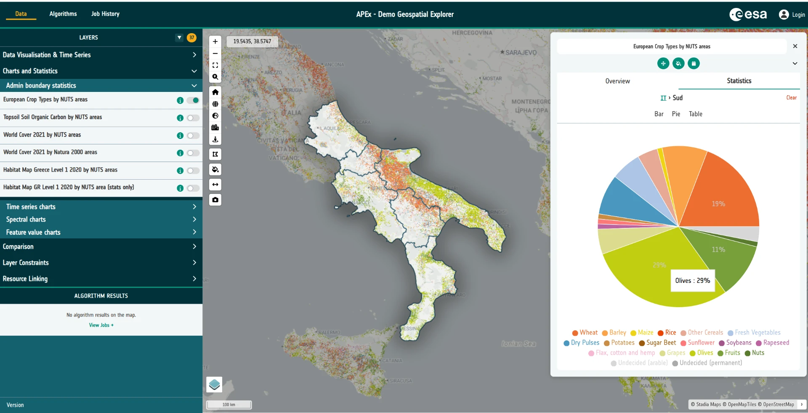

# Geospatial Explorer

The **APEx Geospatial Explorer** is an interactive web map dashboard for
exploring Earth Observation (EO) data and derived products. It brings
together cloud-native geospatial data, SpatioTemporal Asset Catalogs
(STAC), on-the-fly algorithm execution and rich visualisation tools —
all in a no-code environment that end users can drive from a browser.

Every Explorer deployment is shaped by a **configuration** — a JSON
document that defines the layers, services, styling, charts, filters
and storymaps on offer. In later tutorials you'll build one of these
configurations yourself. For now, the goal is simply to get a feel for
what the end-user application looks like and what it can do.

## Tasks

### 1. Open the reference deployment

Open the flagship APEx Geospatial Explorer in a new browser tab:

<https://explorer.apex.esa.int/>

This particular deployment has been organised around the **core areas
of functionality** the Explorer supports — data visualisation, time
series, charts and statistics, constraints and filters, storymaps, and
algorithm execution. Treat it as a showcase of what a well-configured
Explorer can do.

### 2. Have a play

Spend some time exploring the application. There is no wrong way to do
this — click things, toggle layers on and off, open panels, drag the
time slider, try the charts. Some suggestions:

- Switch between different **interface groups** using the top-level
  navigation.
- Toggle layers on and off and adjust their opacity.
- Open a layer's **data visualisation** controls and experiment with
  colormaps or RGB composites.
- Try any **time series** layers — scrub the timeline and watch the
  map update.
- Open a **storymap** if one is available and step through it.
- Apply a **constraint** or filter and see how the map responds.

Don't worry about understanding every control yet — you'll meet them
again in later tutorials.

### 3. Browse the Solutions Gallery

Head over to the APEx Solutions Gallery to see what other teams have
built with the Explorer:

<https://apex.esa.int/resources/solutions-gallery>

Filter the gallery on **"Geospatial Explorer"** as a component and take
a look at a few of the examples. Each entry links out to a live
deployment configured for a specific scientific or operational use
case. Pick two or three that look interesting and open them up — it's
a great way to see the range of applications a single configurable
tool can support.
