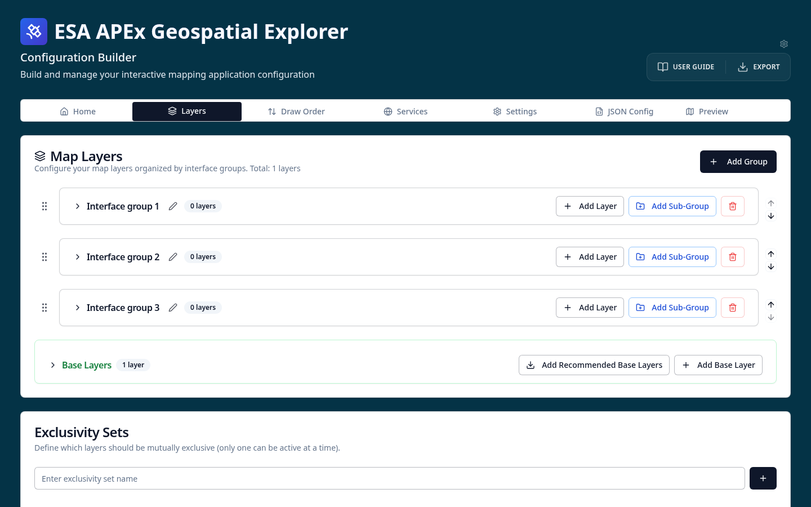

# Add recommended base maps

1. On the **Layers** tab, scroll down to the **Base Layers** section and
   select **Add Recommended Base Layers**.

    

2. Look at the base map cards that appear — attribution and layer metadata are
   populated automatically.
3. Go to the **GE Preview** tab. You will now see a base map switcher in the
   Explorer.

!!! tip "Where do the recommended base maps come from?"
    The recommended base maps are loaded at runtime from the
    [ESA-APEx configs manifest](https://github.com/ESA-APEx/apex_geospatial_explorer_configs).
    New base maps added to the manifest become available in the CB without a
    redeploy. See [Base layers](../../../layers/base-layers.md) for details.
