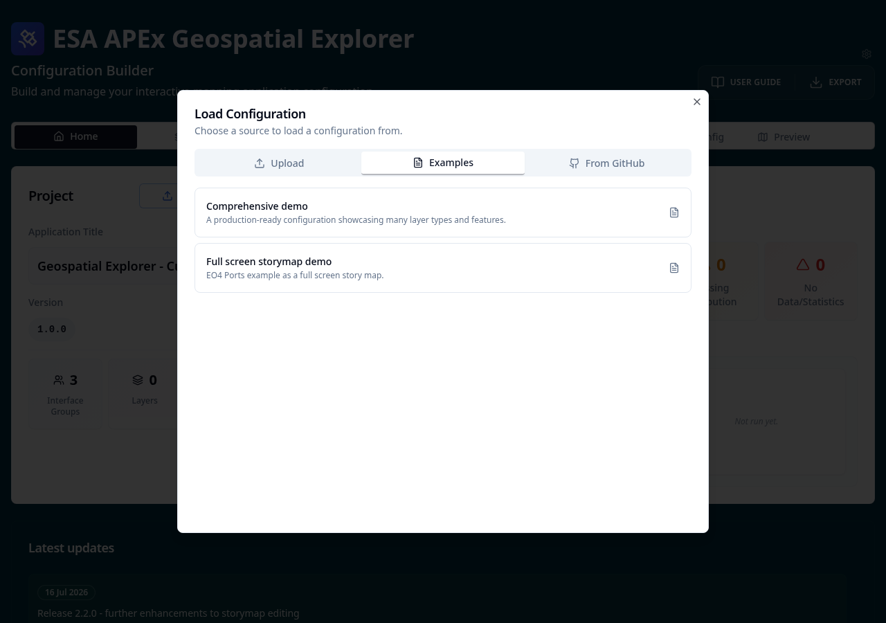

# 1-3. Configuration Builder

The **Configuration Builder** is the companion tool to the Geospatial
Explorer. Where the Explorer is the end-user application, the
Configuration Builder is the no-code editor used to *shape* what an
Explorer deployment looks like — which layers appear, how they are
grouped, what styling and charts are attached, which storymaps are on
offer, and so on.

Before we start building anything from
scratch, it helps to see a fully worked example so you have a mental
picture of what a "finished" configuration contains.

## Tasks

### 1. Open the Configuration Builder

!!! info "Geospatial Explorer Configuration Builder"
    - <https://ge-config-builder.apex.esa.int/>

Save it as a bookmark in your browser as you will use this constantly throughout the tutorials.

### 2. Load the "Comprehensive Demo" example

From the home page, open the **Examples** dialog
and choose **Comprehensive Demo**. This will load a rich, pre-built
configuration into the editor.

Click around a few of the tabs, such as **Layers** and **Settings** to see what is there.

### 3. Open the Preview

Click **Preview** to launch the Geospatial Explorer against the demo
configuration you just loaded. This is exactly the same Explorer
application you looked at in the previous step, but now driven by the
demo config rather than the reference deployment.

Have a quick click around to confirm it behaves as an end user would
expect.

### 4. Switch back to the Configuration Builder

Close the preview (or switch tabs) to return to the Configuration
Builder. This is where you'll spend most of the tutorials.

### 5. Expand the layer groups and layers

In the **Map layers** section, expand the interface groups, then their
sub-groups, and finally the individual layers inside. Each layer card
reveals further sections — data source, data visualisation, charts,
constraints, metadata, and more.

### 6. Have a look around

Take a few minutes to browse through what's configured. You don't need
to understand every field yet — the goal is just to build up a sense
of the shape of a configuration:

- How layers are organised into groups and sub-groups.
- The variety of **data sources** in use (STAC, COG, vector, WMS…).
- How **styling** and **colormaps** are attached to raster layers.
- Where **charts** and **constraints** hang off individual layers.
- Any **storymaps**, **algorithms** or **global layout** settings
  defined elsewhere in the sidebar.

By the end of this browse you should have a rough answer to the
question *"what kinds of things live in a configuration?"* — which is
exactly the foundation we'll build on in the next tutorial.
