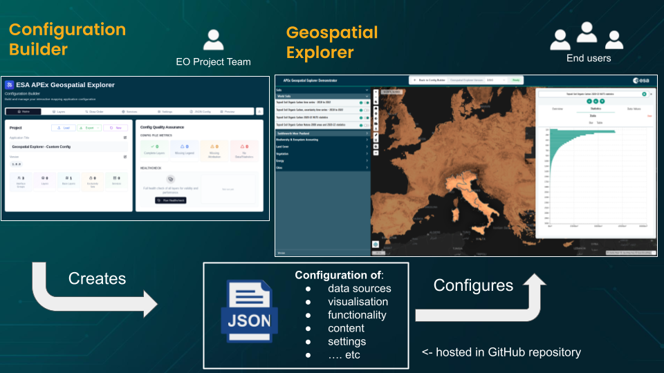

# 1. Familiarisation

## Tutorial Objectives

This first tutorial helps you get comfortable with the two tools you will be
using throughout the tutorials: the APEx Geospatial Explorer (the end-user map
application) and the Configuration Builder (the authoring tool you will use to
shape it).

By the end of this tutorial you will be able to:

- Describe how the Geospatial Explorer and the Configuration Builder fit
  together.
- Navigate the main areas of the Geospatial Explorer as an end user.
- Find your way around the Configuration Builder interface.

## Steps

- [1-1. Pre-requisites](01-prerequisites.md)
- [1-2. Geospatial Explorer](02-geospatial-explorer.md)
- [1-3. Configuration Builder](03-configuration-builder.md)
