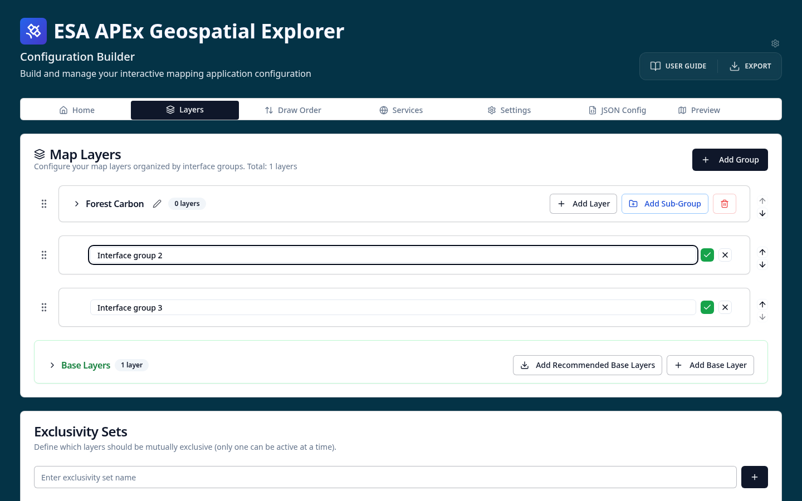

# Name, interface group and branding

In this exercise you will start a fresh configuration and give it a title, an
interface group and a colour scheme.

1. **Open the Config Builder** at
   <https://apex-ge-config-builder.sparkgeo.uk/>.
2. On the **Home** tab, edit the **Title** of the configuration to something of
   your choice — for example, `Forest Carbon Tutorial`.
3. Move to the **Layers** tab.
   - Edit *Interface group 1* and rename it to `Forest Carbon`.
   - Delete the other default interface groups so only *Forest Carbon* remains.
4. Move to the **Settings** tab and change some of the colours to a scheme of
   your choice.
5. Select the **GE Preview** tab to see the changes applied to a live copy of
   the Geospatial Explorer.

Your UI might now look something like this:

!!! tip "Interface groups"
    Interface groups organise layers into named tabs in the Geospatial
    Explorer. See [Interface groups](../../configuration/interface-groups.md)
    for the full reference.
