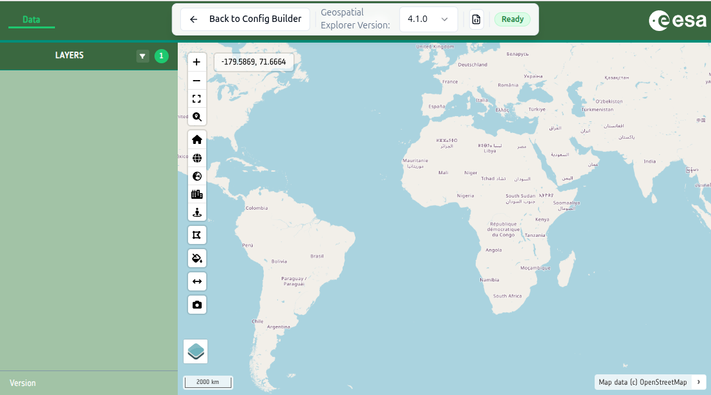

# 2-3. Name, interface group and branding

In this tutorial you will start a fresh configuration and give it a title, an
interface group and a colour scheme.

1. **Open the Config Builder** at
   <https://ge-config-builder.apex.esa.int/>.
2. On the **Home** tab, edit the **Title** of the configuration to something of
   your choice — for example, `<your name>'s first config`.
3. Move to the **Layers** tab.
   - Edit *Interface group 1* and rename it to `Forest Carbon`.
   - Delete the other default interface groups so only *Forest Carbon* remains.

4. Move to the **Settings** tab and change some of the colours to a scheme of
   your choice.
5. Select the **GE Preview** tab to see the changes applied to a live copy of
   the Geospatial Explorer.

   Your preview might look something like this:
   

!!! tip "No Forest Carbon interface group displayed?"
    You will notice that the interface group you renamed to ***Forest Carbon** in Step 3, is not displayed.   Don't worry, this is expected behaviour.  The Geospatial Explorer only builds the parts of the interface that have data to show, and we'll do that shortly.
