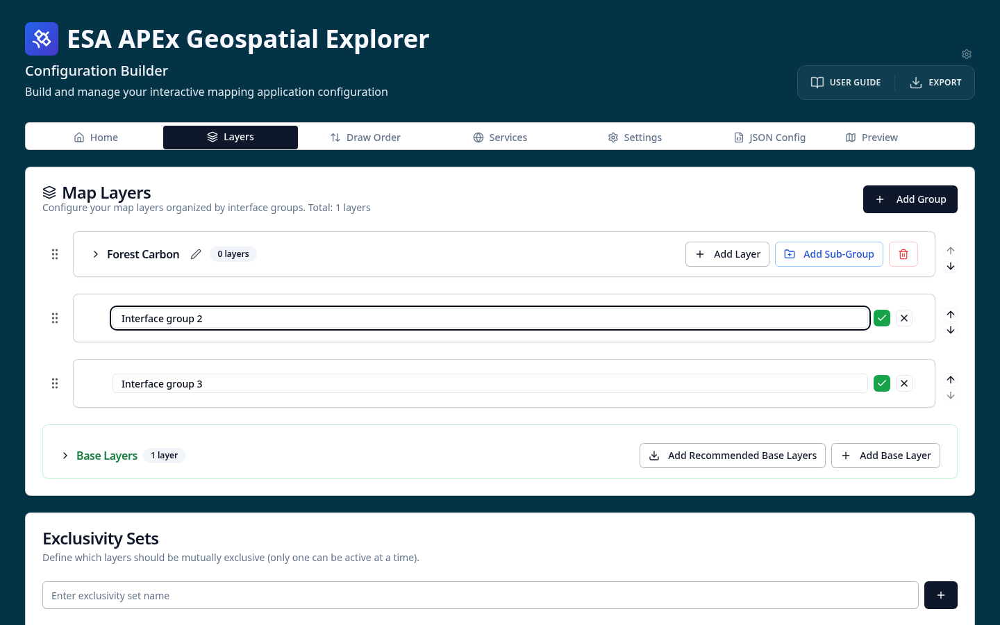
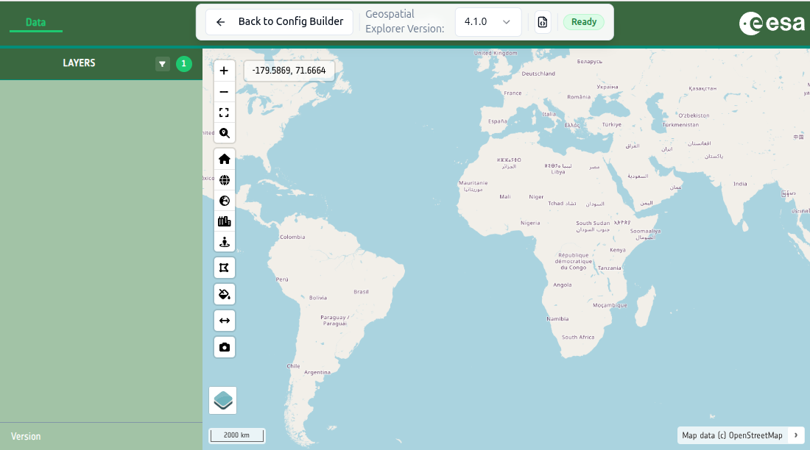

# 2-3. Name, interface group and branding

In this tutorial you will start a fresh configuration and give it a title, an
interface group and a colour scheme.

1. **Open the Config Builder** at
   <https://ge-config-builder.apex.esa.int/>.
2. On the **Home** tab, edit the **Application Title** (by clicking on the pen icon) and rename the configuration to something of
   your choice — for example, `<your name>'s first config`.
3. Move to the **Layers** tab.
   - Edit _Interface group 1_ (by clicking on the pen icon) and rename it to `Forest Carbon`.
   - Delete the other default interface groups so only _Forest Carbon_ remains.

   

4. Move to the **Settings** tab and scroll down to the **Branding Settings** section. Change some of the colours to a scheme of your choice. There is not an explicit _Save_ step here - the changes are applied directly to the config You could also change the logo to the URL of another logo if you want.
5. Select the **Preview** tab to see the changes applied to a live copy of
   the Geospatial Explorer.

   Your preview might look something like this:

   

!!! tip "No Forest Carbon interface group displayed?"
You will notice that the interface group you renamed to ***Forest Carbon** in Step 3, is not displayed. Don't worry, this is expected behaviour. The Geospatial Explorer only builds the parts of the interface that have data to show, and we'll do that shortly.
