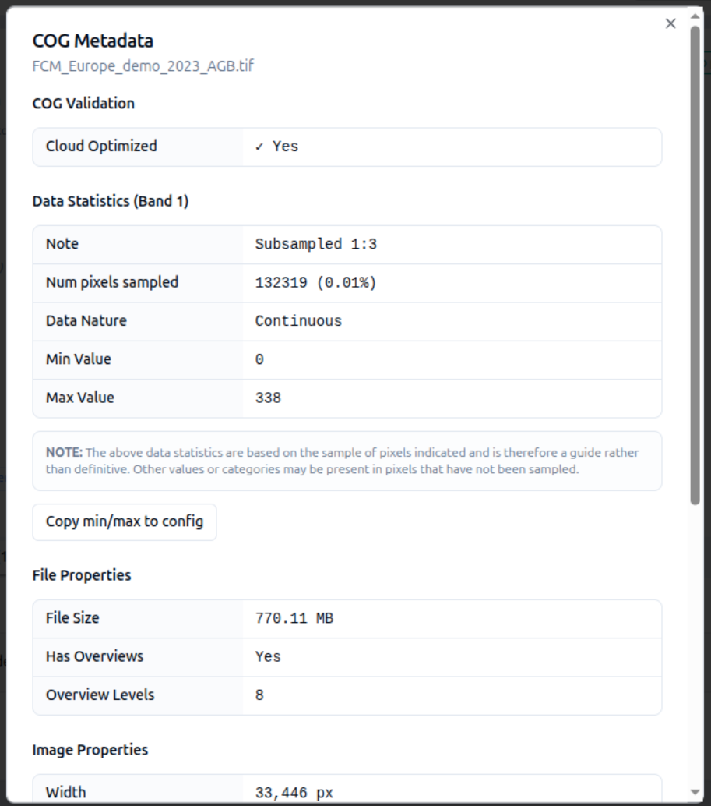

# 2-7. Add a COG data source

In this step we will attach a Cloud Optimized GeoTIFF (COG) to your
*Above Ground Biomass* layer card.

1. On your layer card, select the **Datasets** tab and choose
   **+ Add dataset**.
2. Keep **Direct connection** and **COG** selected as the data format.
3. Paste the following into the **Data source URL** and select **Add source**:

    ```
    https://eoresults.esa.int/d/FCM-AGB-100m/2023/01/01/FCM-AGB-100m-2023/FCM_Europe_demo_2023_AGB.tif
    ```


4. The data source is now listed on the *Datasets* tab.
5. Click the **(i)** info icon on the row to interrogate the COG's metadata.
   Take a general look at what is reported — whether the file is cloud
   optimized, the file size, overviews, and the image properties.

    

6. Make a note of the **min** and **max** pixel values — you will need them in
   the next step — then close the dialog.


!!! success "You've added your first layer!"
    From here you can add more data, restyle it, and layer in more advanced
    controls.

See [COG](../../data-sources/cog.md) for the full COG source reference.
