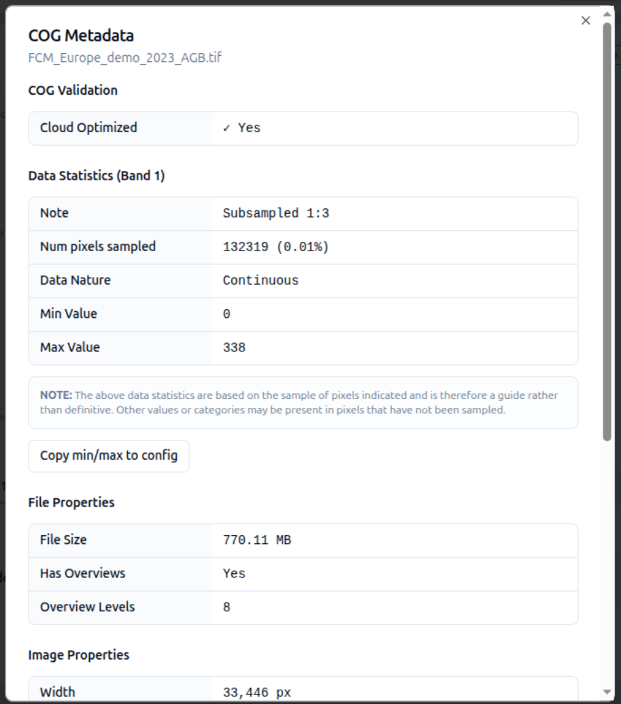

# 2-8. Style with a colormap

Now that your COG is attached, style it with a **colormap** so the pixel
values render as a colour ramp on the map.

1. In your *Above Ground Biomass* layer card, click on the **pencil** icon next to **Colormaps** in the **Data visualisation** section. The colormap editor opens.
2. Pick a colour ramp of your choice — for example *Viridis* for biomass — and enter the **min** and **max** values you noted from the COG metadata in the [previous step](07-add-cog-data.md). This is the range over which the colormap will be rendered.
3. Click **Add colormap** then **Save changes** to return to the layer card.
4. Go to **Preview**. The Above Ground Biomass data now renders with your colour ramp, and
   the legend is generated automatically from the colormap. Your map should
   look something like this:

    

5. Click on the **Data values** tab and take a look at a few of the values returned. Check these are consistent with what you expect from the colormap.
6. **Have you exported recently?** If not, now might be a good time before you lose your work.

The colormap you have set up is the default for this dataset.  However user can actually change it themselves too.  If you click the **Gear** icon to the right of the legend in the overview panel, you will see a very similar UI to the one you just used to set the default up. 

   
!!! tip "One styling tool at a time"
    Categories, Colormap, RGB Composite and Gradient are mutually exclusive for
    a raster layer — activating one clears the others.

See [Colormaps](../../layers/colormaps.md) for the full colormap reference.
