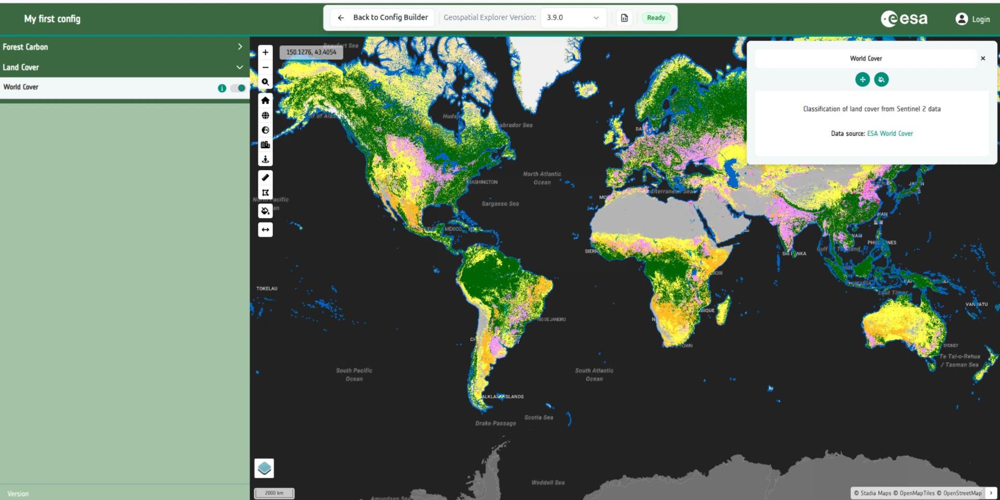

# 2-9. Add a WMS data source

Add a WMS layer using the direct connection flow.

1. On the **Layers** tab, add a new **interface group** called `Land Cover`.
2. Inside it, add a **layer card** called `World Cover 2021` with a suitable
   description (e.g. "Classification of land cover from Sentinel 2 data") and
   attribution ("ESA World Cover", <https://esa-worldcover.org/en>).
3. On the card, select **+ Add dataset**.
4. Choose **Direct connection → WMS/WMTS service**.
5. Paste the following into the **Service URL**:

    ```text
    https://mapproxy.terrascope.be/mapproxy/service
    ```

6. Paste the following into the **Layer name**:

    ```text
    esa-worldcover-map-10m-2021-v2_map
    ```

7. **Export** your current configuration so that you have a saved copy.

8. Select **Preview**. The World Cover WMS renders on the map with your chosen
   attribution and description in the info panel. Your configuration should now
   look something like this.

    

!!! note "No legend yet"

    You will notice that there is no legend for this layer, so it is hard to
    understand what the colours mean. We will address this in **tutorial 5** -
    working with categorical data.


See [WMS / WMTS / WFS](../../data-sources/wms-wmts-wfs.md) for the full
reference.
