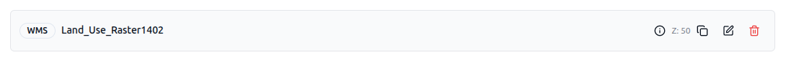
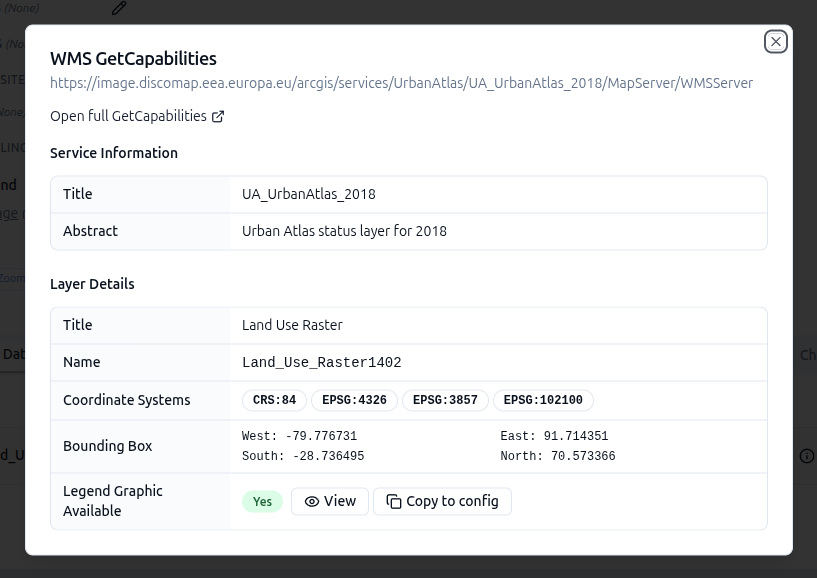
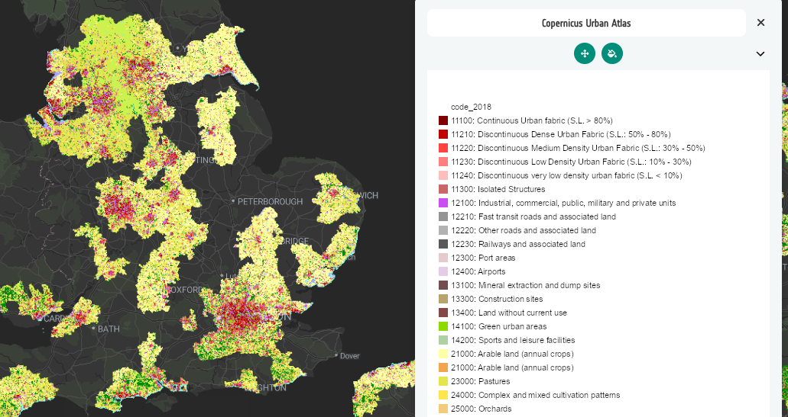

# 2-10. Add legends for a WMS

Some WMS services expose a legend graphic via `GetLegendGraphic`. When they do,
the CB can pull that legend straight into your layer card.

## Add the Copernicus Urban Atlas layer

1. Create a new layer called **Copernicus Urban Atlas** and place it in an
   interface group called **Land Cover** (create the group if it doesn't exist
   yet).
2. Add a dataset using **Direct Connection**, with **Data Format** set to WMS.
   Copy the values below into the form:

     - **Data Source URL**

       ```text
       https://image.discomap.eea.europa.eu/arcgis/services/UrbanAtlas/UA_UrbanAtlas_2018/MapServer/WMSServer
       ```

     - **Layer Name**

       ```text
       Land_Use_Raster1402
       ```

## Copy the legend into your configuration

1. On the dataset row, select the **(i)** info icon to open the metadata
   dialog. Note that it reports **Legend Graphic Available: Yes**.

    

2. Select **View** first to take a look at the legend graphic the server
   publishes.
3. If you're happy with it, select **Copy to config** to attach the legend to
   the layer card.



If no legend graphic is available for a service, edit the layer card and point
the **Legend image URL** at any publicly accessible PNG — for example a legend
you've curated yourself.

## Preview the result

Go to **Preview**, enable the layer, and open its info panel. The Urban Atlas
land-use classes render on the map with the copied legend alongside.




### Did you remember to export?

If not, now is a good moment.
