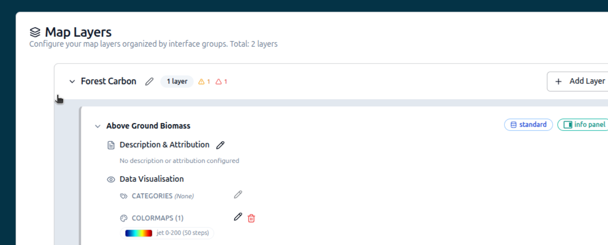

# 2. My first config

## Tutorial Objectives

Build a Geospatial Explorer configuration from scratch: name and branding, base
maps, your first layer card, a COG data source, colormap styling and a direct
WMS layer.

By the end of this tutorial you will be able to:

- Start a new configuration and set its name, interface group and branding.
- Export your work and reload it later.
- Add recommended base maps and your first layer card.
- Add a COG data source and style it with a colormap.
- Add a WMS layer using a direct connection.

## Steps

- [2-1. Pre-requisites](01-prerequisites.md)
- [2-2. Key concepts](02-key-concepts.md)
- [2-3. Name, interface group and branding](03-name-and-branding.md)
- [2-4. Exporting and reloading config](04-export-and-reload.md)
- [2-5. Add recommended base maps](05-add-base-maps.md)
- [2-6. Your first layer card](06-first-layer-card.md)
- [2-7. Add a COG data source](07-add-cog-data.md)
- [2-8. Style with a colormap](08-colormaps.md)
- [2-9. Experiment with layer controls](09-layer-controls.md)
- [2-10. Add a WMS layer directly](10-wms-service.md)
