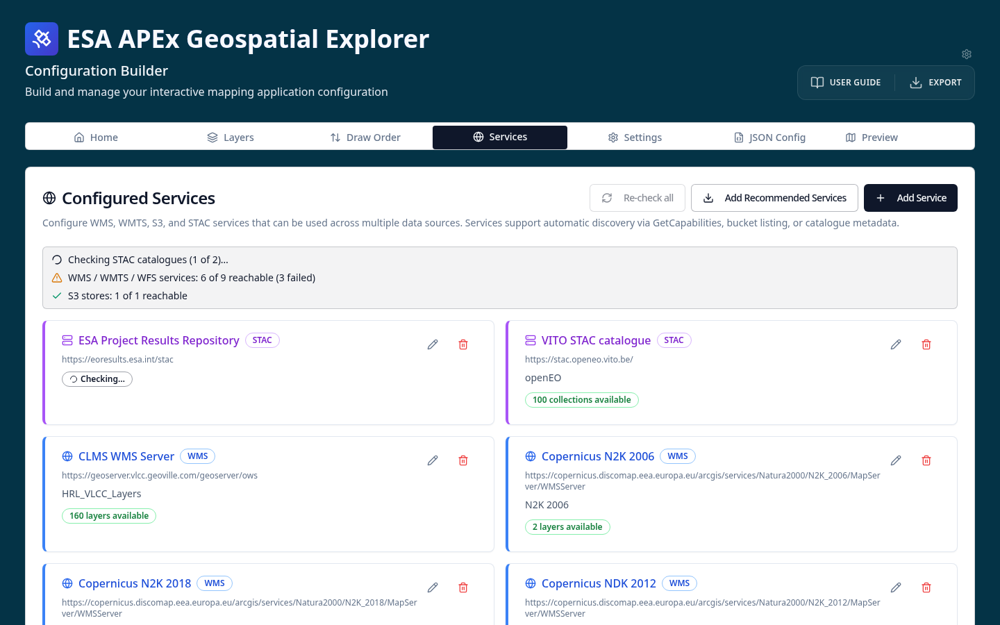

# 3-2. Add recommended services

Recommended services are a curated collection of STAC catalogues and WMS /
WMTS endpoints that are commonly useful across GE configurations.

1. Move to the **Services** tab.
2. Select **Add recommended services**.
3. You will see a list of services added — including the STAC service for the
   **Project Results Repository (PRR)** and several WMS / WMTS services.

Once a service is registered, you can pick data from it when adding datasets
to a layer card via the **From service** flow.

See [Recommended services](../../services/recommended.md) and
[Adding services](../../services/adding-services.md) for details.
