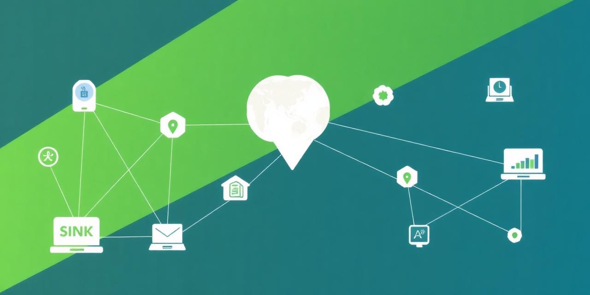

# 3. Working with Services

## Tutorial Objectives

Register recommended services, browse the Project Results Repository (PRR), add
further WMS layers and configure WMS legends.

By the end of this tutorial you will be able to:

- Add services from the recommended services list.
- Browse the Project Results Repository and pull data into your configuration.
- Add further WMS layers from registered services.
- Configure legends for a WMS layer.

## Steps

- [3-1. Pre-requisites](01-prerequisites.md)
- [3-2. Key concepts](02-key-concepts.md)
- [3-3. Add recommended services](03-recommended-services.md)
- [3-4. Add data from the PRR](04-data-from-prr.md)
- [3-5. Add more WMS layers](05-more-wms-layers.md)
- [3-6. Add legends for a WMS](06-wms-legends.md)
