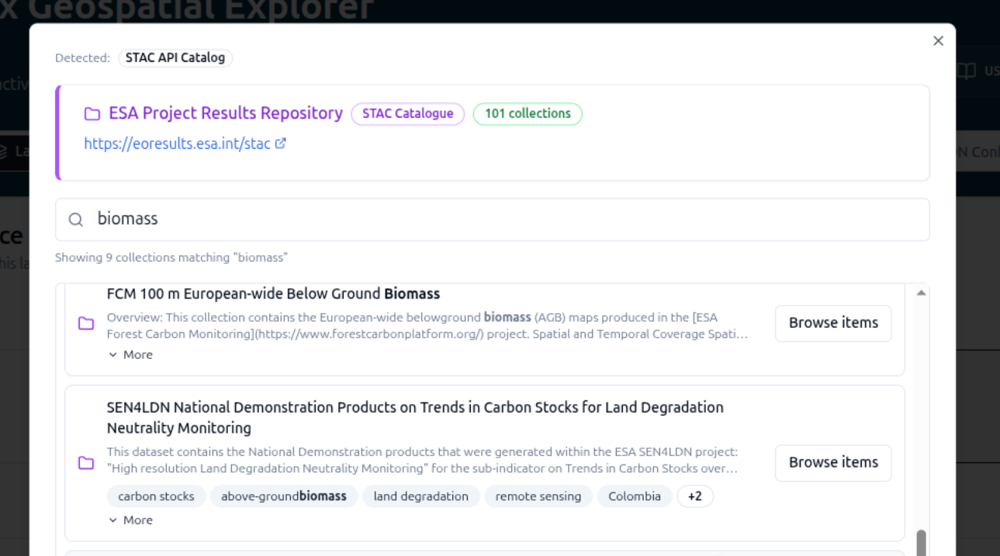

# 3. Working with Services

## Tutorial Objectives

Register a WMS as a service, add recommended services, browse the Project
Results Repository (PRR), add further WMS layers and configure WMS legends.

By the end of this tutorial you will be able to:

- Register a WMS endpoint as a service and browse its layers.
- Add services from the recommended services list.
- Browse the Project Results Repository and pull data into your configuration.
- Add further WMS layers from registered services.
- Configure legends for a WMS layer.

## Steps

- [3-1. Pre-requisites](01-prerequisites.md)
- [3-2. Key concepts](02-key-concepts.md)
- [3-3. Adding WMS as a service](03-wms-as-a-service.md)
- [3-4. Add recommended services](04-recommended-services.md)
- [3-5. Add data from the PRR](05-data-from-prr.md)
- [3-6. Add more WMS layers](06-more-wms-layers.md)
- [3-7. Add legends for a WMS](07-wms-legends.md)
