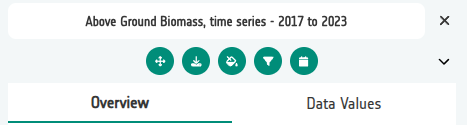
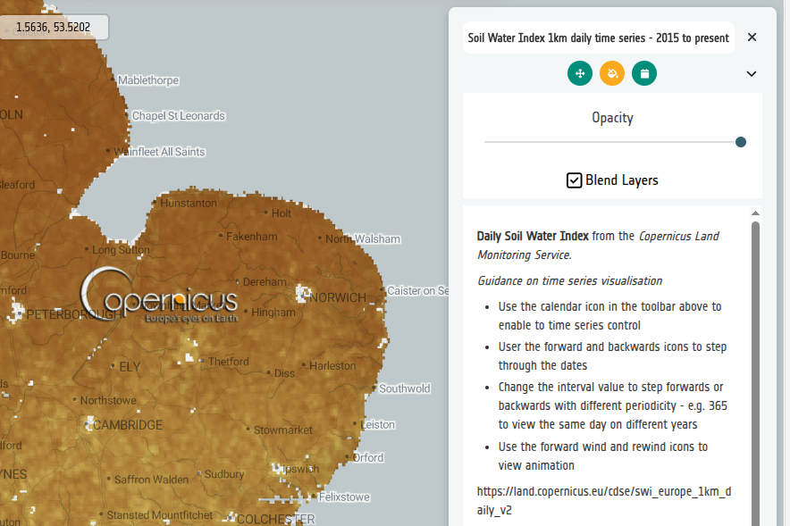

# 4-3. Experiment with layer controls

The **Layer controls** section of a layer card decides which interactive
controls the Explorer shows for that layer. Open your *Above Ground Biomass*
layer card, find the **Controls** section, and click the pencil icon to open
**Edit Controls**.

After each change, **Save** the layer card and open **GE Preview** to see the
effect in the Explorer.



From left to right, the icons are:

- **Zoom to** — centres the map on the layer.
- **Download** — downloads the linked file or page.
- **Opacity & Blend** — fades the layer and changes how it blends with layers
  underneath.
- **Constraints** — shows a slider for any constraint configured on the layer.
- **Temporal control** — opens the time picker for layers with timestamps.

You can test each of these controls on the **Above Ground Biomass** layer you
created earlier.


### Zoom to Center

Adds a zoom button that moves the map to the layer. There are two options for
where it zooms to.

**Layer bounds** — zooms to the extent of the data itself.

1. Tick **Zoom to Center** and choose **Layer bounds**.
2. **Save**, then open **GE Preview**.
3. Pan and zoom the map somewhere else, then click the layer's zoom button.

**Custom extent** — zooms to coordinates you supply, useful when you want to
land on a particular region rather than the whole dataset.

1. Re-open **Edit Controls** and switch to **Custom extent**.
2. Enter an extent as `xmin, ymin, xmax, ymax`, for example, for the UK only:

    ```
    -8, 50, 2, 60
    ```

3. **Save**, preview again, and compare the result with the layer bounds
   behaviour.

!!! tip
    Some service types, such as **XYZ tile services**, do not declare their own
    extent — they are treated as global. For these layers, use **Custom extent**
    if you want the zoom button to focus on a specific area rather than the
    whole world.

!!! note
    If the extent is incomplete or not four valid numbers, the control falls
    back to zooming to the layer bounds.


### Opacity Slider

Lets users fade the layer so they can see what is underneath it.

1. Tick **Opacity Slider** and **Save**.
2. In **GE Preview**, drag the slider and watch the base map show through.

### Blend Controls

Exposes blend modes (multiply, overlay, and so on) that change how the layer
combines with the layers below it.

1. Tick **Blend Controls** and **Save**.
2. In **GE Preview**, try a couple of blend modes over your base map.



!!! tip
    A good way to explore this is to load the **Comprehensive Demo** example
    config, open the **Soil Water Index** layer card, and experiment with
    different blend modes against the base map and layers underneath.


### Constraint Slider

Surfaces a slider for filtering the layer by a configured constraint — for
example only showing values above a threshold.

1. Tick **Constraint Slider** and **Save**.

!!! info "Constraints come later"
    This control only shows a slider once a constraint is defined on the layer
    itself. The separate [Tutorial 7 — Constraints](../07-constraints/index.md)
    covers creating filters that use values from secondary layers.

### Temporal Controls

Shows the time picker for layers that have timestamps. The **Time picker**
dropdown (None, Time, Days, Months, Years) sets the granularity presented to
the user.

Leave this one alone for now — we come back to it in
[Tutorial 6 — Time series](../06-time-series/index.md).

### Download

Adds a download button to the layer card. The optional URL field controls
where that button points.

1. Tick **Download** and paste the URL for the Above Ground Biomass COG:

    ```
    https://eoresults.esa.int/d/FCM-AGB-100m/2023/01/01/FCM-AGB-100m-2023/FCM_Europe_demo_2023_AGB.tif
    ```

2. **Save**, then open **GE Preview**.
3. Click the download button on the layer card and check the download starts.

!!! tip "Download links"
    You can either paste the COG URL (which triggers a direct download) or a
    link to somewhere more useful — for example the dataset's STAC record on the
    PRR.

### Did you remember to export?

If not, now is a good moment. See [Exporting and reloading
config](../02-getting-started/04-export-and-reload.md).
