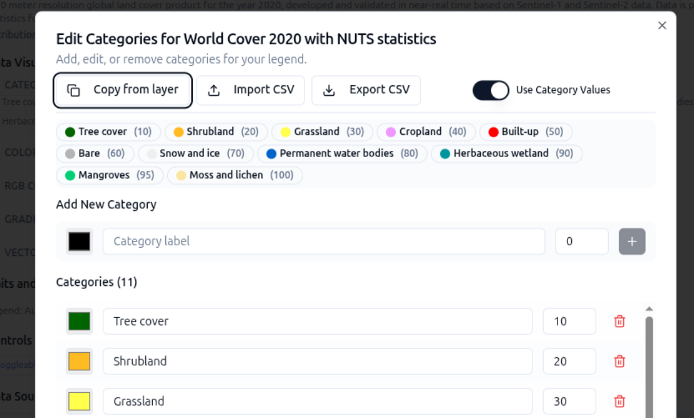

# 4. Fine tuning my config

## Tutorial Objectives

Refine an existing configuration so it behaves well for your users: which
interactive controls appear on each layer, and how those choices show up in
the Explorer.

By the end of this tutorial you will be able to:

- Understand what each layer control does in the Explorer.
- Enable and disable layer controls on a layer card.
- Specify units for numeric layers so they appear in the legend and data values.
- Preview the effect of your choices in GE Preview.

## Steps

- [4-1. Pre-requisites](01-prerequisites.md)
- [4-2. Specifying layer units](02-layer-controls.md)
- [4-3. Experiment with layer controls](03-specifying-layer-units.md)
- [4-4. Default start location](04-default-start-location.md)
- [4-5. Alternative projections](05-alternative-projections.md)
