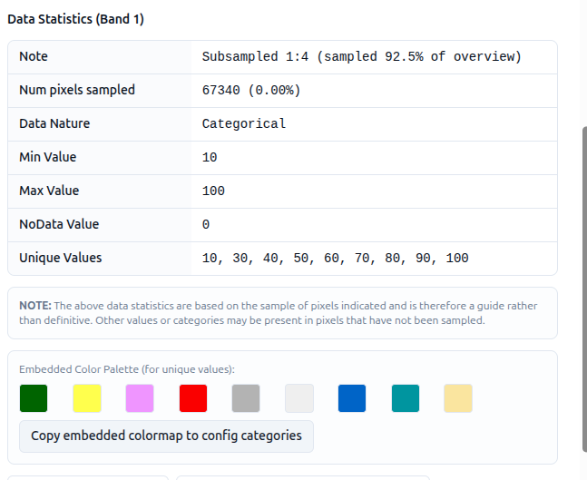

# 5-3. Categories for a COG

The category system determines how COGs are rendered when their values represent a data classification (as opposed to a continuous variable).

1. Create a new layer card called `World Cover - Austria` in the **Land Cover** interface group - see tutorial 2-6 for a recap if needed
2. Add the following dataset — a World Cover COG for Austria - see tutorial 2-7 for a recap if needed:

    ```
    https://esa-apex.s3.eu-west-1.amazonaws.com/APEX-example-data/constraints/PowerDensity_100m_Austria_WGS84_COG_clipped_3857_fix-esa_worldcover_2021.tif
    ```

3. Click the **(i)** info icon on the dataset row to open the COG metadata
   dialog.

    

4. Select **Populate categories**. The categories editor is populated from a
   sample of the pixel values in the COG.

    Alternatively, if the COG has an embedded colour palette, select
    **Copy embedded colormap to config categories** to bring across both the
    values and their original colours.


5. Edit a couple of the category labels to align to the World Cover class
    names (e.g. `10 → Tree cover`, `30 → Grassland`). See the
    [WorldCover class lookup](#worldcover-class-lookup) below for the full list
    of values, colours and names.
6. Save the layer card and preview. The COG is now rendered with the labels
    and colours you defined.


    The values are populated from a **sample** of pixels. It is possible for
    a small number of pixels to fall into classes that were not sampled.
    Cross-check against the source data if completeness matters.

## WorldCover class lookup

| Value | Colour | Colour code | Class name |
| --- | --- | --- | --- |
| 10 | <span style="display:inline-block;width:1.2em;height:1.2em;background:#006400"></span> | `#006400` | Tree cover |
| 20 | <span style="display:inline-block;width:1.2em;height:1.2em;background:#ffbb22"></span> | `#ffbb22` | Shrubland |
| 30 | <span style="display:inline-block;width:1.2em;height:1.2em;background:#ffff4c"></span> | `#ffff4c` | Grassland |
| 40 | <span style="display:inline-block;width:1.2em;height:1.2em;background:#f096ff"></span> | `#f096ff` | Cropland |
| 50 | <span style="display:inline-block;width:1.2em;height:1.2em;background:#fa0000"></span> | `#fa0000` | Built up |
| 60 | <span style="display:inline-block;width:1.2em;height:1.2em;background:#b4b4b4"></span> | `#b4b4b4` | Bare / sparse vegetation |
| 70 | <span style="display:inline-block;width:1.2em;height:1.2em;background:#f0f0f0"></span> | `#f0f0f0` | Snow and ice |
| 80 | <span style="display:inline-block;width:1.2em;height:1.2em;background:#0032c8"></span> | `#0032c8` | Permanent water bodies |
| 90 | <span style="display:inline-block;width:1.2em;height:1.2em;background:#0096a0"></span> | `#0096a0` | Herbaceous wetland |
| 95 | <span style="display:inline-block;width:1.2em;height:1.2em;background:#00cf75"></span> | `#00cf75` | Mangroves |
| 100 | <span style="display:inline-block;width:1.2em;height:1.2em;background:#fae6a0"></span> | `#fae6a0` | Moss and lichen |
| 0 | | | No data |

Source: [ESA WorldCover collection documentation](https://collections.sentinel-hub.com/worldcover/readme.html){target=_blank}
