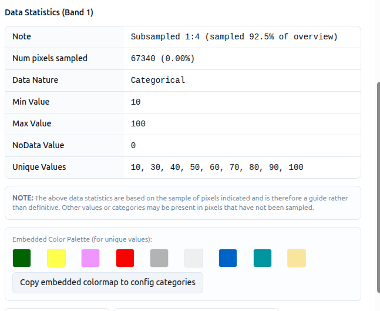
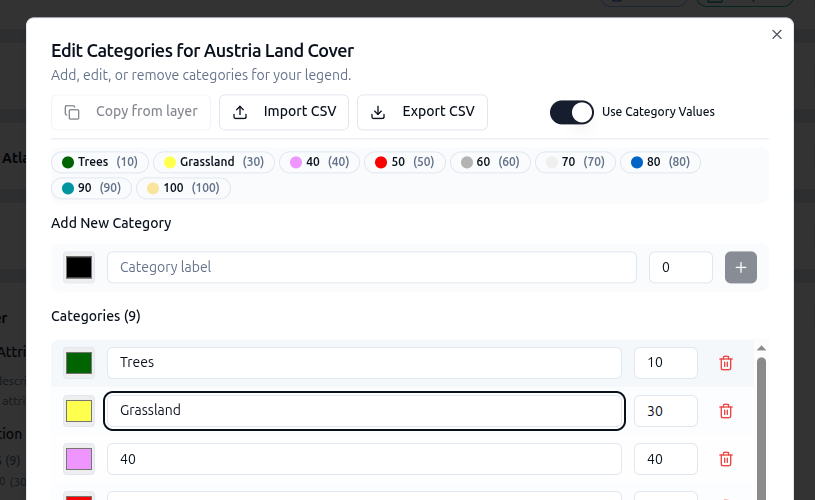

# 5-3. Categories for a COG

The category system determines how COGs are rendered when their values represent a data classification (as opposed to a continuous variable).

1. Create a new layer card called `World Cover - Austria` in the **Land Cover** interface group - see tutorial 2-6 for a recap if needed
2. Add the following dataset — a World Cover COG for Austria - see tutorial 2-7 for a recap if needed:

   ```
   https://esa-apex.s3.eu-west-1.amazonaws.com/APEX-example-data/constraints/PowerDensity_100m_Austria_WGS84_COG_clipped_3857_fix-esa_worldcover_2021.tif
   ```

3. Click the **(i)** info icon on the dataset row to open the COG metadata
   dialog.

   

4. Scroll down until you see the colour palette display, Click **Copy embedded colormap to config categories**. This takes both the class values (10, 30, 40 etc) and colours (green, yellow, red) from the colourmap in the COG and copies them into our layer definition. Then **close** the metadata dialog.
   - Although this COG has an emebedded colormap, that is not always the case. The option to **Copy unique values to config categories** is used when there is no colormap but will still transfer our unique values.

5. Now select the **pen** icon, next to **Categeories** in the **Data Visualisation** section of the layer card. Edit a couple of the category labels to align to the World Cover class
   names (e.g. `10 → Tree cover`, `30 → Grassland`). See the
   [WorldCover class lookup](#worldcover-class-lookup) below for the full list
   of values, colours and names.

   

!!! info
The values are populated from a **sample** of pixels. It is possible for
a small number of pixels to fall into classes that were not sampled.
Cross-check against the source data if completeness matters.

6.  To save on manual typing you can also **import** or export categories from CSV
    files. You can do this now by downloading
    [`world-cover-classes.csv`](../../assets/world-cover-classes.csv) (<- click on the link to download). Then select **Import CSV** and load up the file you just downloaded.

7.  Select **Save Categories** to exit the dialog and then **Preview**, toggle on the layer and view the reesults. The COG is now rendered with the labels and colours you defined.

8.  _(Optional)_ Go back to **Data Visualisation → Categories → Edit** and change
    the colour of one class — for example, make **Tree cover** a light green.
    Save the layer card and preview again. The configured colour overrides the
    colour map embedded in the COG, so the legend and map rendering reflect your
    choice rather than the built-in palette.

## WorldCover class lookup

| Value | Colour                                                                                 | Colour code | Class name               |
| ----- | -------------------------------------------------------------------------------------- | ----------- | ------------------------ |
| 10    | <span style="display:inline-block;width:1.2em;height:1.2em;background:#006400"></span> | `#006400`   | Tree cover               |
| 20    | <span style="display:inline-block;width:1.2em;height:1.2em;background:#ffbb22"></span> | `#ffbb22`   | Shrubland                |
| 30    | <span style="display:inline-block;width:1.2em;height:1.2em;background:#ffff4c"></span> | `#ffff4c`   | Grassland                |
| 40    | <span style="display:inline-block;width:1.2em;height:1.2em;background:#f096ff"></span> | `#f096ff`   | Cropland                 |
| 50    | <span style="display:inline-block;width:1.2em;height:1.2em;background:#fa0000"></span> | `#fa0000`   | Built up                 |
| 60    | <span style="display:inline-block;width:1.2em;height:1.2em;background:#b4b4b4"></span> | `#b4b4b4`   | Bare / sparse vegetation |
| 70    | <span style="display:inline-block;width:1.2em;height:1.2em;background:#f0f0f0"></span> | `#f0f0f0`   | Snow and ice             |
| 80    | <span style="display:inline-block;width:1.2em;height:1.2em;background:#0032c8"></span> | `#0032c8`   | Permanent water bodies   |
| 90    | <span style="display:inline-block;width:1.2em;height:1.2em;background:#0096a0"></span> | `#0096a0`   | Herbaceous wetland       |
| 95    | <span style="display:inline-block;width:1.2em;height:1.2em;background:#00cf75"></span> | `#00cf75`   | Mangroves                |
| 100   | <span style="display:inline-block;width:1.2em;height:1.2em;background:#fae6a0"></span> | `#fae6a0`   | Moss and lichen          |
| 0     |                                                                                        |             | No data                  |

Source: [ESA WorldCover collection documentation](https://collections.sentinel-hub.com/worldcover/readme.html){target=_blank}
